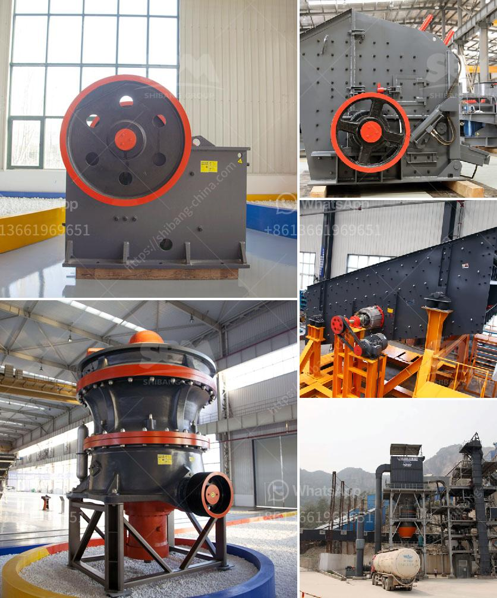

<h3>What determines the capacity of a stone crusher?</h3>
Stone crushers are widely used in mining, metallurgy, building materials, highways, railways, water conservancy and chemical industries. And CHAENG is a famous foundry factory in Henan Province, which has rich experience in providing custom-made mechanical parts for the mining industry, building materials industry, metallurgical industry, construction industry and other fields.

The capacity of a stone crusher is determined by several factors, such as the diameter of the rotor, the width of the hammer, the peripheral speed of the hammer, the frequency of the hammer impacts, the arrangement of the hammerhead, the hardness of the crushed materials, and the grit size of the discharged materials.

The diameter of the rotor is the main factor that determines the crushing capacity. The larger the diameter, the higher the production capacity. In addition, the rotor size also affects the power consumption of the crushing equipment. Generally, the larger the rotor size, the higher the power consumption.

The width of the hammer is an important factor that determines the capacity of a stone crusher. The wider the hammer, the stronger the crushing ability. However, if the hammer is too wide, it will increase the weight and power consumption of the equipment, and the production capacity may not increase proportionally.

The peripheral speed of the hammer is another important factor in determining the capacity of a stone crusher. The higher the peripheral speed, the more impacts per minute the hammer will make, resulting in higher efficiency and production capacity. However, if the peripheral speed is too high, it may cause excessive wear on the hammers and other components, affecting the overall durability of the equipment.

The frequency of the hammer impacts is also a key factor in determining the capacity of a stone crusher. The higher the frequency, the more impacts per minute, which leads to a higher crushing capacity. However, a very high frequency may cause excessive vibration and noise, requiring additional measures to control them.

The arrangement of the hammerhead is crucial in determining the capacity of a stone crusher. The closer the hammers are arranged, the higher the impact frequency and the finer the crushed materials. On the other hand, if the hammers are too far apart, the crushing efficiency will decrease, and the production capacity will be affected.

The hardness of the crushed materials is an essential factor in determining the capacity of a stone crusher. Harder materials require more powerful and durable equipment to crush them effectively, thus increasing the power consumption and affecting the production capacity.

Finally, the grit size of the discharged materials plays a role in determining the capacity of a stone crusher. Smaller grit sizes allow for faster and more efficient crushing, resulting in higher production capacity. However, finer grit sizes may also result in a higher percentage of fines, which can affect the overall quality of the crushed materials.

In conclusion, the capacity of a stone crusher is determined by various factors, including the diameter of the rotor, the width of the hammer, the peripheral speed of the hammer, the frequency of the hammer impacts, the arrangement of the hammerhead, the hardness of the crushed materials, and the grit size of the discharged materials. These factors should be carefully considered when selecting a suitable stone crusher for specific applications.
<h3>Contact us</h3><ul><li><strong>Whatsapp:&nbsp;<a href="https://wa.me/8613661969651">+8613661969651</a></strong></li><li><a href="https://swt.shibang-china.com/?git&amp;zhl&amp;What determines the capacity of a stone crusher"><strong>Online Service(chat now)</strong></a></li></ul><h3>Related</h3><ul><li><a href='What equipment is used in the quarry.md'>What equipment is used in the quarry</a></li><li><a href='What is a construction waste crusher ？.md'>What is a construction waste crusher ？</a></li><li><a href='What is the way to block the material of sand crusher .md'>What is the way to block the material of sand crusher ?</a></li><li><a href='What are the specifications of the crusher for crushing concrete.md'>What are the specifications of the crusher for crushing concrete?</a></li><li><a href='What are the features of a jaw crusher.md'>What are the features of a jaw crusher?</a></li></ul>