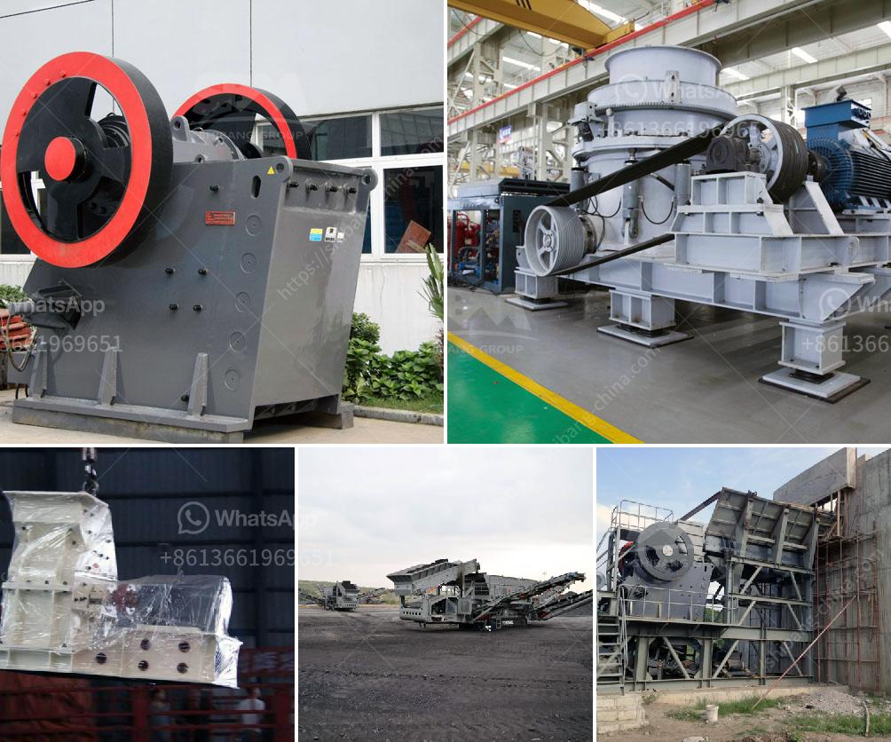

<h3>What do crusher model letters represent?</h3>
Crushers are essential equipment used in various industries, such as mining, construction, and recycling. These machines are designed to break down large rocks into smaller, more manageable pieces. To distinguish between different types and models of crushers, manufacturers often assign them specific letters or codes. These crusher model letters serve as a standardized way to communicate key features and specifications, making it easier for industry professionals to select the right equipment for their needs.

The first letter in a crusher model typically represents the type of crusher. For example, "J" stands for jaw crusher, while "I" represents impact crusher. This letter is crucial in identifying the primary function of the machine. Jaw crushers primarily crush materials by squeezing them between two heavy plates, while impact crushers use the force of impact to break down the rocks.

The second letter in the model represents the applications the crusher is suitable for. For instance, "C" stands for concrete, indicating that the crusher is specifically designed to handle concrete materials. Similarly, "R" may indicate that the crusher is suitable for recycling purposes, while "M" could represent mining.

The number following the letters usually indicates the capacity of the crusher. This number signifies the maximum amount of material that the machine can process in a given time frame. Higher numbers generally indicate greater capacity, allowing for more efficient and productive operations.

In addition to these model letters and numbers, manufacturers may include additional designations to provide even more specific information about the crusher. These can include features like automation, mobility, or special applications. These additional designations ensure that industry professionals can choose the crusher that best fits their requirements.

Understanding these crusher model letters is vital for anyone involved in selecting or using crushers. It helps professionals compare different machines and choose the most suitable one based on their specific needs. For example, a mining company would need an appropriate crusher with high capacity, designated with a letter like "MJ" (mining jaw crusher).

Moreover, these model letters also aid in communication between manufacturers, suppliers, and customers. By using standardized letters and numbers, it becomes easier to discuss and compare different crushers, ensuring that everyone is on the same page.

In conclusion, crusher model letters play a crucial role in identifying and selecting the appropriate machine for various applications. These letters indicate the type of crusher, its intended application, and the capacity it can handle. They provide industry professionals with a common language for discussing and selecting crushers, promoting efficient and effective communication. Understanding these model letters is essential for anyone involved in the mining, construction, or recycling industries, as it helps ensure that the right crusher is chosen for the task at hand.
<h3>Contact us</h3><ul><li><strong>Whatsapp:&nbsp;<a href="https://wa.me/8613661969651">+8613661969651</a></strong></li><li><a href="https://swt.shibang-china.com/?git&amp;zhl&amp;What do crusher model letters represent"><strong>Online Service(chat now)</strong></a></li></ul><h3>Related</h3><ul><li><a href='what are the by products of producing lead through mining.md'>what are the by products of producing lead through mining</a></li><li><a href='What equipment is used for silver mining.md'>What equipment is used for silver mining?</a></li><li><a href='What is the common ore crusher for aluminum.md'>What is the common ore crusher for aluminum?</a></li><li><a href='What machinery is used to mine zinc .md'>What machinery is used to mine zinc ?</a></li><li><a href='What type of crusher do I need for gold.md'>What type of crusher do I need for gold?</a></li></ul>