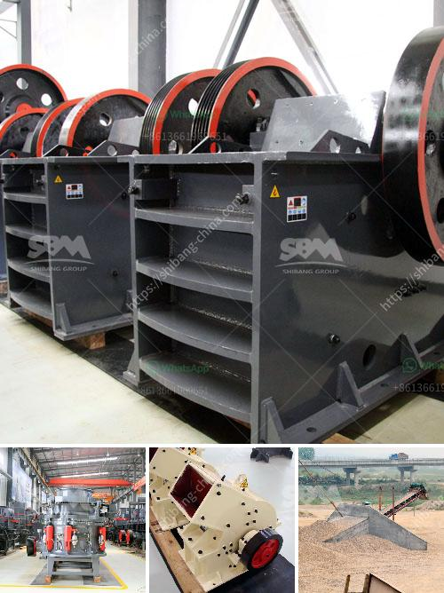

<h3>What does a 100 ton per hour jaw crusher cost?</h3>
As per the information provided by the market research firm, Reports and Data, the global jaw crusher market size was valued at USD 1.68 billion in 2020 and is expected to reach USD 2.03 billion by the end of 2028. This marks a compound annual growth rate (CAGR) of 3.3% during the forecast period. The increasing demand for construction and mining activities across the globe is predicted to drive the demand for jaw crushers.

However, the cost of a jaw crusher greatly varies depending on the specific model, capacity, and brand. In this article, we will explore the cost implications of a 100 ton per hour jaw crusher.

Firstly, we need to have a general understanding of the concept of a jaw crusher. A jaw crusher is a heavy-duty machine that uses compressive force to crush rocks and abrasive materials. It is commonly used in crushing applications in the mining and construction industries. The jaw crusher's main purpose is to reduce the size of large rocks or ore into smaller pieces suitable for further processing.

The cost of a jaw crusher is determined by several factors, including the materials used, the design and construction of the machine, the capacity, horsepower, and maintenance requirements. As the capacity increases, the cost per ton of material processed decreases. A 100 ton per hour jaw crusher has a capacity of 1,000 tons per day, which means it takes about 20-30 hours for a single plant to crush 100 tons of material.

The cost of a single jaw crusher ranges from tens of thousands to hundreds of thousands of dollars, depending on the specific model and features. For instance, a jaw crusher with a double toggle plate design might cost around $1.2 million, while a smaller single toggle jaw crusher might cost $500,000. The operating cost of a jaw crusher is relatively low as compared to other crushing equipment.

In addition to the initial cost of the machine, the operating and maintenance costs also need to be considered. The energy consumption of a jaw crusher is relatively high, especially during the crushing process, which makes the electricity cost a significant factor. Regular maintenance and replacement of wear parts, such as jaw plates and liners, are necessary to ensure the machine's optimal performance, which can increase the overall cost.

Furthermore, the brand and country of origin of the jaw crusher can also affect its cost. Machines manufactured by well-known brands tend to be more expensive due to their reputation, quality, and customer service. Similarly, crushers produced in countries with high labor and manufacturing costs, such as the United States or Europe, may have a higher price compared to those manufactured in countries with lower labor costs.

In conclusion, the cost of a 100 ton per hour jaw crusher can range from tens of thousands to hundreds of thousands of dollars, depending on the specific model, capacity, and brand. It is essential to consider factors such as the initial cost, operating costs, maintenance requirements, and the reputation of the manufacturer before making a purchase decision. Conducting thorough market research and consulting with industry experts can help buyers make an informed choice that suits their requirements and budget.
<h3>Contact us</h3><ul><li><strong>Whatsapp:&nbsp;<a href="https://wa.me/8613661969651">+8613661969651</a></strong></li><li><a href="https://swt.shibang-china.com/?git&amp;zhl&amp;What does a 100 ton per hour jaw crusher cost"><strong>Online Service(chat now)</strong></a></li></ul><h3>Related</h3><ul><li><a href='What is the waste from an orecrushing plant.md'>What is the waste from an ore-crushing plant?</a></li><li><a href='What is the price of a cone crusher in Venezuela.md'>What is the price of a cone crusher in Venezuela?</a></li><li><a href='What method of costing is used for the crusher industry.md'>What method of costing is used for the crusher industry?</a></li><li><a href='What is the way to block the material of sand crusher .md'>What is the way to block the material of sand crusher ?</a></li><li><a href='What kind of mining crusher has a good high yield.md'>What kind of mining crusher has a good high yield?</a></li></ul>