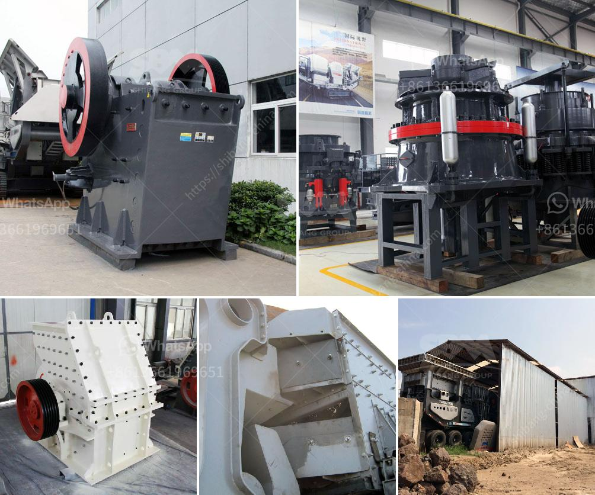

<h3>What does a ball mill do in mining?</h3>
A ball mill, a type of grinder, is a cylindrical device used in grinding (or mixing) materials like ores, chemicals, ceramic raw materials and paints. Ball mills rotate around a horizontal axis, partially filled with the material to be ground plus the grinding medium. Different materials are used as media, including ceramic balls, flint pebbles, and stainless steel balls. An internal cascading effect reduces the material to a fine powder.

Ball mills are commonly used in the mining industry to grind a variety of materials, such as coal, pigments, and feldspar for pottery. They can be used for both wet and dry grinding. In the process of mining, ball mills are used to grind ore into progressively smaller sizes, reducing particles to smaller sizes for further processing or beneficiation.

The purpose of a ball mill in mining is to grind the crushed ore into fine particles, which can be further processed to extract valuable minerals. The material may undergo primary crushing at the mine site before being transported to the processing plant. Once at the plant, it is mixed with water and ground to produce a slurry of fine particles for further processing.

The grinding process in a ball mill is a complex task. Ore particles breakage and the structure integrity of the mill play a key role in the stability of ore grinding. Therefore, understanding the performance of a ball mill involves careful monitoring of the parameters and processes that influence its efficiency and product quality.

One essential factor to consider when selecting grinding equipment is the particle size distribution obtained from the feed material. The desired final product size will dictate the size and type of the grinding media used, the rotational speed of the mill, the grid opening size, and the discharge rate of the ground material.

The efficiency of grinding in a ball mill is determined by a combination of factors, such as the density and hardness of the grinding media, the percentage of solids in the mill, the speed of rotation, and the size of the feed and product particles.

Efficient grinding in a ball mill relies on impacting and grinding action between the media and the ore particles. The motion of the media within the mill generates pressure forces that break the particles, leading to the creation of smaller particles. The grinding process is also influenced by the presence of water in the mill, which acts as a lubricant and prevents excessive heat buildup during grinding.

In conclusion, a ball mill plays a vital role in the mining industry. It is necessary to grind the ore into a fine powder to extract valuable minerals. The process and efficiency of grinding in a ball mill heavily depend on the size, quantity, and composition of the grinding media, as well as the rotational speed of the mill, among other factors. Hence, appropriate monitoring and control of a ball mill is crucial to maintain optimal operational conditions and achieve the desired particle size distribution.
<h3>Contact us</h3><ul><li><strong>Whatsapp:&nbsp;<a href="https://wa.me/8613661969651">+8613661969651</a></strong></li><li><a href="https://swt.shibang-china.com/?git&amp;zhl&amp;What does a ball mill do in mining"><strong>Online Service(chat now)</strong></a></li></ul><h3>Related</h3><ul><li><a href='What is a fixed jaw crusher plate and what are its uses.md'>What is a fixed jaw crusher plate and what are its uses?</a></li><li><a href='What is the best jaw crusher for coal processing.md'>What is the best jaw crusher for coal processing?</a></li><li><a href='what machine is used for crushing quarry stone in philippines？.md'>what machine is used for crushing quarry stone in philippines？</a></li><li><a href='what equipment are used in the production of bentonite？.md'>what equipment are used in the production of bentonite？</a></li><li><a href='What method of mining is used to obtain calcite.md'>What method of mining is used to obtain calcite?</a></li></ul>