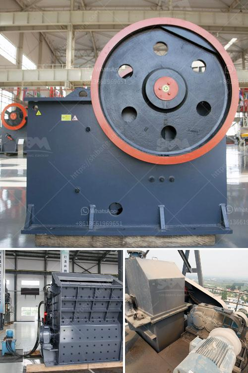

<h3>What does a compound pendulum jaw crusher?</h3>
A compound pendulum jaw crusher, also known as a double-toggle jaw crusher, is a modernized crushing equipment based on the traditional single-toggle jaw crusher. It has taken the advantages of traditional crushers and applied the latest technologies such as hybrid bearing support, which enables the pendulum jaw crusher to be efficient and stable.

The compound pendulum jaw crusher is mainly composed of frame, eccentric shaft, large pulley, flywheel, moving jaw, side guard plate, toggle plate, toggle plate backseat, adjusting screw, returning spring, fixed jaw plate, movable jaw plate, and other components. The main components adopt high-strength materials to ensure the structural stability of the equipment.

One of the key features of the compound pendulum jaw crusher is its excellent crushing capacity. The crushing chamber of this equipment can achieve full feeding and large-sized crushing, making the stone material more evenly crushed. The particle size of the product is relatively uniform, with less needle-like stones and less powder content, which is favored by many industries such as mining, metallurgy, building materials, and chemical engineering.

Moreover, the compound pendulum jaw crusher has the advantages of simple structure, reliable operation, convenient maintenance, and low operating costs. It is mainly used for coarse crushing and medium crushing of various ores and bulk materials. In addition, it is widely used in mining, smelting, building materials, highway, railway, water conservancy, and chemical industries. This makes the compound pendulum jaw crusher an ideal equipment for coarse crushing.

Another advantage of the compound pendulum jaw crusher is its adjustable discharge outlet. Users can adjust the size of the discharge outlet by adjusting the block gap between the toggle plate and the toggle plate backseat, thus changing the final product size. This feature enables the compound pendulum jaw crusher to meet the requirements of different users for different particle sizes.

In conclusion, the compound pendulum jaw crusher is a widely used technology-intensive crushing machine at present, which is mainly used for coarse crushing and medium crushing of various materials in mines, metallurgy, chemical industry, building materials, highways, railways, water conservancy, and other industries. It has the advantages of large crushing ratio, uniform product size, simple structure, reliable operation, and low operating costs. With its excellent performance, this type of jaw crusher will continue to play a significant role in the crushing equipment industry and contribute to the development of related industries.
<h3>Contact us</h3><ul><li><strong>Whatsapp:&nbsp;<a href="https://wa.me/8613661969651">+8613661969651</a></strong></li><li><a href="https://swt.shibang-china.com/?git&amp;zhl&amp;What does a compound pendulum jaw crusher"><strong>Online Service(chat now)</strong></a></li></ul><h3>Related</h3><ul><li><a href='What is the selling price of the hammer crusher.md'>What is the selling price of the hammer crusher?</a></li><li><a href='What material is the jaw crusher tooth plate.md'>What material is the jaw crusher tooth plate?</a></li><li><a href='What machines are used in mines.md'>What machines are used in mines?</a></li><li><a href='What can dolomite be used for when constructing highways.md'>What can dolomite be used for when constructing highways?</a></li><li><a href='What is a hammer mill work.md'>What is a hammer mill work?</a></li></ul>