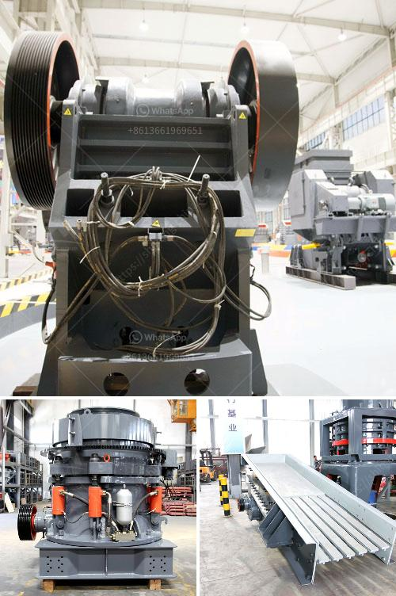

<h3>What does a cone crusher do ?</h3>
Cone crushers are used to reduce the size of large rocks into smaller pieces. They are commonly used in quarries, mining, construction, and recycling industries.

Cone crushers are widely used in industries such as metallurgy, building materials, road construction, chemical engineering and silicate. They are suitable for crushing all kinds of ores and rocks with hardness of medium or above. Cone crushers have the advantages of large crushing ratio, high efficiency, low energy consumption, and uniform product size.

A cone crusher operates by crushing the materials between an eccentrically gyrating cone and a concave, or bowl liner. As the material enters the top of the cone crusher, it becomes wedged and squeezed between the mantle and the bowl liner. This is achieved by the eccentric movement of the crusher main shaft, which causes the mantle to move against the stationary bowl liner. As the material is crushed, it falls through the opening at the bottom of the cone crusher.

The cone crusher has several chambers where the rocks, materials, or the feedstock, fall in and get crushed. These chambers are coated with a concave liner, which reduces the friction between the liner and the rocks. It also acts as a wedge when the materials are being crushed, pushing the rocks against the concave liners. The resulting crushed rocks then fall out through the discharge opening at the bottom of the cone crusher.

There are different types of cone crushers, including spring cone crusher, hydraulic cone crusher, and single-cylinder hydraulic cone crusher. The main difference between these crushers is the way the materials are crushed. For spring cone crushers, the feedstock is fed into the gap between the two cones and the springs are activated, causing the material to be crushed. Hydraulic cone crushers have hydraulic cylinders that release the crushing force when the material is caught between the mantle and the concave liner. Single-cylinder hydraulic cone crushers have a single cylinder, located at the bottom of the cone crusher, which provides a stable and reliable crushing performance.

Cone crushers have a wide application range. They are used in crushing hard and abrasive materials, such as granite, basalt, limestone, copper ore, iron ore, and other minerals. In addition, cone crushers are also used in the primary, secondary, and tertiary stages of crushing, and they are used for producing different sizes of crushed materials.

In conclusion, a cone crusher is a valuable machine that is used for reducing the size of rocks and the separation of stones, minerals, and other materials. It is commonly used in quarries, mining, construction, and recycling industries. Some of the main advantages of using a cone crusher include high efficiency, low energy consumption, and uniform product size. With different types of cone crushers available in the market, it is important to choose the right one based on specific requirements.
<h3>Contact us</h3><ul><li><strong>Whatsapp:&nbsp;<a href="https://wa.me/8613661969651">+8613661969651</a></strong></li><li><a href="https://swt.shibang-china.com/?git&amp;zhl&amp;What does a cone crusher do "><strong>Online Service(chat now)</strong></a></li></ul><h3>Related</h3><ul><li><a href='What equipment is used on a bauxite site.md'>What equipment is used on a bauxite site?</a></li><li><a href='What is a stone crusher.md'>What is a stone crusher?</a></li><li><a href='What are the functions of a gyratory crusher in mining.md'>What are the functions of a gyratory crusher in mining?</a></li><li><a href='What are the specifications of the crusher for crushing concrete.md'>What are the specifications of the crusher for crushing concrete?</a></li><li><a href='What is the price of mobile crusher.md'>What is the price of mobile crusher?</a></li></ul>