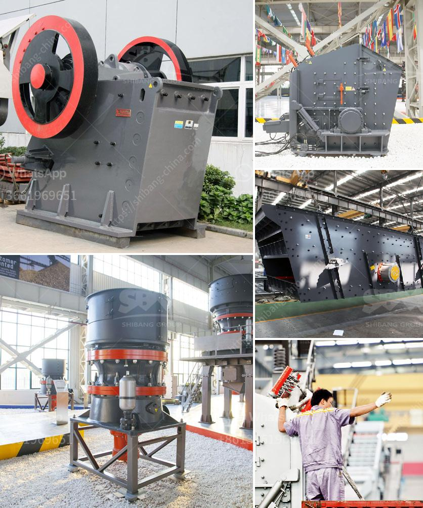

<h3>What does "aggregate crusher" mean?</h3>
When it comes to construction projects, aggregate materials are essential. It is composed of sand, gravel, crushed stone, slag, recycled concrete, and other materials. Aggregate serves as a backbone that provides stability and strength to the overall project. Among these materials, aggregate crusher plays a vital role in processing and shaping the rock or sand particles.

An aggregate crusher is a machine designed to grind or pulverize various types of rock into small, relatively uniform pieces. Aggregate crushers are used in mining, quarrying, and recycling operations. Several types of crushers can perform this task, including hammer mills, roller crushers, jaw crushers, and cone crushers.

The primary goal of an aggregate crusher is to break down materials into smaller-sized pieces. These crushers can handle a wide range of materials, including materials with abrasive characteristics, such as granite or basalt. Some aggregate crushers are also capable of producing a finer product, which has applications in specific construction projects.

The process of aggregate crushing involves multiple stages of crushing, depending on the hardness of the material. The first stage is the primary crushing stage, where large rocks are crushed into smaller pieces. The materials are then passed through a secondary crushing stage, which further reduces the size of the particles. Finally, the crushed material is passed through tertiary or quaternary crushers to achieve the desired size and shape.

Aggregate crushers are widely used in various industries, such as mining, quarrying, construction, and demolition. They are commonly used for producing crushed stone, recycled concrete, sand, and gravel for construction projects. These crushers are also used for processing the raw materials for road construction, railway embankments, and concrete products.

In addition to their primary function of crushing, aggregate crushers can also provide other benefits. For example, they can remove impurities and other foreign materials from the aggregates, resulting in a cleaner final product. Crushers can also produce graded materials, ensuring that the finished product meets specific requirements for size and shape.

The efficiency and effectiveness of an aggregate crusher depend on several factors, including the type of crusher, the size and hardness of the material, and the desired final product. It is essential to select the right type of crusher for the specific application to achieve the desired results.

Aggregate crushers come in various sizes and capacities, ranging from small portable crushers to large stationary crushers. They are designed to work in different environments, including harsh conditions and remote locations. Many crushers are equipped with advanced features, such as automated monitoring, control systems, and dust suppression mechanisms, to improve safety and efficiency.

In conclusion, an aggregate crusher is a machine used to grind or pulverize various types of rock into small, relatively uniform pieces. These machines are widely employed in the mining, quarrying, and recycling industries. They are used to produce crushed stone, sand, gravel, recycled concrete, and other materials for construction projects. The selection of the right crusher depends on factors such as the type of material, desired final product, and operating conditions. By understanding the importance of aggregate crushers, one can appreciate the crucial role they play in shaping the foundation of construction projects.
<h3>Contact us</h3><ul><li><strong>Whatsapp:&nbsp;<a href="https://wa.me/8613661969651">+8613661969651</a></strong></li><li><a href="https://swt.shibang-china.com/?git&amp;zhl&amp;What does aggregate crusher mean"><strong>Online Service(chat now)</strong></a></li></ul><h3>Related</h3><ul><li><a href='what are common raw materials for artificial sand.md'>what are common raw materials for artificial sand</a></li><li><a href='what are the various uses of lime stone powder？.md'>what are the various uses of lime stone powder？</a></li><li><a href='What is the maintenance of a jaw crusher.md'>What is the maintenance of a jaw crusher?</a></li><li><a href='Which crusher discharges the most uniform material.md'>Which crusher discharges the most uniform material?</a></li><li><a href='What kind of mining crusher has a good high yield.md'>What kind of mining crusher has a good high yield?</a></li></ul>