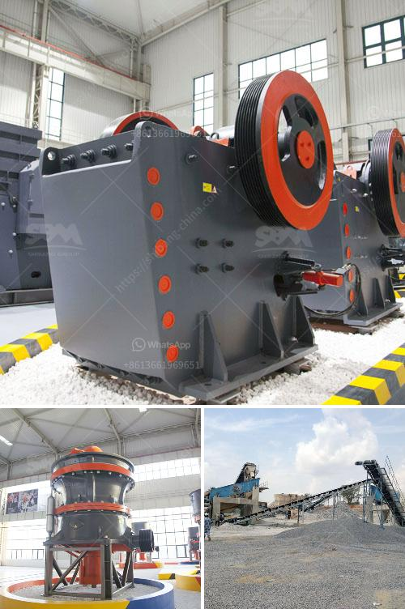

<h3>What does it cost to mill gold ore?</h3>
When it comes to gold mining, one crucial step is the milling of the extracted gold ore into fine powder for further processing. As such, understanding the cost associated with this process is essential for efficient and profitable extraction.

The milling process involves various steps that transform raw gold ore into a concentrated powder, ready for further refinement. Let's take a closer look at the cost factors involved in milling gold ore.

1. Geographical location: The cost associated with milling gold ore depends on the location of the mine. Factors such as transportation expenses, availability of electricity, and labor costs may vary between regions or countries. Remote locations may require additional logistical planning and infrastructure development, resulting in higher milling costs.

2. Ore grade: The quality of the gold ore plays a significant role in determining the cost of milling. High-grade ores require less processing and produce higher yields of gold per tonne of ore. Lower grade ores, on the other hand, often require more intensive processing methods, increasing the cost per ounce of gold produced.

3. Equipment and infrastructure: Milling gold ore requires specialized equipment, including crushers, pulverizers, and grinding mills. The cost of purchasing or renting this machinery can be substantial. Additionally, maintaining and repairing the equipment can add to the overall cost. Infrastructure, such as power supply, water sources, and waste management systems, also contribute to the expenses associated with milling.

4. Energy consumption: The milling process consumes a significant amount of energy. Factors like the hardness of the ore and the desired fineness of the final powder impact energy requirements. Energy costs, including electricity or fuel, are significant contributors to the overall milling cost.

5. Labor and safety: Skilled personnel are required to operate and maintain the milling equipment. The cost of hiring skilled workers, training, and providing a safe work environment can add to the overall expenses. Ensuring compliance with safety regulations and reducing accidents is crucial but also contributes to the cost.

6. Environmental regulations: Mining operations must comply with environmental regulations, which often entail additional costs. Proper waste management, water treatment, and remediation efforts are necessary for sustainable and responsible gold mining. Meeting these regulatory requirements may involve investing in sophisticated systems or technologies that affect the cost of milling gold ore.

7. Ancillary processes: Gold milling is just one step in the overall gold extraction process. Other processes, such as leaching or flotation, may be needed to further extract gold from the concentrate. These ancillary processes come with their own cost factors, which should be considered when evaluating the overall cost of milling gold ore.

In conclusion, the cost of milling gold ore varies depending on several factors, including the geographical location of the mine, ore grade, equipment and infrastructure requirements, energy consumption, labor and safety considerations, environmental regulations, and ancillary processes. Understanding these factors and finding ways to optimize each step can help reduce milling costs and improve overall profitability in gold mining operations.
<h3>Contact us</h3><ul><li><strong>Whatsapp:&nbsp;<a href="https://wa.me/8613661969651">+8613661969651</a></strong></li><li><a href="https://swt.shibang-china.com/?git&amp;zhl&amp;What does it cost to mill gold ore"><strong>Online Service(chat now)</strong></a></li></ul><h3>Related</h3><ul><li><a href='What is Raymond mill and ball mill process .md'>What is Raymond mill and ball mill process ?</a></li><li><a href='What are the main current crusher and which is good.md'>What are the main current crusher and which is good?</a></li><li><a href='What equipment is used on a bauxite site.md'>What equipment is used on a bauxite site?</a></li><li><a href='What is the applicability of a jaw crusher.md'>What is the applicability of a jaw crusher?</a></li><li><a href='What kind of quartz can be used in the paint industry and how to get it.md'>What kind of quartz can be used in the paint industry and how to get it?</a></li></ul>