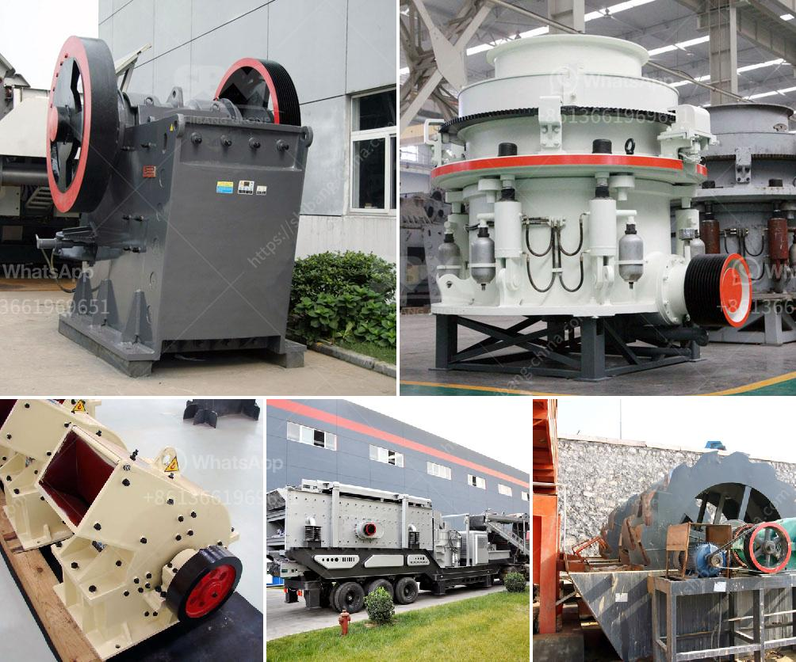

<h3>What equipment can be used to crush 6 mm aggregate into dust?</h3>
Crushing 6 mm aggregate into dust can be a challenging task. However, with the right equipment, it can be accomplished efficiently and effectively. In this article, we will explore various equipment options that can be used to crush 6 mm aggregate into dust.

1. Jaw Crusher: A jaw crusher is a heavy-duty machine that uses compressive force to crush hard materials. It consists of a fixed plate and a movable plate, with the movable plate moving back and forth to crush the aggregate against the fixed plate. Jaw crushers are commonly used in mining and construction industries, and they are capable of crushing large quantities of aggregate into smaller sizes.

2. Cone Crusher: A cone crusher operates on the principle of compression crushing. It uses a mantle that gyrates within a concave bowl to crush the aggregate between them. Cone crushers are widely used in the mining and aggregate industries, as they can effectively crush various types of materials, including hard and abrasive ones.

3. Impact Crusher: An impact crusher uses impact force to crush aggregate into dust. It consists of a rotor equipped with blow bars that strike the aggregate and break it into smaller pieces. Impact crushers are versatile machines that can handle both primary and secondary crushing operations. They are commonly used in recycling and construction sites to crush various materials, including concrete and asphalt.

4. Hammer Mill: A hammer mill is a machine that uses rotating hammers or knives to crush aggregate into dust. It is particularly suitable for crushing brittle materials, such as limestone or coal. Hammer mills are often used in mining and metallurgical industries, as well as in the production of construction aggregates.

5. Vertical Shaft Impactor (VSI): A VSI crusher utilizes velocity rather than force to crush aggregate into dust. It consists of a high-speed rotor that throws the aggregate against a stationary anvil, breaking it into smaller pieces. VSI crushers are primarily used in the production of manufactured sand and cubical-shaped aggregates.

6. Roller Crusher: A roller crusher is a machine that uses a pair of parallel cylindrical rollers to crush aggregate into dust. The rollers rotate in opposite directions, compressing the aggregate between them. Roller crushers are commonly used in the mining and construction industries, as they can efficiently crush hard materials and produce a consistent product shape.

In conclusion, various types of equipment can be used to crush 6 mm aggregate into dust. The choice of equipment depends on factors such as the desired aggregate shape, the hardness of the materials, and the required production capacity. Jaw crushers, cone crushers, impact crushers, hammer mills, vertical shaft impactors, and roller crushers are all viable options to accomplish this task. It is important to select the appropriate equipment based on the specific crushing requirements to ensure efficient and cost-effective operations.
<h3>Contact us</h3><ul><li><strong>Whatsapp:&nbsp;<a href="https://wa.me/8613661969651">+8613661969651</a></strong></li><li><a href="https://swt.shibang-china.com/?git&amp;zhl&amp;What equipment can be used to crush 6 mm aggregate into dust"><strong>Online Service(chat now)</strong></a></li></ul><h3>Related</h3><ul><li><a href='What is the difference between a singletoggle and doubletoggle crusher.md'>What is the difference between a single-toggle and double-toggle crusher?</a></li><li><a href='What are the functions of a gyratory crusher in mining.md'>What are the functions of a gyratory crusher in mining?</a></li><li><a href='What is receiving feeder in a crusher.md'>What is receiving feeder in a crusher?</a></li><li><a href='What machines are used in mines.md'>What machines are used in mines?</a></li><li><a href='What is the capacity of the mobile crushers.md'>What is the capacity of the mobile crushers?</a></li></ul>