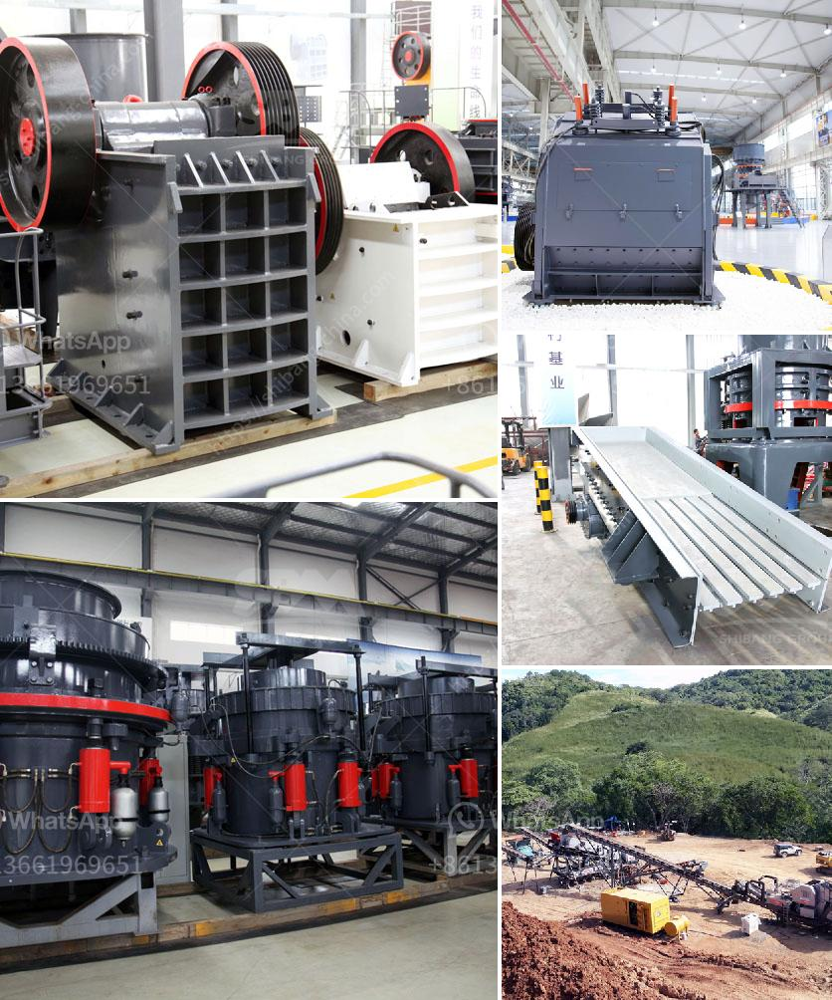

<h3>What equipment do you need for coal mining?</h3>
Coal mining is a highly technical and complex process that requires various types of equipment to extract, process, and transport coal to power plants or export terminals. Coal mining equipment plays a crucial role in the productivity and efficiency of coal mining operations. Let's take a closer look at some of the equipment commonly used in coal mining.

One of the primary pieces of equipment used in coal mining is the continuous miner. This machine is responsible for cutting coal from the seam, which is then loaded onto conveyors or shuttle cars for transport to the surface. Continuous miners come in different sizes and models, each suited for specific mining conditions. These machines are equipped with a cutting head that rotates to break coal from the seam while a conveyor system transports the coal to the surface.

Another critical piece of equipment is the roof bolter. As its name suggests, the roof bolter is used to install roof bolts for the prevention of roof collapse in the underground mining process. These bolts secure the roof to the walls and maintain the stability of the mine. Without roof bolters, workers would be at risk due to potential cave-ins.

Conveyors are an integral part of the coal mining process. They are used to transport coal from one location to another, such as from the continuous miner to the surface or from the surface to the processing plant. Depending on the distance and terrain, conveyors can be stationary or mobile, and they are designed to handle various capacities and types of coal.

Mining trucks are also essential in coal mining operations. These trucks are used to transport the extracted coal from the mining area to the processing plant or storage area. They are built to withstand heavy loads and challenging terrain. Some mining trucks can carry up to 400 tons of coal in a single trip.

In addition to these primary pieces of equipment, coal mining also relies on auxiliary equipment to support the mining process. For instance, rock dusters are used to prevent the spread of coal dust, reducing the risk of a potential explosion. Ventilation systems are installed to ensure proper airflow, removing harmful gases and maintaining a safe environment for workers. Other auxiliary equipment includes pumps, generators, lighting systems, and safety equipment.

It is important to note that the type and size of equipment used in coal mining may vary depending on the mining method employed. For example, underground mining requires different equipment compared to surface or open-pit mining. The specific geological conditions of the mine and the accessibility of the coal seam also play a role in determining the equipment needed.

In conclusion, coal mining requires a range of equipment to extract, process, and transport coal efficiently and safely. From continuous miners to roof bolters, conveyors to mining trucks, each piece of equipment plays a crucial role in the coal mining process. Additionally, auxiliary equipment such as rock dusters and ventilation systems ensure the safety of workers and the smooth operation of the mining site. The selection of equipment depends on various factors, including mining method, geological conditions, and coal seam accessibility.
<h3>Contact us</h3><ul><li><strong>Whatsapp:&nbsp;<a href="https://wa.me/8613661969651">+8613661969651</a></strong></li><li><a href="https://swt.shibang-china.com/?git&amp;zhl&amp;What equipment do you need for coal mining"><strong>Online Service(chat now)</strong></a></li></ul><h3>Related</h3><ul><li><a href='What are the fields of coal crushing equipment .md'>What are the fields of coal crushing equipment ?</a></li><li><a href='What machines do stone crushing plants need？.md'>What machines do stone crushing plants need？</a></li><li><a href='What are the limitations affecting the ball mill feed.md'>What are the limitations affecting the ball mill feed?</a></li><li><a href='What is the best jaw crusher for coal processing.md'>What is the best jaw crusher for coal processing?</a></li><li><a href='What good sand making equipment manufacturers are there.md'>What good sand making equipment manufacturers are there?</a></li></ul>