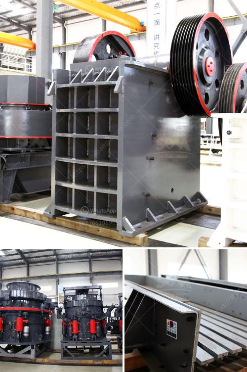

<h3>What equipment do you need to start a quarry business?</h3>
Starting a quarry business involves substantial investment in terms of time, energy, and finances. To ensure the successful launch of your endeavor, it is vital to understand the equipment required for the job. This article outlines the equipment you need to start a quarry business, helping you make informed decisions while planning your venture.

1. Excavators: Excavators are crucial for digging and removing large quantities of earth, rocks, and gravel from the quarry site. These heavy-duty machines come in various sizes, capable of handling different workloads. Select an excavator appropriate for your quarry size and production requirements.

2. Wheel Loaders: Wheel loaders are essential for transporting and loading extracted materials onto trucks. Their ability to maneuver in tricky terrains makes them ideal for quarry operations. Choose loaders with high lift capacity and dump height to ensure efficient loading.

3. Crushers: Crushers are indispensable for processing quarried materials into smaller, more manageable sizes. They reduce rocks and stones to specific dimensions, facilitating their transport and further processing. Jaw crushers, cone crushers, or impact crushers are commonly used in quarries.

4. Screens: Screens are essential for sorting and separating different sizes of stones and rocks after crushing. Vibrating screens, inclined screens, or flat screens can be employed, depending on the desired final product size. Investing in high-quality screens improves overall efficiency and product quality.

5. Conveyors: Conveyors transport extracted materials from one processing stage to another. These machines save time, effort, and human resources, ensuring a smooth and continuous workflow. Opt for conveyors with adjustable speed, length, and inclination to suit your quarry layout and operational needs.

6. Drilling Machines: Drilling machines are used to create holes in the earth's surface, enabling the insertion of explosives for controlled fragmentation. These machines are vital for the initial development of a quarry. Some quarries also require drilling rigs for water well drilling or exploratory drilling.

7. Blasting Tools: Blasting tools, such as explosives and detonators, are necessary for breaking large rocks into smaller pieces during quarrying. Qualified personnel with expertise in handling explosives should be employed to ensure safety and compliance with regulations.

8. Dump Trucks: Dump trucks are crucial for transporting large quantities of extracted materials from the quarry to the processing site or market. Choose dump trucks with robustness, high load capacity, and fuel efficiency to optimize productivity and reduce operational costs.

9. Maintenance Equipment: Maintaining your quarry machinery is essential for ensuring long-term productivity and minimizing downtime. Equipment such as lubrication systems, oil filters, and spare parts should be readily available to promptly address any issues.

10. Safety Equipment: Prioritize the safety of your workforce by investing in personal protective equipment (PPE), including helmets, safety goggles, gloves, and high-visibility clothing. Ensure fire extinguishers and safety signage are in place, and provide adequate training for all workers.

Starting a quarry business requires careful planning, financial analysis, and thorough market research. Understanding the necessary equipment is a crucial step in this process. Consider factors such as quarry size, expected production volume, and resource availability when selecting the equipment. By making informed decisions and investing wisely, you can establish a successful quarry business.
<h3>Contact us</h3><ul><li><strong>Whatsapp:&nbsp;<a href="https://wa.me/8613661969651">+8613661969651</a></strong></li><li><a href="https://swt.shibang-china.com/?git&amp;zhl&amp;What equipment do you need to start a quarry business"><strong>Online Service(chat now)</strong></a></li></ul><h3>Related</h3><ul><li><a href='What does a cone crusher do .md'>What does a cone crusher do ?</a></li><li><a href='What is construction waste and what can we do to reuse it.md'>What is construction waste, and what can we do to reuse it?</a></li><li><a href='What kind of crusher is used to create railway ballast.md'>What kind of crusher is used to create railway ballast?</a></li><li><a href='What guards should be installed on a jaw crusher.md'>What guards should be installed on a jaw crusher?</a></li><li><a href='What is the purpose of using hydraulic cylinders in cone crushers.md'>What is the purpose of using hydraulic cylinders in cone crushers?</a></li></ul>