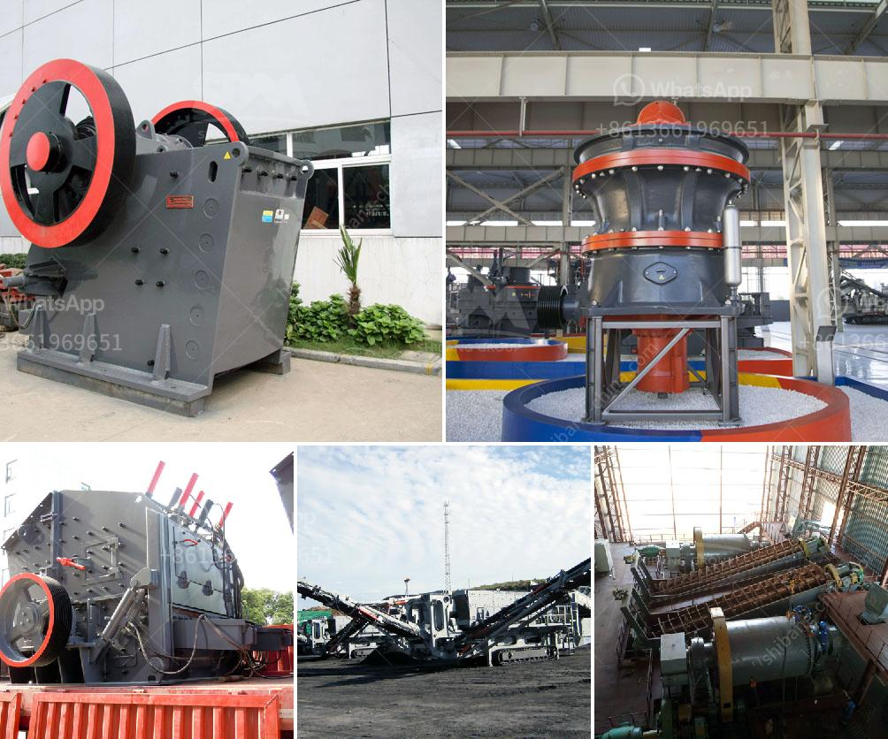

<h3>What equipment is necessary for crushing pumice?</h3>
Pumice is a unique volcanic rock that is commonly used in various industries, such as construction, horticulture, and abrasive manufacturing. It is known for its lightweight and porous properties, making it an ideal material for many applications. However, before pumice can be utilized, it needs to go through a crushing process to achieve its desired size and consistency. In this article, we will explore the necessary equipment for crushing pumice.

One of the most common methods of crushing pumice is the use of a jaw crusher. This machine, also known as a primary crusher, operates by compressing large chunks of pumice into smaller particles. The jaw crusher relies on a pair of jaws, one fixed and one moving, to achieve this task. The movable jaw applies force onto the pumice and gradually breaks it down into smaller pieces.

In addition to a jaw crusher, a secondary crusher such as a cone crusher or impact crusher is often used to further process the crushed pumice. These machines are designed to break down the particles even finer, resulting in a more uniform and consistent product. Cone crushers operate by squeezing the pumice between an eccentrically gyrating mantle and a concave liner, while impact crushers use rapid impact forces to crush the material.

After the initial crushing process, pumice may still need to undergo additional stages of size reduction. This can be achieved using equipment such as hammer mills or roller crushers. Hammer mills consist of rotating hammers mounted on a rapidly rotating rotor. The hammers strike and break the pumice, reducing it to the desired size. Roller crushers utilize two large rollers that rotate in opposite directions, squeezing and crushing the pumice between them.

Once the pumice has been crushed to the desired size, it may need to undergo further processing to remove impurities and achieve the desired quality. This can be done using equipment such as vibrating screens or air classifiers. Vibrating screens separate the crushed pumice into different size fractions, while air classifiers use air flow and gravitational forces to separate the pumice based on density.

It is important to note that the specific equipment required for crushing pumice may vary depending on the intended application and desired final product specifications. Some industries may require additional equipment, such as conveyors or storage bins, to facilitate the handling and transport of the crushed pumice. It is crucial to consult with industry experts or equipment suppliers to determine the most suitable equipment for your specific needs.

In conclusion, crushing pumice requires specialized equipment to achieve the desired size and consistency. A combination of primary and secondary crushers, as well as additional equipment for size reduction and processing, is often necessary. The selection of the appropriate equipment depends on various factors, such as the intended application and desired final product specifications. By understanding the equipment requirements, industries can effectively utilize pumice in their processes, unlocking its unique properties and benefits.
<h3>Contact us</h3><ul><li><strong>Whatsapp:&nbsp;<a href="https://wa.me/8613661969651">+8613661969651</a></strong></li><li><a href="https://swt.shibang-china.com/?git&amp;zhl&amp;What equipment is necessary for crushing pumice"><strong>Online Service(chat now)</strong></a></li></ul><h3>Related</h3><ul><li><a href='What is the selling price of the hammer crusher.md'>What is the selling price of the hammer crusher?</a></li><li><a href='What is the cost of gravel crushing .md'>What is the cost of gravel crushing ?</a></li><li><a href='What does a compound pendulum jaw crusher.md'>What does a compound pendulum jaw crusher?</a></li><li><a href='What is the bearing specification for an impact crusher.md'>What is the bearing specification for an impact crusher?</a></li><li><a href='What should you pay attention to in iron ore mining.md'>What should you pay attention to in iron ore mining?</a></li></ul>