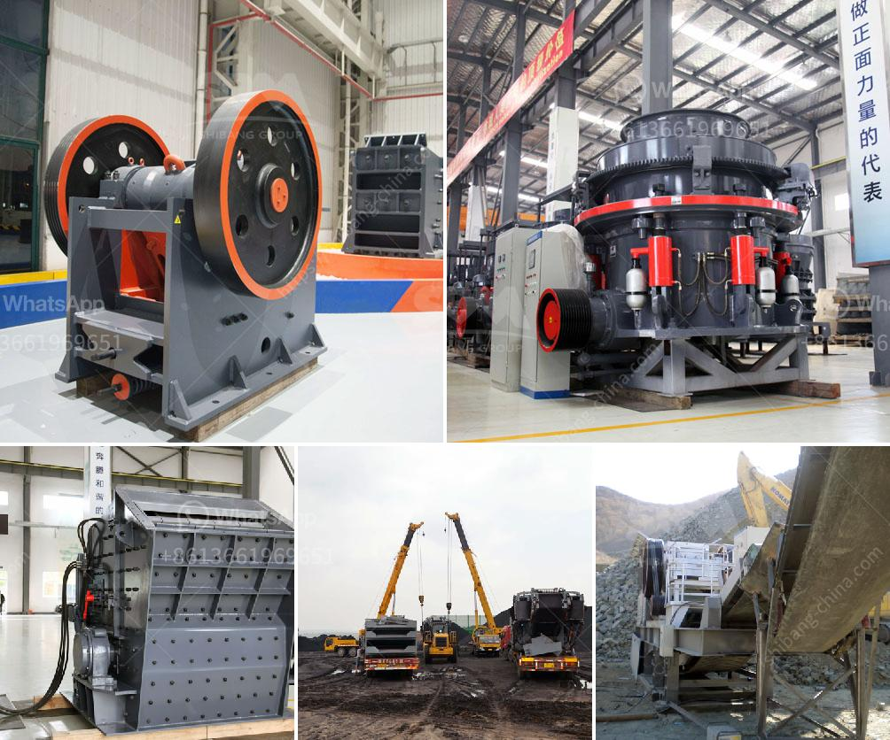

<h3>What equipment is required for a large quarry?</h3>
Operating a large quarry can be a complex task that requires a range of heavy machinery. From excavators and bulldozers to rock crushers and screens, there are many essential pieces of equipment involved in extracting and processing stone, gravel, and other materials. In this article, we will explore the various types of equipment that are required for a large quarry operation.

1. Excavators: Excavators are the workhorses of a quarry. These powerful machines are used for digging and loading large quantities of material such as overburden, soil, and rocks. With their hydraulic systems and attachments like buckets and rippers, excavators are crucial for quarrying operations.

2. Bulldozers: Quarry sites often require the use of bulldozers to clear land and access the different areas of the quarry. Bulldozers are used for pushing and leveling heavy materials, as well as creating access roads within the site.

3. Wheel Loaders: Wheel loaders are versatile machines that are used to transport materials within the quarry. These vehicles are equipped with large front buckets and are ideal for loading trucks with stone, gravel, or other extracted materials.

4. Rock Crushers: To extract useful materials from the quarry, rock crushers are needed. These powerful machines break down large rocks into smaller, more manageable sizes. Jaw crushers, gyratory crushers, and cone crushers are common types of rock crushers used in quarries.

5. Screens: Screens are essential for segregating different sizes of crushed stones and aggregates. Vibrating screens or static screens effectively separate the material into distinct sizes, allowing for the saleable products to be extracted from the quarry.

6. Conveyors: Conveyors play a vital role in the transportation of materials within the quarry. They are used to continuously move bulk materials, such as stone, gravel, or sand, from one processing area to another. This saves time and decreases manual labor requirements.

7. Crushers and Screens: In addition to rock crushers, quarries often require specialized equipment for processing materials. These may include cone crushers, impact crushers, and vibrating screens. These machines further break down and sort the extracted materials into specific sizes, enabling the production of various products depending on customer requirements.

8. Dust Suppression Systems: Dust suppression systems are crucial in large quarries due to the potential for dust generated during the extraction and crushing process. The use of water sprays, misting systems, or foam sprays can help minimize the spread of dust and create a safer working environment for quarry workers.

9. Drilling Equipment: Some quarries require drilling equipment to create holes for blasting. This equipment is typically used to break up large pieces of rock or for drilling blast holes to place explosive materials.

10. Dump Trucks: Once materials have been extracted and processed, dump trucks are used to transport them for sale or further processing. These large vehicles are designed to carry heavy loads and are an integral part of quarry operations.

In conclusion, operating a large quarry requires a diverse range of equipment. From excavation and rock crushing to screening and material transport, each piece of machinery plays a vital role in the extraction and processing of materials. Investing in high-quality equipment is essential for achieving efficiency, productivity, and profitability in quarry operations.
<h3>Contact us</h3><ul><li><strong>Whatsapp:&nbsp;<a href="https://wa.me/8613661969651">+8613661969651</a></strong></li><li><a href="https://swt.shibang-china.com/?git&amp;zhl&amp;What equipment is required for a large quarry"><strong>Online Service(chat now)</strong></a></li></ul><h3>Related</h3><ul><li><a href='What is the application of a ball mill.md'>What is the application of a ball mill?</a></li><li><a href='What type of crusher is used for iron ore？.md'>What type of crusher is used for iron ore？</a></li><li><a href='What is the beneficiation technique for marble.md'>What is the beneficiation technique for marble?</a></li><li><a href='What type of quarry crusher is .md'>What type of quarry crusher is ?</a></li><li><a href='What is a ball mill for .md'>What is a ball mill for ?</a></li></ul>