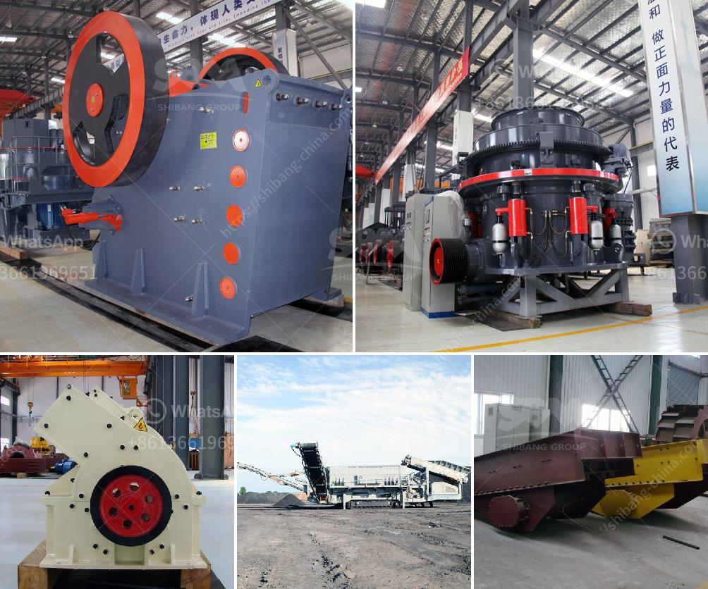

<h3>What equipment is required for quartz sand production?</h3>
Quartz sand is a key raw material for the production of a wide range of products, such as glass, ceramics, and electronic devices. It is a naturally occurring mineral that is abundant in many parts of the world, making it a cost-effective and versatile material. However, before quartz sand can be used in various industries, it must undergo a production process that requires specific equipment. In this article, we will explore the equipment required for quartz sand production.

1. Crushers: Crushers are machines used to reduce the size of quartz stones or rocks into smaller particles. They are typically used in the initial crushing stage of quartz sand production. Jaw crushers, cone crushers, or impact crushers can be used, depending on the specific requirements of the production process.

2. Vibrating feeders: Vibrating feeders are essential equipment for the even distribution of quartz stones or rocks to the crushers. They ensure a continuous and controlled flow of materials, preventing any blockages or irregularities in the production process.

3. Belt conveyors: Belt conveyors are used to transport crushed quartz materials from crushers to the next stage of the production process. They are durable, reliable, and highly efficient in handling bulk materials, making them essential equipment for quartz sand production.

4. Vibrating screens: Vibrating screens are used to separate quartz sand particles of different sizes. They consist of multiple layers of screens with different mesh sizes, allowing for the classification of quartz sand into various grades. Vibrating screens ensure that only particles within the desired size range are used in the production process, improving the quality of the final product.

5. Sand washing machines: Sand washing machines are used to remove impurities and foreign materials from quartz sand. They employ water and a combination of mechanical and chemical actions to clean and purify the sand. Sand washing machines enhance the quality of quartz sand by removing clay, silt, and other contaminants, making them a crucial component of the production process.

6. Drying machines: Drying machines are used to remove moisture from washed quartz sand. Excess moisture can negatively affect the performance and quality of the final product, making it essential to dry the sand thoroughly. Drying machines use hot air or other drying methods to evaporate moisture, ensuring that the quartz sand is ready for further processing.

7. Storage and handling equipment: Once quartz sand is produced and processed, it needs to be stored and handled properly to prevent contamination or degradation. Silos, hoppers, and conveyor systems are commonly used to store and transport quartz sand to its final destination.

In conclusion, quartz sand production requires a range of specialized equipment to ensure the efficient extraction, processing, and handling of this valuable raw material. Crushers, vibrating feeders, belt conveyors, vibrating screens, sand washing machines, drying machines, and storage and handling equipment are all essential components of the production process. Having the right equipment in place ensures the production of high-quality quartz sand that meets the specific requirements of various industries.
<h3>Contact us</h3><ul><li><strong>Whatsapp:&nbsp;<a href="https://wa.me/8613661969651">+8613661969651</a></strong></li><li><a href="https://swt.shibang-china.com/?git&amp;zhl&amp;What equipment is required for quartz sand production"><strong>Online Service(chat now)</strong></a></li></ul><h3>Related</h3><ul><li><a href='What are the mechanical devices used in mining What is the role of each.md'>What are the mechanical devices used in mining? What is the role of each?</a></li><li><a href='What is a single toggle jaw crusher.md'>What is a single toggle jaw crusher?</a></li><li><a href='what is the quarrying process？.md'>what is the quarrying process？</a></li><li><a href='What is the flywheel size and weight in a jaw crusher.md'>What is the flywheel size and weight in a jaw crusher?</a></li><li><a href='What is the difference between impact cone jaw crushers .md'>What is the difference between impact cone jaw crushers ?</a></li></ul>