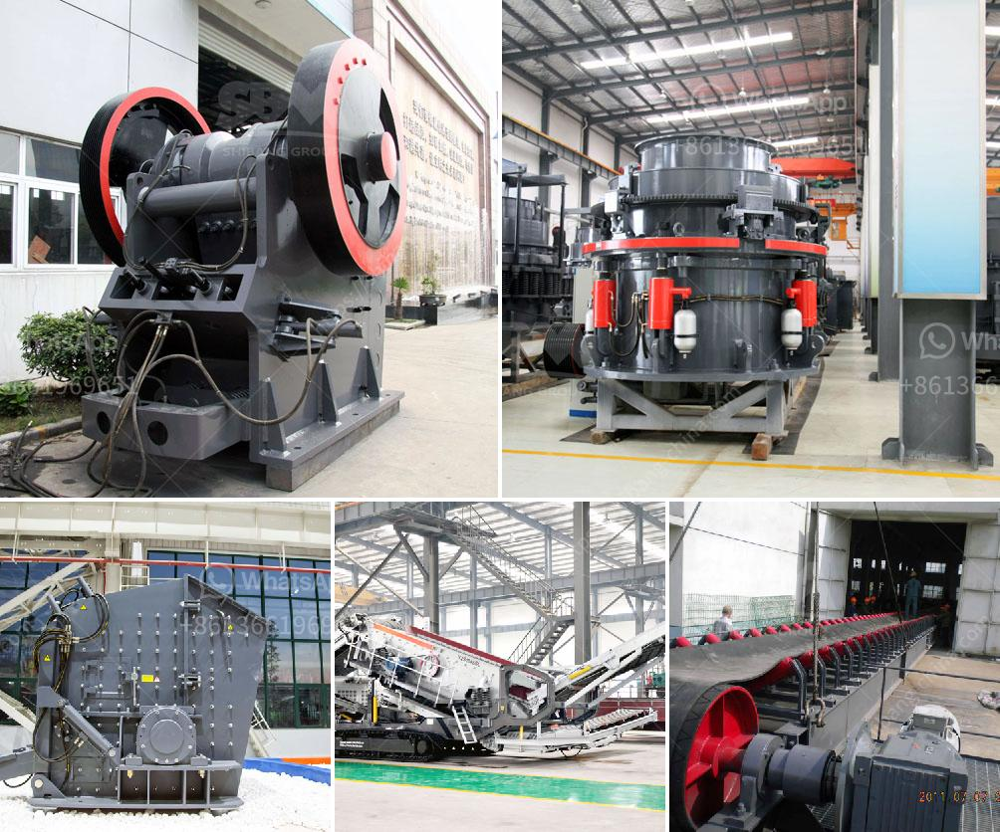

<h3>What equipment is used for silver mining?</h3>
Silver is a precious metal that has been widely used for various purposes throughout history. From jewelry to coins and from industrial applications to photography, silver has played a significant role in various industries. However, to harness this versatile metal, the process of mining is crucial. So, what equipment is used for silver mining?

The process of silver mining involves several steps, including exploration, extraction, and refining. Each step requires specific equipment to ensure the efficient and safe retrieval of silver ore.

The first step in silver mining is exploration. This involves identifying potential sites for silver deposits. Geologists use a variety of tools and equipment to assess the geological characteristics of an area. These may include satellite imagery, geophysical surveys, and core sampling. Satellite imagery provides an overview of the terrain and helps identify areas with potential silver deposits. Geophysical surveys involve using instruments to measure anomalies in the Earth's magnetic field and electrical conductivity. Core sampling involves drilling small holes into the ground to collect rock samples for analysis.

Once a potential silver deposit is identified, the extraction process begins. Several pieces of equipment are employed in this process, depending on the scale and method of extraction. For large-scale mining operations, heavy machinery such as excavators, trucks, and bulldozers are used to remove the overburden and access the silver-bearing layers of soil or rock. These machines are typically equipped with powerful engines and hydraulic systems to handle the challenging terrains and heavy loads.

In underground silver mining, miners use specialized equipment to access the silver veins. Tunnelling machines and drill jumbos are used to create tunnels and drill holes into the rock. Once the tunnels are established, miners use equipment such as loaders and trucks to remove the silver-bearing ore from the underground site. Safety equipment such as helmets, respirators, and personal protective gear are also essential to protect the miners during the extraction process.

After the ore is extracted, it undergoes further processing to obtain pure silver. This typically involves crushing and grinding the ore into a fine powder. Several types of crushers, mills, and screens are used in this process. The crushed ore is then treated with chemicals to separate the silver from the other minerals. Flotation cells and magnetic separators are commonly used in this stage of the process.

Finally, the extracted silver goes through a refining process to eliminate impurities and achieve a high level of purity. Equipment such as furnaces, electrolytic cells, and filters are used during the refining process. Silver bars or pellets are the final result, ready to be used in various industries and applications.

In conclusion, the silver mining process requires a range of equipment to locate, extract, and refine the precious metal. From satellite imagery to heavy machinery, the process is complex and well-suited to advancements in technology. As mining companies continue to innovate and improve efficiency, equipment used for silver mining will likely see further advancements to ensure the sustainable and responsible extraction of this valuable resource.
<h3>Contact us</h3><ul><li><strong>Whatsapp:&nbsp;<a href="https://wa.me/8613661969651">+8613661969651</a></strong></li><li><a href="https://swt.shibang-china.com/?git&amp;zhl&amp;What equipment is used for silver mining"><strong>Online Service(chat now)</strong></a></li></ul><h3>Related</h3><ul><li><a href='What is vsi in mobile stone jaw crusher.md'>What is vsi in mobile stone jaw crusher</a></li><li><a href='What is the process for mining manganese ore.md'>What is the process for mining manganese ore?</a></li><li><a href='what does a raymond coal mill cost？.md'>what does a raymond coal mill cost？</a></li><li><a href='What are the models of Raymond mill.md'>What are the models of Raymond mill?</a></li><li><a href='What are the byproducts of mining quartz.md'>What are the byproducts of mining quartz?</a></li></ul>