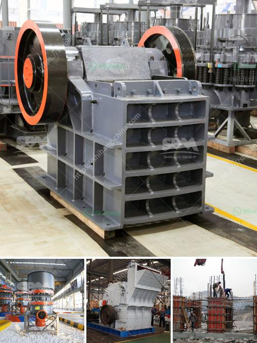

<h3>What equipment is used in salt mining?</h3>
Salt mining is an essential process that involves the extraction of salt from underground deposits for various purposes. Over the years, the techniques and equipment used in salt mining have evolved, making the process more efficient and safe. Let's delve into the types of equipment commonly used in salt mining and how they contribute to this important industry.

First and foremost, drilling is a crucial step in salt mining. Drill rigs with rotary or percussive drilling methods are used to create holes in the ground. Rotary drill rigs are commonly used in large-scale operations and employ a rotating drill bit to penetrate the earth. Percussive drill rigs, on the other hand, use repetitive hammering force to break into the salt deposits. These drilling techniques are effective in accessing the salt deposits buried deep underground.

Once the holes are drilled, explosives are used to break up the salt deposit. Bulk explosives, such as ammonium nitrate, are commonly used due to their ability to fragment large quantities of salt at once. Controlled explosion techniques ensure the safety of the workers and minimize the chances of damage to surrounding infrastructure.

After the explosive charge is detonated, the mining process moves to the loading phase. Loaders, commonly known as front-end loaders, are used to extract the loosened salt from the mine face. These powerful machines are equipped with large buckets that can carry significant amounts of salt in a single scoop. Loaders are widely used in both underground and surface salt mining operations due to their versatility and high productivity.

Once the salt is loaded, it needs to be transported out of the mine for processing and distribution. Conveyors play a vital role in this process, efficiently moving the salt from the mine to the surface. Belt conveyors are commonly used in salt mining and are capable of transporting large quantities of salt over long distances. They are robust and reliable, minimizing downtime and ensuring a continuous flow of salt.

In addition to drilling, blasting, loading, and transportation equipment, various support equipment is crucial for smooth salt mining operations. This includes roof bolters, which are used to stabilize the mine roof to prevent collapses, and ventilation systems to ensure that fresh air is circulated throughout the mine. Additionally, water management systems, such as pumps and drainage systems, play a crucial role in salt mining, ensuring a safe working environment and preventing flooding.

Safety is of paramount importance in salt mining, and equipment plays a crucial role in ensuring the well-being of workers. Personal protective equipment (PPE), including hard hats, safety glasses, gloves, and high-visibility clothing, are essential for providing protection against potential hazards. Moreover, advanced monitoring systems, such as gas detectors and mine tracking systems, are employed to detect any potential risks in real-time.

In conclusion, salt mining involves the use of several specialized pieces of equipment to extract salt from underground deposits efficiently. Drill rigs, explosives, loaders, conveyors, and support equipment are all crucial to ensure a smooth and safe mining operation. As the salt industry continues to advance, new and improved equipment is being developed to enhance productivity and safety in this essential industry.
<h3>Contact us</h3><ul><li><strong>Whatsapp:&nbsp;<a href="https://wa.me/8613661969651">+8613661969651</a></strong></li><li><a href="https://swt.shibang-china.com/?git&amp;zhl&amp;What equipment is used in salt mining"><strong>Online Service(chat now)</strong></a></li></ul><h3>Related</h3><ul><li><a href='What are the mechanical devices used in mining What is the role of each.md'>What are the mechanical devices used in mining? What is the role of each?</a></li><li><a href='What are the advantages of a jaw crusher over the gyratory crusher .md'>What are the advantages of a jaw crusher over the gyratory crusher ?</a></li><li><a href='what is a mobile impactor crusher？.md'>what is a mobile impactor crusher？</a></li><li><a href='What are the investments for a stone crusher.md'>What are the investments for a stone crusher?</a></li><li><a href='What is the process for mining manganese ore.md'>What is the process for mining manganese ore?</a></li></ul>