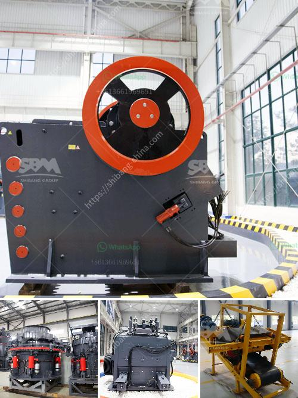

<h3>What equipment is used in the quarry</h3>
A quarry is a site where various types of rocks are extracted from the earth's crust. The process of quarrying involves drilling, blasting, and cutting these rocks into smaller sizes for different construction purposes. Many different types of equipment are required in the quarry to ensure that the work is carried out efficiently and safely. In this article, we will explore some of the equipment commonly used in quarries.

1. Bulldozers: Bulldozers are powerful machines with tracks and blades at the front that are used to push or move large quantities of earth, soil, or rocks. In a quarry, bulldozers are mainly used for leveling or clearing the land, creating access roads, and removing obstacles.

2. Excavators: Excavators are heavy-duty machines with a bucket or a dipper attached to a rotating platform. They are used to dig deep trenches or excavate large quantities of earth or rocks. In a quarry, excavators are used for digging the raw material and loading them onto dump trucks for transportation to the processing plant.

3. Wheel Loaders: Wheel loaders are large machines that have a front-mounted bucket used for scooping and loading materials. They are commonly used in quarries for loading rocks or raw materials onto trucks. Wheel loaders are known for their excellent maneuverability and versatility and are often used for materials handling in a quarry.

4. Drilling Rigs: Drilling rigs are machines equipped with a rotating drill bit used to create holes in the earth's surface for various purposes. In a quarry, drilling rigs are used to create blast holes for explosives or to extract core samples for geological analysis. They are essential for the quarrying process as they help create an efficient and controlled blasting operation.

5. Crushers: Crushers are powerful machines used to reduce the size of rocks or raw materials into smaller, more manageable pieces. There are different types of crushers used in quarries, including jaw crushers, cone crushers, impact crushers, and hammer crushers. They play a crucial role in processing and crushing the extracted rocks into the desired sizes for construction purposes.

6. Conveyors: Conveyors are mechanical devices used to transport heavy materials or goods from one place to another. In a quarry, conveyors are used to transport rocks or raw materials from the extraction site to the processing plant. They help in improving the efficiency and productivity of the quarry operation by reducing manual handling and transportation costs.

7. Dump Trucks: Dump trucks are heavy-duty vehicles used to transport materials, such as rocks or raw materials, from one location to another within the quarry or to external sites. They are commonly used in quarries for carrying large quantities of materials for processing or stockpiling.

In conclusion, various types of equipment are used in a quarry to ensure the efficient and safe extraction of rocks or raw materials. Bulldozers, excavators, wheel loaders, drilling rigs, crushers, conveyors, and dump trucks are some of the commonly used equipment in quarries. Each of these machines plays a crucial role in the quarrying process, and their proper utilization is essential for achieving the desired results in terms of productivity and safety.
<h3>Contact us</h3><ul><li><strong>Whatsapp:&nbsp;<a href="https://wa.me/8613661969651">+8613661969651</a></strong></li><li><a href="https://swt.shibang-china.com/?git&amp;zhl&amp;What equipment is used in the quarry"><strong>Online Service(chat now)</strong></a></li></ul><h3>Related</h3><ul><li><a href='What is the cost of roller mills.md'>What is the cost of roller mills?</a></li><li><a href='what is hammer crusher pakistan？.md'>what is hammer crusher pakistan？</a></li><li><a href='What type of flywheel is used in the double toggle jaw crusher.md'>What type of flywheel is used in the double toggle jaw crusher</a></li><li><a href='What are the mechanical devices used in mining What is the role of each.md'>What are the mechanical devices used in mining? What is the role of each?</a></li><li><a href='What is the capacity of the mobile crushers.md'>What is the capacity of the mobile crushers?</a></li></ul>