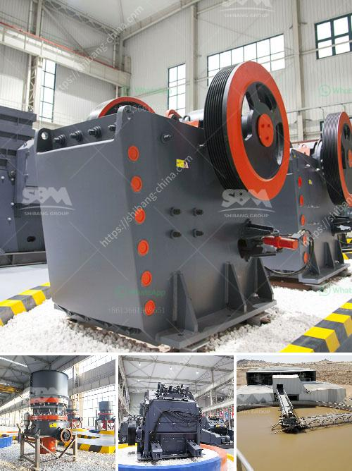

<h3>What equipment is used on a bauxite site?</h3>
Bauxite mining plays a crucial role in the global aluminum industry, as it is the primary source of aluminum ore. Bauxite is a sedimentary rock composed mainly of aluminum-bearing minerals, such as gibbsite, boehmite, and diaspore, which are used to extract aluminum metal through the Bayer process. To facilitate efficient mining and extraction, several types of equipment are deployed on a bauxite site. Let's explore the key machinery and tools utilized in bauxite mining operations.

1. Excavators: Excavators are heavy machines used to dig and remove the overburden, the topsoil covering the bauxite deposit. These powerful machines use buckets to scoop and transport the soil to the designated areas for temporary storage or further processing.

2. Bulldozers: Bulldozers are used to push and remove the larger rocks and debris from the site, creating access roads and leveling the land. Their sturdy blades enable them to handle the tough conditions of the mining site without any difficulty.

3. Haul Trucks: Haul trucks, also known as dump trucks, are oversized vehicles designed for carrying heavy loads. These trucks are responsible for transporting excavated bauxite ore from the mining area to the ore processing plant. Their large capacity greatly aids in improving the efficiency of the mining operations.

4. Crushers: Crushers are used to break the bauxite ore into smaller pieces suitable for processing. The crushing process reduces the size of the ore particles, making it easier to handle and extract the aluminum. Various types of crushers, including jaw crushers, impact crushers, and cone crushers, are commonly used in bauxite crushing circuits.

5. Conveyors: Conveyors are used to transport the crushed bauxite ore from the crushers to the processing plants. They are essential for smooth operations as they eliminate the need for manual handling and reduce the risk of material spills.

6. Screens: Screens are employed to separate the bauxite ore into different sizes required for further processing. These vibrating or rotating screens ensure the uniformity of the ore, allowing efficient downstream processes.

7. Digesters: Digesters are pressure vessels used in the Bayer process to extract alumina from the bauxite ore. Inside these vessels, the bauxite is mixed with a hot caustic soda solution, resulting in a chemical reaction that dissolves the aluminum-bearing minerals. The alumina-rich solution is then further processed to extract aluminum.

8. Settler Tanks: Settler tanks, also known as clarifiers or decanters, are used to separate the alumina from the caustic soda solution after the digestion process. These tanks allow the settling of the solid impurities, leaving behind the clear alumina solution.

9. Calciners: Calciners are high-temperature furnaces used to heat the alumina, transforming it into alumina powder through a process called calcination. The final product, known as calcined alumina, is then utilized in the production of aluminum metal.

Each of these equipment pieces plays a significant role in the efficient extraction and processing of bauxite ore. The use of modern machinery and advanced technologies not only enhances productivity but also ensures worker safety and minimizes environmental impacts. With the continual development of mining equipment, bauxite mining operations continue to evolve, striving for increased efficiency and sustainability.
<h3>Contact us</h3><ul><li><strong>Whatsapp:&nbsp;<a href="https://wa.me/8613661969651">+8613661969651</a></strong></li><li><a href="https://swt.shibang-china.com/?git&amp;zhl&amp;What equipment is used on a bauxite site"><strong>Online Service(chat now)</strong></a></li></ul><h3>Related</h3><ul><li><a href='What equipment is used in the quarry.md'>What equipment is used in the quarry</a></li><li><a href='What is the process that coal goes through to become a finished product.md'>What is the process that coal goes through to become a finished product?</a></li><li><a href='What is the problem with ore mining .md'>What is the problem with ore mining ?</a></li><li><a href='What is the best iron ore mobile crushing plant？.md'>What is the best iron ore mobile crushing plant？</a></li><li><a href='What is the maintenance of a jaw crusher.md'>What is the maintenance of a jaw crusher?</a></li></ul>