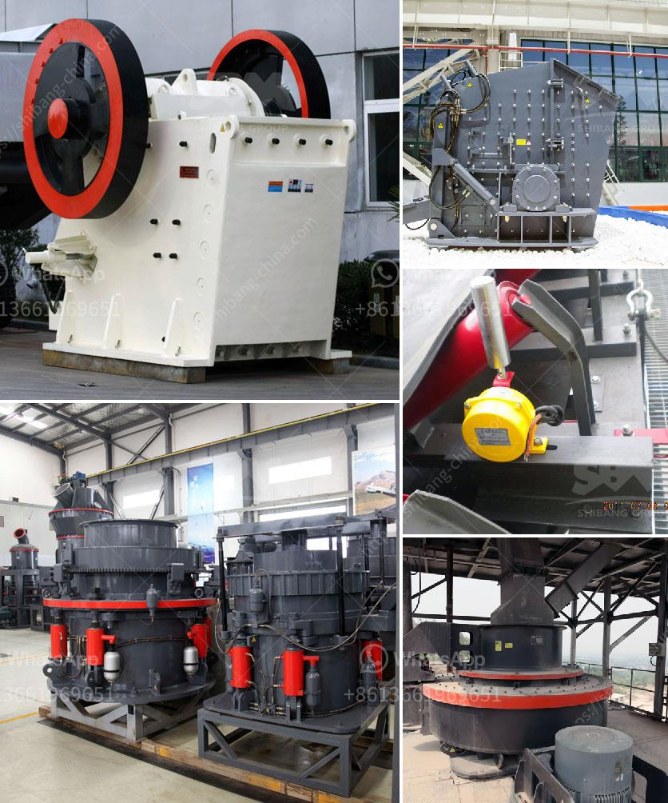

<h3>What equipment is used to extract iron ore ?</h3>
Iron ore is the backbone of modern civilization and its use is instrumental in driving economic growth. The extraction of iron ore is a process that involves machinery, drilling, blasting, crushing, and grinding. This article will discuss the equipment used in the iron ore extraction process.

Iron ore extraction begins with blasting in a mine. Blasting involves drilling holes into the Earth’s surface and filling them with explosives. Once detonated, these explosives break up the rock so that it can be extracted. This is a critical step in mining iron ore, as it helps to break the rock into smaller pieces, making it easier to extract.

Drilling is another crucial step in the iron ore extraction process. Large drills are used to bore holes into the Earth’s crust, which are then filled with explosives. These holes are drilled at predetermined depths and angles to facilitate the blasting process. Drilling is a highly skilled task that requires precision and expertise.

Once the material has been blasted and broken up, it must be removed from the mine site. Haul trucks are large vehicles that transport the ore from the mine to the processing plant. These trucks are specially designed to carry heavy loads and can move large quantities of ore at once.

Loaders are another type of equipment used in the extraction process. They are used to load the ore onto the haul trucks. Loaders are versatile machines that can be used for a variety of tasks, including digging, lifting, and carrying heavy loads.

After the ore has been removed from the mine, it is sent to a processing plant to extract the iron ore. The first step in this process is crushing and grinding the ore. The ores are broken down into small pieces through crushing, and then the pieces are ground to a fine powder through grinding. This process helps to liberate the iron ore particles from the surrounding rock and prepare them for further processing.

Conveyors are an integral part of the iron ore extraction process. They are used to transport the ore from one stage of the process to another. Conveyors come in various sizes and types, depending on the distance and capacity requirements of the mine.

Once the ore has been crushed and ground, it is subjected to magnetic separation. Magnetic separators are used to extract the iron ore particles from the rest of the material. This separation process involves the use of powerful magnets that attract the iron ore particles and separate them from the other minerals.

The extraction of iron ore is a complex process that requires specific equipment for each stage of the process. Blasting, drilling, haul trucks, loaders, crushing and grinding equipment, conveyors, and magnetic separators are all crucial to the iron ore extraction process. These types of equipment work together to break up the rock, remove the ore, crush it to a fine powder, and separate the iron particles from the surrounding minerals. Without this equipment, the extraction of iron ore would be difficult, if not impossible, ensuring that this vital resource is available for use in our daily lives.
<h3>Contact us</h3><ul><li><strong>Whatsapp:&nbsp;<a href="https://wa.me/8613661969651">+8613661969651</a></strong></li><li><a href="https://swt.shibang-china.com/?git&amp;zhl&amp;What equipment is used to extract iron ore "><strong>Online Service(chat now)</strong></a></li></ul><h3>Related</h3><ul><li><a href='What are the spare parts of a stone crusher.md'>What are the spare parts of a stone crusher?</a></li><li><a href='What materials are used in concrete alternatives to sand.md'>What materials are used in concrete alternatives to sand?</a></li><li><a href='What good sand making equipment manufacturers are there.md'>What good sand making equipment manufacturers are there?</a></li><li><a href='What is the best jaw crusher for coal processing.md'>What is the best jaw crusher for coal processing?</a></li><li><a href='What is the procedure for obtaining a stone quarry license.md'>What is the procedure for obtaining a stone quarry license?</a></li></ul>