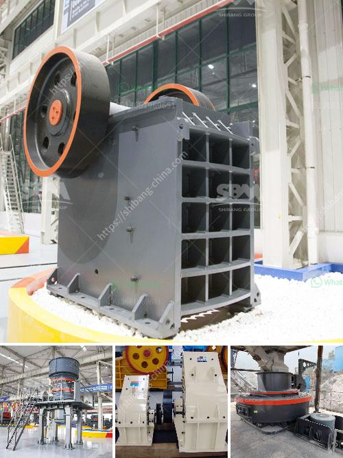

<h3>What equipment is used to mine tungsten stone crusher?</h3>
Tungsten is a rare metal, known for its exceptional hardness and high melting point. It is commonly used in various industries due to its robust properties. Tungsten mining plays a vital role in the production of this valuable metal, and to extract it, specialized equipment is required.

One of the key machines used in tungsten mining is the stone crusher. It is essential for the primary crushing of large rocks and boulders into smaller, more manageable pieces. The crusher reduces the ore size for further processing. Tungsten concentrators generally use jaw crushers or impact crushers to crush the mined ore into smaller sizes.

Jaw crushers are particularly popular due to their relatively simple design and high processing capacity. They consist of a fixed plate and a movable plate. The movable plate moves back and forth, crushing the rocks against the fixed plate. This produces smaller-sized materials, which can then be further processed.

On the other hand, impact crushers utilize the principle of impact or striking to crush the rocks. These crushers have a rotor equipped with hammers. When the rotor spins at high speed, the hammers impact the rocks, causing them to break. The crushed tungsten ore is then guided through a series of screens to sort it into different sizes for further processing.

In addition to crushers, other equipment is essential in tungsten mining operations. For example, conveyors are used to transport the crushed ore from the crusher to the concentrator or processing plant. These conveyor systems help optimize the efficiency of the mining operation by minimizing the time and effort required to move the material.

Another crucial piece of equipment used in tungsten mining is vibrating screens. These screens are used to separate the crushed ore into different sizes based on their particle size. This classification process allows for more efficient processing and ensures that each size fraction undergoes the appropriate beneficiation steps.

Furthermore, mining operations often require loaders or excavators to remove the overburden or waste materials that cover the tungsten ore deposits. These heavy-duty machines provide efficient and rapid removal of unwanted materials, allowing access to the valuable tungsten ore.

A well-designed and reliable stone crusher, along with the necessary supporting equipment, is fundamental for the efficient and productive extraction of tungsten. Mining companies must invest in high-quality machinery that can withstand the demanding conditions of tungsten mining. Additionally, proper maintenance and regular inspections are crucial to ensure the equipment's longevity and prevent unexpected breakdowns.

In conclusion, mining tungsten is a complex operation that requires specialized equipment. Stone crushers, including jaw crushers and impact crushers, play a crucial role in the primary crushing stage. Conveyors, vibrating screens, loaders, and excavators are also essential for efficient tungsten extraction. Investing in reliable and high-quality equipment, along with regular maintenance, is necessary to ensure smooth mining operations and maximize productivity.
<h3>Contact us</h3><ul><li><strong>Whatsapp:&nbsp;<a href="https://wa.me/8613661969651">+8613661969651</a></strong></li><li><a href="https://swt.shibang-china.com/?git&amp;zhl&amp;What equipment is used to mine tungsten stone crusher"><strong>Online Service(chat now)</strong></a></li></ul><h3>Related</h3><ul><li><a href='What are the merits of vibratory screens.md'>What are the merits of vibratory screens?</a></li><li><a href='What equipment is necessary for crushing pumice.md'>What equipment is necessary for crushing pumice?</a></li><li><a href='What are the basic geotechnical issues involved in quarry development.md'>What are the basic geotechnical issues involved in quarry development?</a></li><li><a href='What is the final product of columbite.md'>What is the final product of columbite?</a></li><li><a href='What are the characteristics of the spring cone crusher.md'>What are the characteristics of the spring cone crusher?</a></li></ul>