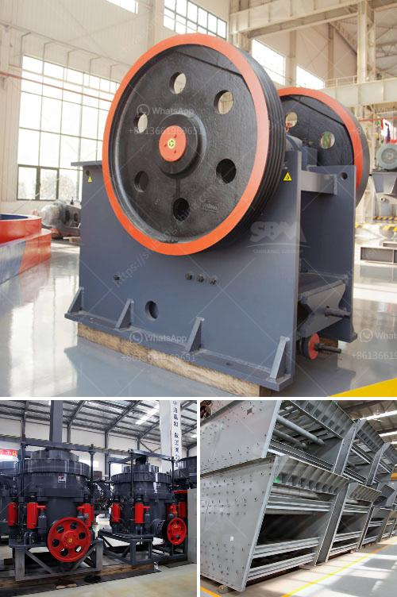

<h3>What good sand making equipment manufacturers are there?</h3>
When it comes to the production of artificial sand, having high-quality sand making equipment is crucial. The efficiency and performance of the equipment can directly impact the quality and quantity of the produced sand. With numerous manufacturers in the market, it becomes necessary to identify the best sand making equipment manufacturers. In this article, we will discuss some of the top manufacturers known for their exceptional equipment.

One of the leading sand making equipment manufacturers is Vipeak Heavy Industry Machinery Co., Ltd. This company has been providing top-notch equipment for many years and has gained a reputation for its excellent performance and reliability. Vipeak's sand making machines are designed with advanced technology, ensuring high efficiency in sand production. Their equipment not only produces high-quality sand but also helps to reduce production costs, making it a preferred choice for many.

Another reputable manufacturer in the industry is Henan Hongxing Mining Machinery Co., Ltd. Their sand making equipment is known for its durability and long lifespan, making it a cost-effective investment for businesses. Hongxing's machines are designed to process various materials, ensuring flexibility and versatility in their applications. The company is also known for its excellent after-sales service, providing prompt assistance and maintenance support to its customers.

Shanghai Shibang Machinery Co., Ltd. is a renowned manufacturer of sand making equipment that has a global presence. Their equipment is popular for its innovative designs and advanced technology. Shibang Machinery's sand making machines are known for their energy efficiency and low maintenance requirements. The company also offers customization options to meet specific customer requirements, further enhancing their reputation in the market.

Zhengzhou Unique Industrial Equipment Co., Ltd. is another reliable manufacturer of sand making equipment. Their machines are robust and designed for heavy-duty operations, ensuring high productivity. Unique Industrial Equipment's sand making machines are equipped with advanced features like automatic control systems, which improve efficiency and reduce human error. The company also offers comprehensive technical support and training programs to their customers, ensuring seamless integration of their equipment into existing operations.

In addition to the above-mentioned manufacturers, there are several other reliable companies in the market. It's essential to thoroughly evaluate their reputation, customer feedback, and product quality before making a purchase decision. Reading online reviews and seeking recommendations from industry experts can help in identifying the most suitable manufacturer for specific requirements.

To conclude, choosing the right sand making equipment manufacturer is vital for producing high-quality artificial sand. Companies like Vipeak Heavy Industry Machinery Co., Ltd., Henan Hongxing Mining Machinery Co., Ltd., Shanghai Shibang Machinery Co., Ltd., and Zhengzhou Unique Industrial Equipment Co., Ltd. are known for their exceptional products and services in the industry. Investing in reliable and efficient sand making equipment will not only improve sand production but also contribute to the overall success and profitability of the business.
<h3>Contact us</h3><ul><li><strong>Whatsapp:&nbsp;<a href="https://wa.me/8613661969651">+8613661969651</a></strong></li><li><a href="https://swt.shibang-china.com/?git&amp;zhl&amp;What good sand making equipment manufacturers are there"><strong>Online Service(chat now)</strong></a></li></ul><h3>Related</h3><ul><li><a href='What is the largest industrial crusher.md'>What is the largest industrial crusher?</a></li><li><a href='What is the difference between a ball mill and a roller mill.md'>What is the difference between a ball mill and a roller mill?</a></li><li><a href='What are the processing equipment for feldspar powder？.md'>What are the processing equipment for feldspar powder？</a></li><li><a href='What kind of mining crusher has a good high yield.md'>What kind of mining crusher has a good high yield?</a></li><li><a href='What is the difference between a wet and dry coal crusher and a hammer crusher.md'>What is the difference between a wet and dry coal crusher and a hammer crusher?</a></li></ul>