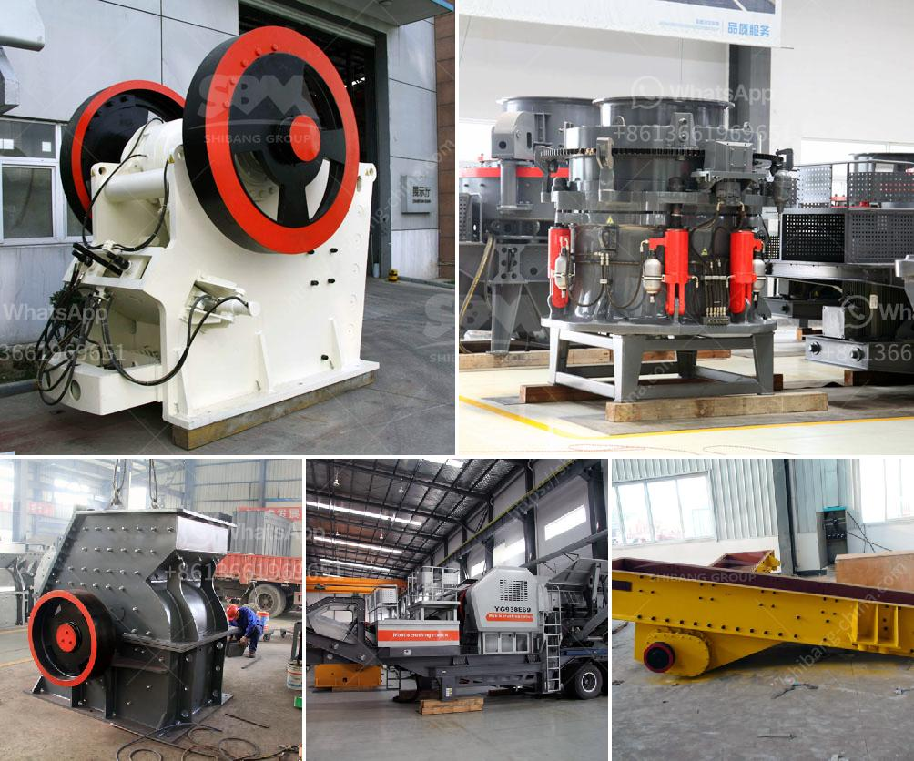

<h3>What guards should be installed on a jaw crusher?</h3>
Jaw crushers are widely used in the mining and construction industry due to their ability to crush large rocks and hard materials into smaller particles. However, they can pose a safety risk if not properly installed and maintained. One crucial component of this equipment is the guards that protect the operator and other workers in the vicinity.

The primary function of guards on a jaw crusher is to protect the operator and prevent accidental injuries during operation. Guards are typically installed on the flywheel and on the opposite side of the machine to prevent any potential direct contact with moving parts. These guards act as a shield, preventing any debris or material from getting trapped in the machine and causing unnecessary damage.

One of the most critical areas where guards are required on a jaw crusher is the flywheel area. The flywheel is a heavy wheel that provides the momentum needed to crush the rocks. If not adequately protected, the flywheel can become a potential hazard. It is essential to install a robust guard around the flywheel to prevent any accidental contact, resulting in severe injuries.

Similarly, guards should also be installed on the opposite side of the machine, where the crushing action takes place. This area is exposed to high forces and vibrations, which can be dangerous if not adequately protected. Guards should be designed to withstand high impacts and provide a barrier between the moving parts and workers nearby.

In addition to protecting the operator and workers, properly installed guards also help maintain the equipment's performance and longevity. By preventing any debris or material from entering the machine, guards ensure the smooth operation of the jaw crusher. They reduce the chances of breakdowns and premature wear and tear, ultimately saving time and money on repairs and replacements.

When choosing guards for a jaw crusher, it is crucial to select high-quality materials that can withstand the forces and impacts of the equipment. Guards should be made of strong materials such as steel or durable polymers that can withstand heavy-duty use. Additionally, guards should be regularly inspected and maintained to ensure their integrity and functionality.

Proper installation of guards on a jaw crusher involves hiring experienced professionals or following the manufacturer's guidelines. It is essential to adhere to the recommended specifications and ensure that the guards are securely fixed in place. Regular inspections and maintenance should be carried out to check for any signs of wear or damage and promptly address any issues.

In conclusion, guarding a jaw crusher is of utmost importance to protect the operator and other workers from injuries. Adequately installed guards not only provide a barrier between the moving parts and individuals but also help maintain the equipment's performance and longevity. Choosing high-quality materials and following proper installation and maintenance guidelines will ensure the safety and efficiency of a jaw crusher.
<h3>Contact us</h3><ul><li><strong>Whatsapp:&nbsp;<a href="https://wa.me/8613661969651">+8613661969651</a></strong></li><li><a href="https://swt.shibang-china.com/?git&amp;zhl&amp;What guards should be installed on a jaw crusher"><strong>Online Service(chat now)</strong></a></li></ul><h3>Related</h3><ul><li><a href='What is the project cost for ball grinding unit .md'>What is the project cost for ball grinding unit ?</a></li><li><a href='What is tpd in stone crusher plant capacity.md'>What is "tpd" in stone crusher plant capacity?</a></li><li><a href='What is receiving feeder in a crusher.md'>What is receiving feeder in a crusher?</a></li><li><a href='what is a bench berm in mining.md'>what is a bench berm in mining?</a></li><li><a href='what is the best installation for crusher plant production and maintenance？.md'>what is the best installation for crusher plant production and maintenance？</a></li></ul>