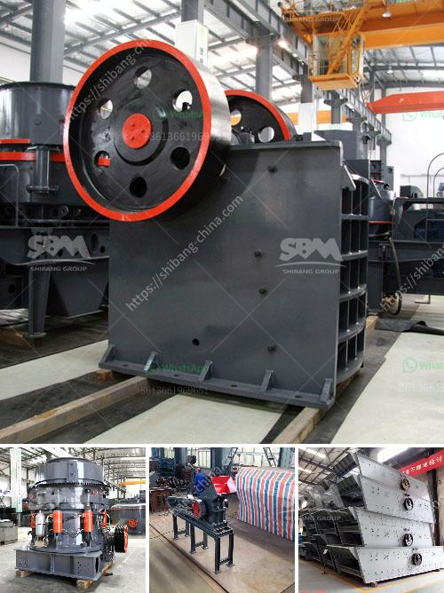

<h3>What happened in the vibrating screen?</h3>
Vibrating screens are an integral part of many industries, used to separate materials into various sizes for further processing. These screens employ a deck of screens that vibrate at high speeds, causing the materials to separate based on size. However, like any piece of machinery, vibrating screens can encounter issues that warrant attention and resolution. Let's delve into some common problems and possible solutions that can occur in a vibrating screen.

One frequent problem in vibrating screens is the material getting stuck in the mesh openings, leading to inefficient screening and reduced productivity. This can occur due to various reasons, such as the material being too wet, sticky, or having a high moisture content. To address this issue, several steps can be taken. Firstly, the material can be dried beforehand to reduce its moisture content, making it less likely to clog the screen. Additionally, the deck slope and incline angle can be adjusted to facilitate the flow of material through the mesh openings, preventing blockages.

Another common problem is the excessive wear of screen panels. The constant vibration and abrasion of the materials passing through the screens can cause the panels to wear out over time. This wear not only affects screening efficiency but also increases maintenance costs. To mitigate this issue, choosing high-quality wear-resistant panels and regularly inspecting and replacing worn-out panels are crucial. Proper maintenance and regular lubrication of the screen's bearings can also extend the lifespan of the screen panels.

Moreover, vibrating screens may experience mechanical failures, such as cracked or broken screen decks. These failures can result from overloading the screen with too much material or applying excessive force during operation. To prevent such failures, it is essential to adhere to the manufacturer's recommended load capacity for the screen. Regular inspection of the screen's structural integrity and addressing any cracks or damage promptly can prevent catastrophic failures and costly downtime.

Additionally, vibrating screens can encounter issues with incorrect stroke settings. The stroke of the screen refers to the amplitude or the distance the screen travels in a complete cycle. Incorrect stroke settings can lead to inefficient screening, reduced throughput, and premature screen panel failure. Regularly monitoring and adjusting the stroke settings based on the specific requirements of the materials being processed can optimize the screen's performance.

In conclusion, vibrating screens play a crucial role in various industries, but they are not without their share of problems. Material blockages, excessive wear, mechanical failures, and incorrect stroke settings can impede the efficient operation of vibrating screens. However, by addressing these issues through proper material handling, regular maintenance, and adherence to manufacturer recommendations, the productivity and longevity of vibrating screens can be optimized.
<h3>Contact us</h3><ul><li><strong>Whatsapp:&nbsp;<a href="https://wa.me/8613661969651">+8613661969651</a></strong></li><li><a href="https://swt.shibang-china.com/?git&amp;zhl&amp;What happened in the vibrating screen"><strong>Online Service(chat now)</strong></a></li></ul><h3>Related</h3><ul><li><a href='What is a dry ball mill.md'>What is a dry ball mill?</a></li><li><a href='what machine is used for crushing quarry stone in philippines？.md'>what machine is used for crushing quarry stone in philippines？</a></li><li><a href='What is the smallest size of output for a hammer crusher.md'>What is the smallest size of output for a hammer crusher?</a></li><li><a href='What is the application of a ball mill.md'>What is the application of a ball mill?</a></li><li><a href='What procedures need to be done for a quarry.md'>What procedures need to be done for a quarry?</a></li></ul>