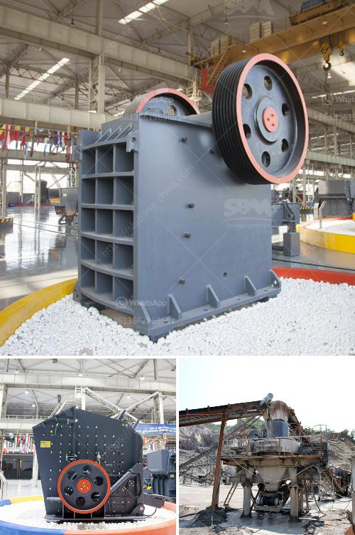

<h3>What happens to the crusher when the manganese liner starts to wear out?</h3>
Crushers are important machines used in the mining and construction industries to reduce the size of large rocks into smaller stones, gravel, or rock dust. The key components of a crusher include the feed hopper, the crushing chamber, the rotating shaft, and the manganese liner. The manganese liner plays a vital role in protecting the crushing chamber and ensuring efficient operation of the crusher. However, over time, these liners start to wear out, which can have significant consequences for the crusher and its overall performance.

When the manganese liner starts to wear out, it can lead to several problems. Firstly, as the liner becomes thinner, it reduces the space between the mantle and the concave, affecting the feed opening and the crushing chamber's effectiveness. This reduction in space can result in decreased production capacity, as the crusher is no longer able to handle a larger volume of material.

The reduced space also affects the crusher's ability to achieve the desired product size. As the liner wears out, the gap between the mantle and the concave becomes more significant, resulting in larger crushed particles. This can lead to a decrease in the quality and consistency of the final product, causing issues for downstream processes such as screening or further processing.

Another significant issue that arises when the manganese liner wears out is the potential for damage to the crusher itself. The liner acts as a protective shield for the crusher's inner components, including the mantle and the concave. Without the liner's protection, these components are exposed to increased wear and tear, potentially leading to more severe damage.

The wear on the mantle and concave can cause a decrease in their lifespan, resulting in the need for more frequent replacements. This not only adds to the maintenance cost but also increases the downtime of the crusher, impacting overall operational efficiency. Additionally, if the wear on the inner components becomes severe, it can even lead to mechanical failure, necessitating more extensive repairs or replacements.

To mitigate the negative effects caused by the manganese liner's wear, regular maintenance and monitoring are crucial. By keeping a close eye on the liner's condition and replacing it before it becomes too thin, operators can ensure the crusher's optimum performance and prevent damage to the inner components. Additionally, using high-quality manganese liners can also help prolong the overall lifespan of the liner and provide better protection for the crusher.

In conclusion, the manganese liner plays a critical role in the efficient operation of a crusher. When it starts to wear out, it can lead to various issues, including reduced production capacity, decreased product quality, and potential damage to the crusher's inner components. Regular maintenance and timely replacement of the liner are essential to ensure the crusher's optimal performance and minimize operational disruptions. By prioritizing proper care for the manganese liner, operators can prolong the crusher's lifespan and enhance its overall efficiency.
<h3>Contact us</h3><ul><li><strong>Whatsapp:&nbsp;<a href="https://wa.me/8613661969651">+8613661969651</a></strong></li><li><a href="https://swt.shibang-china.com/?git&amp;zhl&amp;What happens to the crusher when the manganese liner starts to wear out"><strong>Online Service(chat now)</strong></a></li></ul><h3>Related</h3><ul><li><a href='What method of mining is used to obtain calcite.md'>What method of mining is used to obtain calcite?</a></li><li><a href='What is a ball mill used for in gold mining.md'>What is a ball mill used for in gold mining?</a></li><li><a href='What is bauxite used to make and how to extraction process.md'>What is bauxite used to make? and how to extraction process?</a></li><li><a href='What is the price of a cone crusher in Venezuela.md'>What is the price of a cone crusher in Venezuela?</a></li><li><a href='What is the best jaw crusher for coal processing.md'>What is the best jaw crusher for coal processing?</a></li></ul>