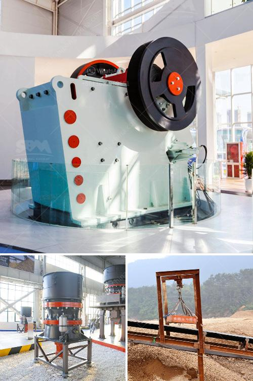

<h3>What is 42 and 65 in 42×65 gyratory crusher?</h3>
When it comes to the world of crushing equipment, the gyratory crusher is one of the most useful machines out there. It is used in a wide range of industries, including mining, construction, metallurgy, and many others. But what exactly do the numbers 42 and 65 signify in a 42x65 gyratory crusher? Let's find out.

To understand the significance of these numbers, we need to delve into the technical specifications of the gyratory crusher. In this case, the numbers refer to the size of the crusher. The first number, which is 42, represents the feed opening width, while the second number, 65, represents the mantle diameter.

The feed opening width is the measurement of the distance between the two crushing surfaces at the top of the crusher when it is fully open. It indicates the maximum size of the material that can be fed into the crusher. In this case, a 42x65 gyratory crusher has an opening width of 42 inches or around 1067 millimeters. This means that the largest material that can be fed into the crusher is around 42 inches in diameter.

The mantle diameter, on the other hand, is the measurement of the distance between the bottom of the mantle and the top of the concave liners. It determines the size of the crushed product that the crusher can produce. In this case, the 42x65 gyratory crusher has a mantle diameter of 65 inches or around 1651 millimeters. This means that the crushed product will have a maximum size of 65 inches in diameter.

These numbers play a crucial role in determining the capacity and performance of the gyratory crusher. The larger the feed opening width and the mantle diameter, the higher the capacity of the crusher. This means that the crusher can process more material in a given amount of time, leading to higher productivity.

In addition to capacity, the size of the crusher also affects the quality of the crushed product. A larger mantle diameter allows for a finer product size while a smaller diameter results in a coarser product size. This can be important for certain applications where a specific product size is required.

Overall, the numbers 42 and 65 in a 42x65 gyratory crusher represent the feed opening width and the mantle diameter, respectively. They are crucial measurements that determine the capacity and product size of the crusher. Understanding these numbers is essential for selecting the right gyratory crusher for a specific application.

In conclusion, the gyratory crusher is a powerful machine used in various industries for crushing materials. The numbers 42 and 65 in a 42x65 gyratory crusher indicate the feed opening width and mantle diameter, respectively. These numbers play a significant role in determining the capacity and product size of the crusher. By understanding these measurements, professionals can select the appropriate gyratory crusher for their specific needs and optimize the crushing process.
<h3>Contact us</h3><ul><li><strong>Whatsapp:&nbsp;<a href="https://wa.me/8613661969651">+8613661969651</a></strong></li><li><a href="https://swt.shibang-china.com/?git&amp;zhl&amp;What is 42 and 65 in 42×65 gyratory crusher"><strong>Online Service(chat now)</strong></a></li></ul><h3>Related</h3><ul><li><a href='what is the best installation for crusher plant production and maintenance？.md'>what is the best installation for crusher plant production and maintenance？</a></li><li><a href='what equipment are used in the production of bentonite？.md'>what equipment are used in the production of bentonite？</a></li><li><a href='What equipment is used on a bauxite site.md'>What equipment is used on a bauxite site?</a></li><li><a href='What is a single toggle jaw crusher.md'>What is a single toggle jaw crusher?</a></li><li><a href='What is the functions of crusher .md'>What is the functions of crusher ?</a></li></ul>