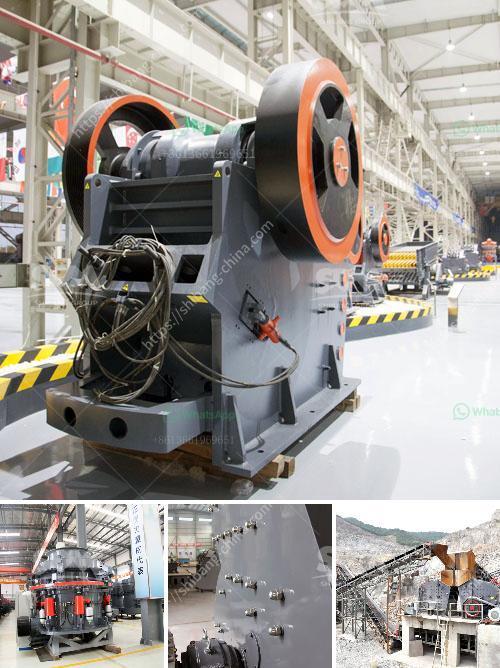

<h3>What is Crushing and Screening ?</h3>
Crushing and screening are fundamental processes in the mining and construction industries. From initial excavation to final product, material processing contributes to a variety of projects. However, the processes mentioned above are often misunderstood or overlooked. This article aims to shed light on what crushing and screening entail and their importance in various industries.

Crushing refers to the reduction or fragmentation of the size of materials such as rocks and minerals. It is done by applying mechanical forces to break these materials into smaller pieces, typically using compression or impact. The purpose of crushing is to prepare the material for further processing. Screening, on the other hand, involves separating crushed materials into different sizes or grades.

The first stages of crushing involve primary crushers, where large rocks or raw materials are initially reduced in size. They can be either mobile or stationary, depending on the specific requirements. The size of the stones or ores determines the selection of the primary crushers, which can include jaw crushers, gyratory crushers, or impact crushers.

Following primary crushing, the material may undergo secondary or tertiary crushing stages. Secondary crushers are designed to further reduce the size of the material, while tertiary crushers aim to produce finer particles. Cone crushers, roll crushers, and impact crushers are commonly used in these secondary and tertiary stages.

After the crushing process, the material is then screened to separate different particle sizes. Screening equipment consists of screens, commonly made of polyurethane or wire mesh, that allow smaller-sized materials to pass through while retaining the larger pieces. Proper screening is crucial as it determines the final product size and quality.

Crushing and screening processes are integral in various industries, including mining, construction, and recycling. In mining applications, crushing and screening equipment is used to extract valuable minerals and materials from the earth. These minerals are further processed into refined products used in industries like manufacturing, agriculture, and energy production.

In the construction industry, crushing and screening equipment is used to produce aggregates for building projects. Aggregates are essential components in concrete, asphalt, and road construction. Properly sized and graded aggregates contribute to the durability, strength, and appearance of various structures.

Recycling is another industry that heavily relies on crushing and screening. By crushing and screening waste materials, organizations can recover valuable resources and reduce their environmental impact. Materials such as concrete, asphalt, and demolition waste can be processed and reused in new construction projects, conserving natural resources and reducing landfill waste.

Crushing and screening offer numerous advantages. Besides reducing the size of materials, they allow for the separation of valuable minerals and resources from waste. The processed materials can then be reused or sold for economic benefit. Additionally, proper sizing and grading of materials ensure the production of high-quality end products.

In conclusion, crushing and screening are essential processes in mining, construction, and recycling industries. They involve reducing the size of materials and separating them into different grades. These processes contribute to the extraction of valuable minerals and resources, the production of high-quality building materials, and the efficient utilization of waste materials. By understanding the importance of crushing and screening, industries can optimize their operations and contribute to sustainable resource management.
<h3>Contact us</h3><ul><li><strong>Whatsapp:&nbsp;<a href="https://wa.me/8613661969651">+8613661969651</a></strong></li><li><a href="https://swt.shibang-china.com/?git&amp;zhl&amp;What is Crushing and Screening "><strong>Online Service(chat now)</strong></a></li></ul><h3>Related</h3><ul><li><a href='What is the maintenance of a jaw crusher.md'>What is the maintenance of a jaw crusher?</a></li><li><a href='What is the final product of columbite.md'>What is the final product of columbite?</a></li><li><a href='What are the fields of coal crushing equipment .md'>What are the fields of coal crushing equipment ?</a></li><li><a href='What does a compound pendulum jaw crusher.md'>What does a compound pendulum jaw crusher?</a></li><li><a href='What determines the capacity of a stone crusher.md'>What determines the capacity of a stone crusher?</a></li></ul>