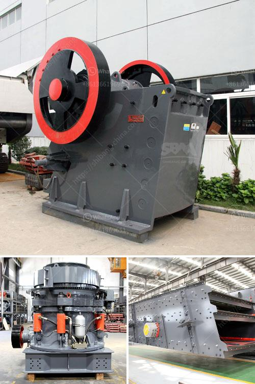

<h3>What is Raymond mill and ball mill process ?</h3>
Raymond mill and ball mill are both commonly used mining machines in grinding equipment. They are similar in some ways but also have their own differences.

The biggest difference between Raymond mill and ball mill is the grinding machine's structure. Raymond mill is mainly composed of a host machine, a fineness analysis machine, a finished product cyclone separator, a pipeline device, a motor, and a blower. Ball mill is composed of a horizontal cylinder, a hollow shaft for feeding and discharging, and a grinding head. The main body is a long cylinder made of steel. The cylinder is provided with an abrasive body, and the steel lining plate is fixed to the cylinder body. The grinding body is generally a steel ball and is loaded into the cylinder according to different diameters and a certain proportion, and the grinding body can also be used as a steel section.

The structure of Raymond mill is more complex than that of ball mill. The discharge port of Raymond mill is also small and the residual airflow becomes a phenomenon. In addition, the raw materials of Raymond mill are mainly processed through a cyclone collector, which is convenient for material collection and transportation. Compared with the ball mill, the Raymond mill has a high efficiency, lower power consumption, smaller covered area, less investment.

The grinding roller compressed on the grinding ring tightly due to the centrifugal force. Thus, the output and fineness of the finished product will not be affected when the grinding ring is worn to a certain degree. In addition, experiments have shown that the Raymond mill can grind different materials and its technological process can also be better carried out. High-pressure Raymond mill equipment is commonly used in industrial field. This is mainly due to the wide range of silicate raw materials, including mica powder, talc powder, iron ore powder, and many other mineral powder materials. By using Raymond mill, the output of silicate products has increased significantly.

In contrast, the ball mill is a grinding machine composed of a horizontal cylinder and two hollow shafts for grinding. The material is periodically cut into pieces by the grinding medium. More importantly, different grinding bodies (steel balls, steel bars, gravel,) require different lining structures, which affect the process of the grinding operation to some extent. The ball mill also consumes a large amount of energy, which is more than the Raymond mill.

Therefore, the choice of machinery and equipment should be comprehensively considered according to the needs of production. Raymond mill and ball mill have different working principles and performance. For different materials, the choice of equipment is also different. Regardless of which type of machine is used, each performs its own functions. Both Raymond mill and ball mill are used to grind and process materials. However, although they have their own characteristics, they are ultimately used for processing materials to achieve the desired end product.
<h3>Contact us</h3><ul><li><strong>Whatsapp:&nbsp;<a href="https://wa.me/8613661969651">+8613661969651</a></strong></li><li><a href="https://swt.shibang-china.com/?git&amp;zhl&amp;What is Raymond mill and ball mill process "><strong>Online Service(chat now)</strong></a></li></ul><h3>Related</h3><ul><li><a href='What equipment is used in salt mining.md'>What equipment is used in salt mining?</a></li><li><a href='what are the maintenance of primary ball mill？.md'>what are the maintenance of primary ball mill？</a></li><li><a href='what size material can be made with an impact crusher？.md'>what size material can be made with an impact crusher？</a></li><li><a href='What are the models of Raymond mill.md'>What are the models of Raymond mill?</a></li><li><a href='What is the mining process of barite？.md'>What is the mining process of barite？</a></li></ul>