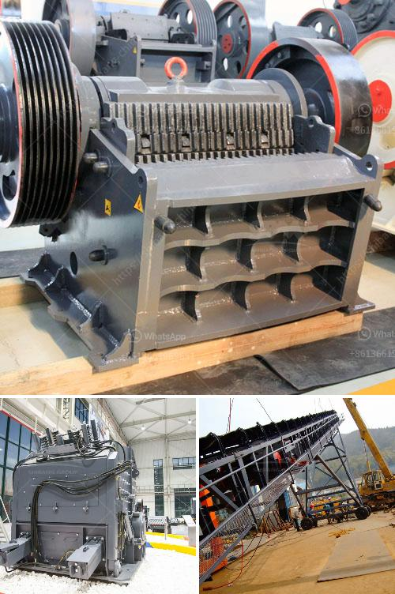

<h3>What is a Jaw Crusher? What type of stone is broken?</h3>
A jaw crusher is a large piece of equipment that’s used in mine and ore processing plants to crush rocks. The equipment was first introduced back in 1858 by inventor Eli Whitey Black who primarily developed machinery used for crushing stone. From there, jaw crushers have seen plenty of action in the pit and quarry industries as well as in recycling processes where large hard materials need to be reduced.

Jaw crushers are commonly used as primary crushers because they can take large and variable sized feed material, so the original feed won’t have to be blasted down to a fine size. Powerscreen jaws are designed to be significantly more reliable and have lower wear rates, maximizing production and minimizing wear parts.

A jaw crusher fractures the stone in the first plane, so the stone is broken in tension by pressure. Thus, when rock is crushed, it is more fragile than when it is broken by striking and breaking with topological characteristics.

Jaw crushers are used in various industries, such as mining, building materials, and construction. They are commonly used in the refining of metal ores and aggregates. They serve the purpose of reducing large rocks into smaller rocks or gravel before processing them further in a different machine or at a specific industry.

Jaw crushers are composed of a fixed jaw and a moving jaw, a swing jaw, which is not fixed in the body of the crusher. The shape of the jaws is designed to crush the stones in the first case, with pressure. The second case applies pressure where the mouth of the jaws is actually the smallest at the ends, tapering to a point. This results in a more acute fracture at the stone’s weakest point, preventing further fragmentation.

The type of stone that is crushed by a jaw crusher is usually hard and has high compressive strength, such as granite, basalt, limestone, quartzite, and sandstone. These materials require regular maintenance and can be fragile to handle. However, jaw crushers are a versatile, efficient, and cost-effective solution for reducing large-size rocks to smaller stones for further processing.

With technological advancements, jaw crushers have evolved to cope with the demands of modern industries. They have become more robust and versatile, offering improved performance and increased productivity. Additionally, advanced features like hydraulic adjusting systems and automatic lubrication systems have contributed to their enhanced effectiveness and reliability.

To conclude, a jaw crusher is a machinery designed to break stones into smaller pieces. This versatile and efficient piece of equipment has found numerous applications in various industries, from mining to construction, where large rocks need to be crushed into smaller, more transportable stones. With their durability and reliability, jaw crushers continue to be an essential tool in the mining and construction industries.
<h3>Contact us</h3><ul><li><strong>Whatsapp:&nbsp;<a href="https://wa.me/8613661969651">+8613661969651</a></strong></li><li><a href="https://swt.shibang-china.com/?git&amp;zhl&amp;What is a Jaw Crusher What type of stone is broken"><strong>Online Service(chat now)</strong></a></li></ul><h3>Related</h3><ul><li><a href='What should I know about a crusher plant.md'>What should I know about a crusher plant?</a></li><li><a href='What are the advantages of a jaw crusher over the gyratory crusher .md'>What are the advantages of a jaw crusher over the gyratory crusher ?</a></li><li><a href='What is the process for mining manganese ore.md'>What is the process for mining manganese ore?</a></li><li><a href='What are the byproducts of mining quartz.md'>What are the byproducts of mining quartz?</a></li><li><a href='What is the process that coal goes through to become a finished product.md'>What is the process that coal goes through to become a finished product?</a></li></ul>