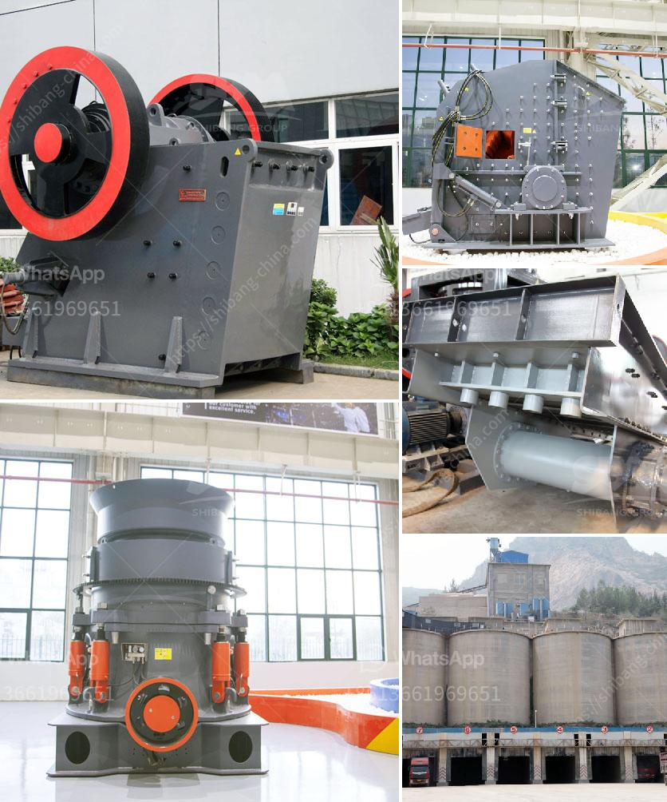

<h3>What is a Raymond mill?</h3>
Raymond mill is a commonly used grinding equipment, primarily used for grinding non-metallic materials, chemical raw materials, and other materials. It is widely used in mineral processing field, building materials and chemical industry, etc., bringing considerable economic benefits to users.

The Raymond mill is named after its creator, Raymond Grinding Mill, who developed the machine in 1906. Raymond mill has the advantages of stable performance, convenient operation, low energy consumption, product size adjustable. It has been widely used in a variety of ores, metallurgy, building materials, chemicals, and other fields. Raymond mill equipment is a classic model among the milling machines. Its performance and production efficiency have won unanimous praise from users.

The structure of Raymond Mill is mainly composed of a main machine, an analyzer, a fan, a finished cyclone separator, a fine powder cyclone separator, and a duct. Among them, the main body is composed of a frame, an inlet volute, a blade, a grinding roller, a grinding ring, and a cover.

During the operation process, the air flow is blown into the grinding chamber by the blower. The material is crushed by the grinding roller and then sent to the analysis machine. The powder particles passing through the analysis machine are selected by the cyclone separator and collected. The larger particles are returned to the grinding chamber for further grinding. The collected powder is the finished product, and the air flow is discharged through the exhaust pipe.

Raymond mill uses high-pressure springs to increase the grinding pressure between the grinding roller and the grinding ring. This increases the specific gravity of the grinding material and increases the grinding efficiency. The high-pressure suspension roller mill can process materials with a Mohs hardness of 9.3 or less, and the final particle size is adjustable from 0.613 mm to 0.033 mm.

Raymond mill has many advantages compared with traditional milling equipment. Some of the key features include:

1. High efficiency and low energy consumption: The energy consumption of Raymond mill is lower than that of traditional mill with the same capacity.

2. Large feeding size and adjustable fineness: The feeding size of Raymond mill can reach 35mm, and the fineness of the finished product is continuously adjustable from 80 mesh to 325 mesh.

3. High reliability and stability: The important parts of Raymond mill are made of high-quality steel, and the wear parts are made of high-performance wear-resistant materials. The machine has stable performance, reliable operation, and long service life.

In conclusion, Raymond mill is a widely used grinding equipment that can be used for processing various non-metallic ores, building materials, and chemical raw materials. Its excellent performance, high efficiency, and low energy consumption have made it a popular choice among users. With continuous technological advancements, Raymond mill is expected to become even more efficient and reliable in the future, providing better grinding solutions for various industries.
<h3>Contact us</h3><ul><li><strong>Whatsapp:&nbsp;<a href="https://wa.me/8613661969651">+8613661969651</a></strong></li><li><a href="https://swt.shibang-china.com/?git&amp;zhl&amp;What is a Raymond mill"><strong>Online Service(chat now)</strong></a></li></ul><h3>Related</h3><ul><li><a href='What machines do stone crushing plants need？.md'>What machines do stone crushing plants need？</a></li><li><a href='What is the process of mining galena.md'>What is the process of mining galena?</a></li><li><a href='What is bauxite used to make and how to extraction process.md'>What is bauxite used to make? and how to extraction process?</a></li><li><a href='What are some good ways to improve the capacity of a cement ball mill.md'>What are some good ways to improve the capacity of a cement ball mill?</a></li><li><a href='What is Raymond mill and ball mill process .md'>What is Raymond mill and ball mill process ?</a></li></ul>