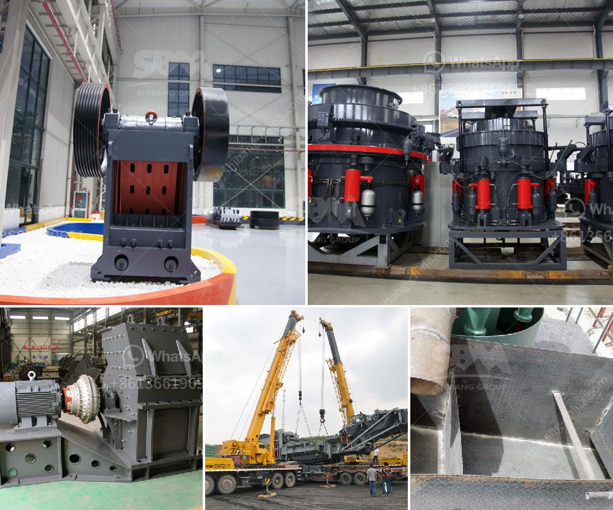

<h3>What is a ball mill and how does it function?</h3>
Ball mills are a common grinding device used to grind and blend materials for use in various industries. The purpose of this equipment is the process of reducing particle size, which is done by using a rotating drum filled with steel balls as the grinding medium. Ball mills can be used for both dry and wet grinding processes, with the wet grinding being more common.

The basic design of a ball mill involves a rotating drum filled with steel balls, in which the material to be ground is placed. When the drum is rotated, the balls cascade and crush the material into a fine powder. This powder is then discharged from the drum through a sieve or screen, which allows for the desired product size to be achieved.

One of the key design factors when designing a ball mill is the grinding media or balls used. Grinding media can be made of hardened steel, ceramic, or even natural materials such as pebbles. Because these materials are harder, more energy is needed to grind them down to the desired size, which increases the overall efficiency of the milling process.

The size of the balls is also a crucial factor in the performance of a ball mill. Typically, larger balls are used for coarse grinding, while smaller balls are used for fine grinding. It is important to choose the right ball size distribution to maximize the grinding efficiency.

The speed at which the ball mill rotates is another important factor in efficient grinding. Rotation speed influences the motion of the balls inside the mill, thereby impacting the grinding action and product size distribution. Higher rotation speeds result in more cascading and more impacts between the balls and the material, leading to faster grinding.

In addition to the size and speed of the balls, other operational parameters can affect the performance of a ball mill. These include the loading capacity of the mill, the feed rate, and the pulp density of the slurry being ground. These factors can be adjusted to optimize the grinding process and achieve the desired product quality.

Ball mills are widely used in various industries such as mining, cement, metallurgy, and chemical. They are often used to grind materials down to a finer particle size than other types of grinding equipment. This allows for the production of a more uniform product, which is crucial in many applications.

In conclusion, ball mills are a common grinding device used to grind and blend materials for various industries. They rely on the principles of impact and attrition to reduce particle size. By controlling key factors such as grinding media, ball size, rotation speed, and operational parameters, ball mills can be optimized for efficient grinding and high-quality product output.
<h3>Contact us</h3><ul><li><strong>Whatsapp:&nbsp;<a href="https://wa.me/8613661969651">+8613661969651</a></strong></li><li><a href="https://swt.shibang-china.com/?git&amp;zhl&amp;What is a ball mill and how does it function"><strong>Online Service(chat now)</strong></a></li></ul><h3>Related</h3><ul><li><a href='What are cone crusher used to crush .md'>What are cone crusher used to crush ?</a></li><li><a href='What is the disk spacing in a jaw crusher known as.md'>What is the disk spacing in a jaw crusher known as?</a></li><li><a href='What are the features of a jaw crusher.md'>What are the features of a jaw crusher?</a></li><li><a href='What points should be checked by a maintenance PM on a ball mill.md'>What points should be checked by a maintenance PM on a ball mill?</a></li><li><a href='What is the process of mining orthoclase feldspar.md'>What is the process of mining orthoclase feldspar?</a></li></ul>