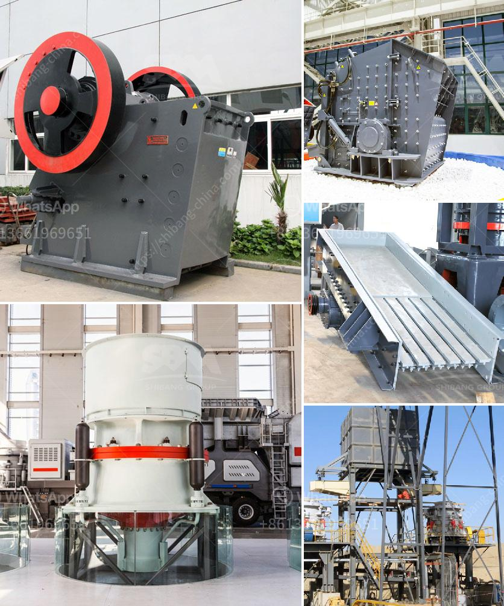

<h3>What is a ball mill for ?</h3>
A ball mill is a vital tool for grinding and blending materials in the pharmaceutical and food industries. You may be wondering what the purpose of these mills is in the first place. Well, we are here to demystify the process and shed light on its significance and applications.

Simply put, a ball mill is a piece of equipment that is utilized to grind and blend materials for use in mineral dressing processes, ceramics, pyrotechnics, paints, and selective laser sintering. It works on the principle of impact and attrition: size reduction is done by impact as the balls drop from near the top of the shell.

The primary purpose of a ball mill is to crush and grind materials into fine powders. This tool is often used in conjunction with other machinery like attrition mills and jaw crushers. It plays a crucial role in the final product quality and process efficiency.

One primary application of ball mills is in ore dressing. Planetary ball mills, on the other hand, are popularly used for laboratory purposes in mineral dressing processes, paints, pyrotechnics, and ceramics. These machines are incredibly valuable in mining and industry where they are used to grind ores and minerals in rare cases, like preparing nanomaterials and alloys, crushing rocks, and grinding pigments, and chemicals.

In the pharmaceutical industry, ball mills are utilized for production of ointments, pastes, creams, and lotions. The mills can also be used for mixing, homogenizing, and dispersing substances like pigments and dyes. To enhance the quality of pharmaceutical products, the mills play a crucial role in grinding active pharmaceutical ingredients (APIs) to the desired particle size.

Moreover, the food industry also extensively uses ball mills in various stages of production. These mills are employed in grinding, refining, homogenizing, and blending of raw ingredients, additives, and flavors. In the manufacturing of chocolate, for instance, ball mills are employed to reduce particle size and blend different ingredients to create a smooth and consistent end product.

In recent years, ball mills have gained attention in the field of nanotechnology. The ability of ball mills to produce fine powders at a large scale has made them prime tools for the synthesis of nanoparticles. Nanoparticles are used in a wide range of applications, including drug delivery systems, electronics, and construction materials.

It is important to note that ball mills come in different sizes, designs, and capacities to suit varied applications. They can be horizontal or vertical and may have ceramic, rubber, or steel grinding media. Some mills are powered by electricity, while others are driven by liquid or air pressure.

In conclusion, ball mills have numerous applications in various industries, making them incredibly versatile and valuable tools. From ore grinding in mining to blending ingredients in the food and pharmaceutical industries, these mills play a critical role in enhancing process efficiency and overall product quality. Their ability to grind materials into fine powders and create homogenous blends has made them indispensable in modern manufacturing processes.
<h3>Contact us</h3><ul><li><strong>Whatsapp:&nbsp;<a href="https://wa.me/8613661969651">+8613661969651</a></strong></li><li><a href="https://swt.shibang-china.com/?git&amp;zhl&amp;What is a ball mill for "><strong>Online Service(chat now)</strong></a></li></ul><h3>Related</h3><ul><li><a href='what are the raw material for cement production .md'>what are the raw material for cement production ?</a></li><li><a href='7 different vibrating screens how do you choose.md'>7 different vibrating screens, how do you choose?</a></li><li><a href='What is a ball mill for .md'>What is a ball mill for ?</a></li><li><a href='What is receiving feeder in a crusher.md'>What is receiving feeder in a crusher?</a></li><li><a href='What is a cement plants tertiary crusher.md'>What is a cement plant's tertiary crusher?</a></li></ul>