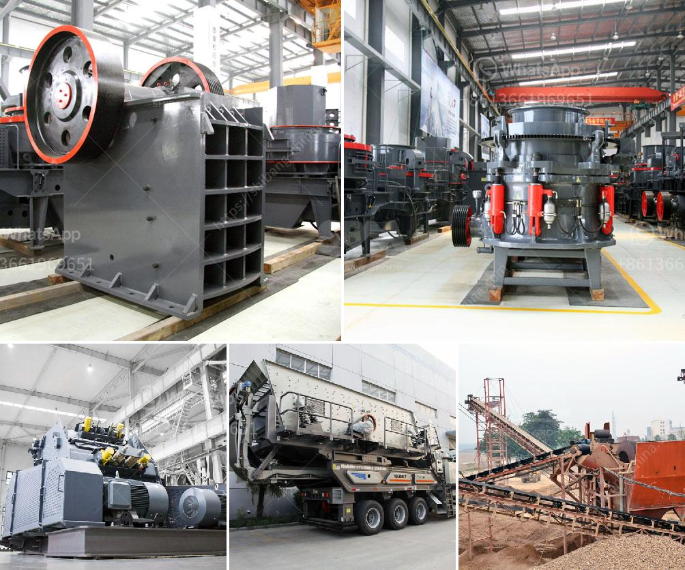

<h3>What is a ball mill used for in gold mining?</h3>
A ball mill is a type of grinder used to grind, blend and sometimes for mixing of materials for use in mineral dressing processes, paints, pyrotechnics, ceramics and selective laser sintering. It works on the principle of impact and attrition: size reduction is done by impact as the balls drop from near the top of the shell. A ball mill consists of a hollow cylindrical shell rotating about its axis. The axis of the shell may be either horizontal or at a small angle to the horizontal. It is partially filled with balls. The grinding media is the balls, which may be made of steel, stainless steel, ceramic, or rubber.

The ball mill is a key piece of equipment for grinding crushed materials, and it is widely used in production lines for powders such as cement, silicates, refractory material, fertilizer, glass ceramics, etc. as well as for ore dressing of ferrous and non-ferrous metals. The ball mill can grind ores and other materials either wet or dry.

There are two kinds of ball mill, grate type and overfall type, due to different ways of discharging material. Many types of grinding media are suitable for use in a ball mill, each material having its own specific properties and advantages. Key properties of grinding media are size, density, hardness, and composition.

The ball mill is used to grind and blend materials for use in various gold ore benefication settings, from secondary crushing to fine grinding, and preparing for processing stage. Grinding balls for mining are generally used to break down secondary materials such as rock, cement and stone during the extraction of ores and metals. AISI steel grinding balls for ball mill applications typically have a tolerance of ±0.05/±0.10 and a density of 7.70 to 7.95.

The main purpose of grinding media in gold mining industry is to crush the ore into smaller particles to be used in the next stage of ore processing. Gold ore crushing and extraction machine used to transfer the crushed gold ore to the ball mill for further grinding.

After the ball mill grinding process, the crushed gold ore will be transferred to the flotation cell for further grinding. This process increases the surface area of the gold particles, making it easier to recover them from the ore.

In addition to grinding and flotation, ball mills are also used for the final reduction of gold ore, or for grinding other materials in the ore dressing industry. Ball mills are also used in pyrotechnics, for mixing gunpowder with other compounds to create firework powder.

Overall, a ball mill is a versatile and efficient tool for grinding and blending materials in gold mining operations. The application of ball mills for gold ore grinding and processing is immense, as it offers a wide range of advantages, including high grinding efficiency, low energy consumption, flexible operation and easy maintenance. Ball mills are widely used in the industry, and often used in gold mining factories to process all kinds of dust ore and other materials.
<h3>Contact us</h3><ul><li><strong>Whatsapp:&nbsp;<a href="https://wa.me/8613661969651">+8613661969651</a></strong></li><li><a href="https://swt.shibang-china.com/?git&amp;zhl&amp;What is a ball mill used for in gold mining"><strong>Online Service(chat now)</strong></a></li></ul><h3>Related</h3><ul><li><a href='What is an opencircuit ball mill.md'>What is an open-circuit ball mill?</a></li><li><a href='What is the production process of stone aggregates .md'>What is the production process of stone aggregates ?</a></li><li><a href='What is rotary screen cement plant .md'>What is rotary screen cement plant ?</a></li><li><a href='What type of machine is used in the cement industry.md'>What type of machine is used in the cement industry?</a></li><li><a href='what is the best installation for crusher plant production and maintenance？.md'>what is the best installation for crusher plant production and maintenance？</a></li></ul>