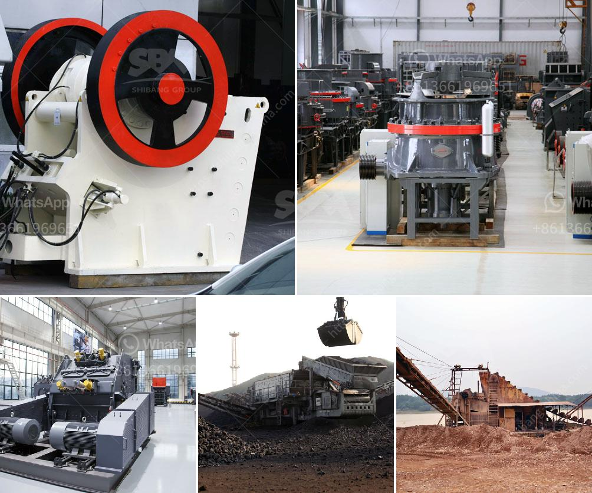

<h3>What is a ball mill?</h3>
A ball mill is a type of grinding mill, which is used to grind materials into extremely fine powder. It is used in paints, pyrotechnics, and ceramics industries, among others. There are two types of ball mills: horizontal and vertical.

The horizontal ball mill consists of a rotating cylinder with horizontal axis and is filled with steel or ceramic balls. The material to be ground is added to the cylinder along with steel or ceramic balls, which are being lifted up by the rotating cylinder, causing them to fall back onto the material and grinding it into a fine powder. The rotation of the cylinder helps create a cascading effect, where the balls continuously impact the material, resulting in reduced particle size. This grinding process is highly efficient and produces a uniform and fine powder.

A vertical ball mill, on the other hand, is ideal for continuous waste loading mill charging. The cylinder is vertical and is supported by the chassis, which is equipped with pistons to push and pull the grinding chamber. Material is loaded into the grinding chamber through the mill inlet, where it is ground by the interaction between grinding media and the material itself. The ground material is then discharged through the mill outlet. A vertical ball mill is specifically designed for grinding hard and abrasive materials and ensures minimal contamination during the grinding process.

Ball mills are widely used in various industrial sectors like mining, cement, and construction for grinding different materials. These machines consist of a hollow cylindrical shell, which rotates around its axis, imparting rotational motion to the grinding medium. The material to be ground is loaded into the chamber, and as the cylinder rotates, the grinding medium is lifted and dropped, impacting the material and reducing its particle size. The grinding medium can be made of steel, ceramic, or natural rocks, depending on the application.

Ball mills offer numerous advantages over other types of grinding mills. Firstly, they are cost-effective and require less energy consumption. Secondly, ball mills can perform wet or dry grinding, thus allowing for a wide range of material processing options. Additionally, the uniform and fine particle size produced by ball mills makes them suitable for various applications, including the production of high-quality industrial products and materials.

In conclusion, a ball mill is a vital tool for grinding materials into fine powder, enabling them to be used in various sectors like construction, mining, and ceramics. The ball mill can perform both dry and wet grinding operations, depending on the conditions, allowing for high-quality and uniform particle size. With its wide range of applications, cost-effectiveness, and energy efficiency, a ball mill is an indispensable machine in the industrial sector.
<h3>Contact us</h3><ul><li><strong>Whatsapp:&nbsp;<a href="https://wa.me/8613661969651">+8613661969651</a></strong></li><li><a href="https://swt.shibang-china.com/?git&amp;zhl&amp;What is a ball mill"><strong>Online Service(chat now)</strong></a></li></ul><h3>Related</h3><ul><li><a href='What are the investments for a stone crusher.md'>What are the investments for a stone crusher?</a></li><li><a href='What is the capacity of the grinding mill.md'>What is the capacity of the grinding mill?</a></li><li><a href='What is the difference between an impact crusher and a cone crusher.md'>What is the difference between an impact crusher and a cone crusher?</a></li><li><a href='What are some good ways to improve the capacity of a cement ball mill.md'>What are some good ways to improve the capacity of a cement ball mill?</a></li><li><a href='What is the procedure for obtaining a stone quarry license.md'>What is the procedure for obtaining a stone quarry license?</a></li></ul>