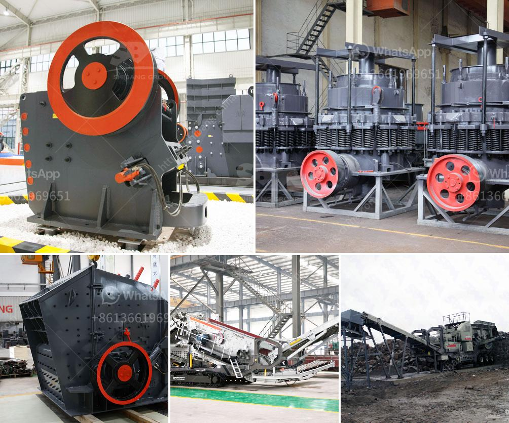

<h3>What is a belt conveyor machine ?</h3>
A belt conveyor machine is a device that simplifies the transportation of different types of materials, from one place to another, within a factory or an industrial setting. This machine, also known as a conveyor belt system, is widely used in many industries including mining, agriculture, automotive, and food processing.

The fundamental design of a belt conveyor machine consists of a belt, which is usually made of durable and flexible materials such as rubber, PVC, or nylon. This belt is looped around a series of pulleys or drums, which are powered by an electric motor, allowing the belt to move continuously.

One of the key advantages of a belt conveyor machine is its ability to transport materials over longer distances and at a high speed. This makes it an efficient solution for moving heavy or large volumes of materials from one location to another. The speed and capacity of belt conveyors can be customized to meet specific user requirements depending on the type and weight of the materials being transported.

There are various types of belt conveyor machines available, each designed for different purposes. For instance, flat belt conveyors are commonly used for transporting objects with a flat surface, while troughed belt conveyors are used to carry bulk materials or loose items in a trough-shaped belt. Additionally, belt conveyors can be inclined or declined to transport materials at different angles.

In addition to its transporting capabilities, belt conveyor machines can also be equipped with various features and accessories to optimize their performance. Some of these include side skirts to prevent materials from falling off the edges of the belt, cleats or ribs to stabilize and guide the materials being transported, and sensors to monitor and control the speed and positioning of the conveyor belt.

The maintenance of a belt conveyor machine is relatively simple. Regular cleaning and lubrication of the conveyor belt, as well as periodic inspections of the pulleys and motors, are necessary to ensure optimal performance and prevent breakdowns. Additionally, proper training and safety precautions should be implemented for the operators working with the conveyor belt system to avoid accidents or injuries.

In conclusion, a belt conveyor machine is a crucial component in many industries where efficient and safe transportation of materials is required. With its ability to move heavy loads over long distances at high speeds, this machine plays a vital role in streamlining operations and improving productivity. By choosing the right type of belt conveyor system and implementing proper maintenance practices, businesses can benefit from a reliable and cost-effective solution for their material handling needs.
<h3>Contact us</h3><ul><li><strong>Whatsapp:&nbsp;<a href="https://wa.me/8613661969651">+8613661969651</a></strong></li><li><a href="https://swt.shibang-china.com/?git&amp;zhl&amp;What is a belt conveyor machine "><strong>Online Service(chat now)</strong></a></li></ul><h3>Related</h3><ul><li><a href='What machines are used in mines.md'>What machines are used in mines?</a></li><li><a href='what is the difference between tube grinder and ball mill.md'>what is the difference between tube grinder and ball mill</a></li><li><a href='What is the standard particle size of ball mill grinding .md'>What is the standard particle size of ball mill grinding ?</a></li><li><a href='What is the purpose of using hydraulic cylinders in cone crushers.md'>What is the purpose of using hydraulic cylinders in cone crushers?</a></li><li><a href='What is gradation in a crusher.md'>What is gradation in a crusher?</a></li></ul>