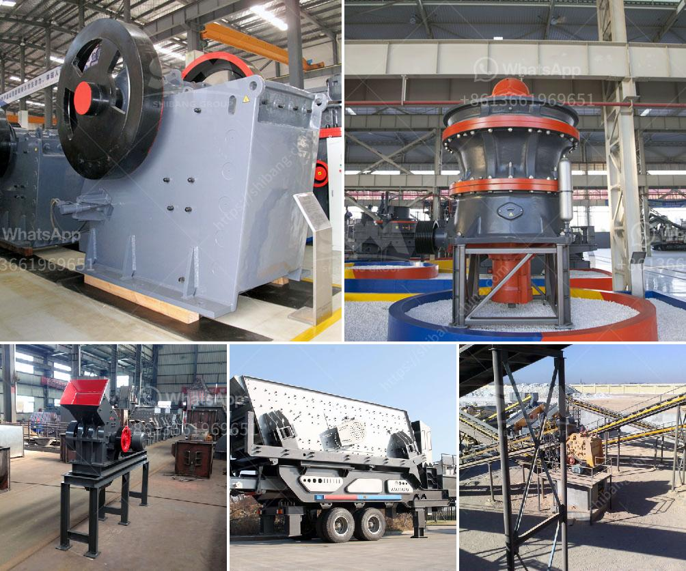

<h3>What is a beneficiation plant primary mill?</h3>
A beneficiation plant primary mill is a crucial equipment in the ore comminution circuit. It is responsible for achieving the desired grind size for the subsequent steps in the beneficiation process. But, what exactly is a primary mill, and what role does it play in the overall plant operation? Let's explore these questions in more detail.

A beneficiation plant primary mill, also known as a primary grinding mill, plays a vital role in the ore processing flow. It is used to grind the large-sized rocks extracted from the ore bodies into small particles suitable for further process steps, such as flotation or leaching. The primary mill acts as a bridge between the blasting and flotation processes, where the desired minerals are extracted from the ore.

The primary mill consists of a rotating drum, usually made of steel, containing a charge of metal balls or rods. When the ore enters the mill, it is lifted and tossed by the rotating drum and is subjected to the grinding action of the balls or rods. As the ore particles collide with the grinding media, they break down into smaller sizes, eventually reaching the desired fineness.

The size reduction achieved in the primary mill is known as primary grinding. The primary objective of this step is to liberate the valuable minerals from the gangue material. Effective comminution ensures that the valuable minerals are exposed and can be easily separated in the subsequent beneficiation steps.

The design of a primary mill is based on several factors, including the ore's hardness, size distribution, and desired grind size. The mill's capacity, grinding efficiency, and power consumption are also key considerations. Typically, the primary mill operates in a closed circuit with other equipment, such as hydrocyclones or screens, to ensure the desired product size is achieved.

A well-designed primary mill provides several benefits to a beneficiation plant. Firstly, it maximizes the recovery of valuable minerals by effectively reducing the ore size. This allows for better liberation and separation of valuable minerals from the gangue, leading to higher overall ore recovery.

Secondly, a primary mill helps in optimizing the plant's energy consumption. By achieving the desired grind size with minimum power input, the plant can operate efficiently and minimize its energy costs. Reduced power consumption also means lower carbon emissions, contributing to a more sustainable operation.

Furthermore, a primary mill plays a crucial role in maintaining the overall plant stability and reliability. It ensures a consistent feed size to downstream processes, preventing any operational upsets or inefficiencies. By providing a reliable grind size distribution, the primary mill enables other equipment in the circuit to perform optimally.

In conclusion, a beneficiation plant primary mill is a key component of the ore processing flow. It grinds the ore into the desired size, enabling efficient liberation and separation of valuable minerals from the gangue. The primary mill's design and operation directly impact the plant's overall performance, energy consumption, and stability. Therefore, its importance cannot be overstated in achieving successful and sustainable beneficiation processes.
<h3>Contact us</h3><ul><li><strong>Whatsapp:&nbsp;<a href="https://wa.me/8613661969651">+8613661969651</a></strong></li><li><a href="https://swt.shibang-china.com/?git&amp;zhl&amp;What is a beneficiation plant primary mill"><strong>Online Service(chat now)</strong></a></li></ul><h3>Related</h3><ul><li><a href='What is a conetype rock crusher.md'>What is a cone-type rock crusher?</a></li><li><a href='What is the feed of the jaw crusher .md'>What is the feed of the jaw crusher ?</a></li><li><a href='What is the role of a mill in a coalfired power plant.md'>What is the role of a mill in a coal-fired power plant?</a></li><li><a href='what is the quarrying process？.md'>what is the quarrying process？</a></li><li><a href='What are the uses of a cone crusher to mining operations.md'>What are the uses of a cone crusher to mining operations?</a></li></ul>