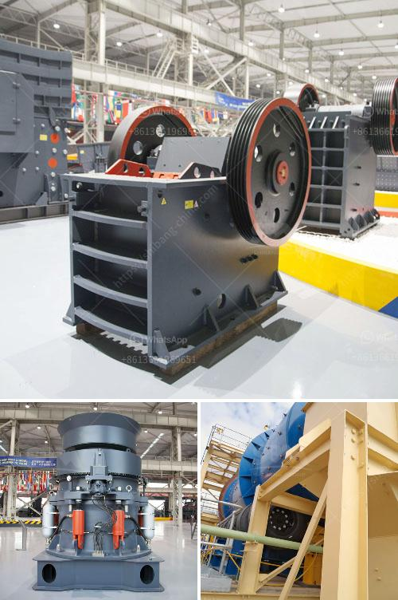

<h3>What is a cement plant's tertiary crusher?</h3>
A cement plant's tertiary crusher is primarily used to break down the clinker or rocks coming from the secondary crusher into smaller sizes. Cement plants typically have on-site crushers for their captive use, but they also purchase crushers from external sources for their auxiliary usage. The latter is what is referred to as a tertiary crusher in the cement plant.

The primary function of this crusher is to reduce large rocks into smaller sizes of gravel or rock dust. It achieves this by utilizing a cone-shaped crushing chamber that is lined with wear-resistant liners (usually made of manganese steel) to minimize abrasion. The material to be crushed enters the chamber through a vibrating feeder and is crushed between the crushing surfaces of the mantle and concave.

A key feature of a tertiary crusher is its ability to produce a cubical-shaped final product. This is crucial for the production of high-quality cement as well as other construction materials. The cubic particles have better packing density, which improves the strength and workability of the concrete. Additionally, they have a more uniform shape, providing a smoother surface finish.

The crushed material then goes through a process called screening, where it is separated into different size fractions. These fractions are then conveyed to the appropriate storage or blending facilities. The smaller-sized fractions are often used as raw material for the production of cement, while the larger ones may be used for other applications like road base or landscaping.

Tertiary crushers are designed to handle a wide range of materials, including soft and medium-hard rocks, limestone, gypsum, and similar minerals. They are capable of producing a variety of sizes, depending on the desired end product specifications. This versatility allows cement plants to adjust their production process and meet market demands for different types and grades of cement.

In terms of maintenance, tertiary crushers require regular servicing to ensure optimal performance. This includes routine inspections, replacement of wear parts, and lubrication of moving components. By maintaining proper maintenance practices, cement plants can maximize the lifespan of their tertiary crushers and minimize downtime, leading to increased productivity and cost savings.

In conclusion, a cement plant's tertiary crusher plays a crucial role in the production of high-quality cement and other construction materials. Its primary function is to reduce large rocks into smaller sizes that can be used in the manufacturing process. With proper maintenance and care, these crushers can provide years of reliable service, contributing to the efficient operation of cement plants and the construction industry as a whole.
<h3>Contact us</h3><ul><li><strong>Whatsapp:&nbsp;<a href="https://wa.me/8613661969651">+8613661969651</a></strong></li><li><a href="https://swt.shibang-china.com/?git&amp;zhl&amp;What is a cement plants tertiary crusher"><strong>Online Service(chat now)</strong></a></li></ul><h3>Related</h3><ul><li><a href='What is the difference between impact crusher and jaw crusher.md'>What is the difference between impact crusher and jaw crusher?</a></li><li><a href='What is mobile crushing plant and how it works crushing .md'>What is mobile crushing plant and how it works crushing ?</a></li><li><a href='What is the best use of quarry limestone.md'>What is the best use of quarry limestone?</a></li><li><a href='What does a compound pendulum jaw crusher.md'>What does a compound pendulum jaw crusher?</a></li><li><a href='What kind of mining crusher has a good high yield.md'>What kind of mining crusher has a good high yield?</a></li></ul>