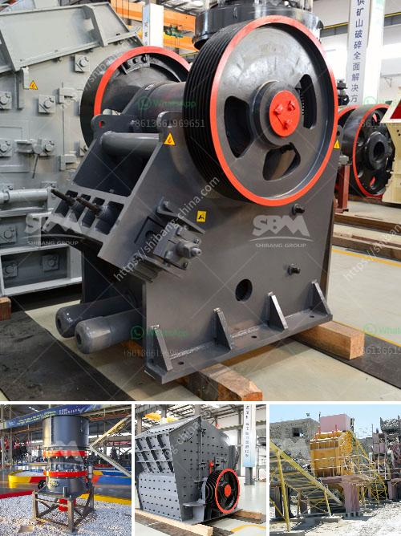

<h3>What is a composite cone crusher?</h3>
A composite cone crusher is a type of cone crusher that is used in the mining industry. It is designed to crush materials of varying hardness and compressive strength, providing excellent versatility and durability. Unlike other cone crushers, composite cone crushers consist of a rotating mantle and a concave bowl, both made of wear-resistant materials. This unique design allows for the efficient crushing of materials, resulting in high-quality final products.

The main advantage of a composite cone crusher is its ability to accommodate various feed sizes and maintain a high reduction ratio. This means that the crusher can handle both large and small materials, which is crucial in mining operations where different sizes of rocks need to be crushed to produce the desired product. The composite cone crusher achieves this by combining the benefits of both a gyratory crusher and a cone crusher.

The rotating mantle in a composite cone crusher acts as a continuous crushing surface, compressing the rocks against the concave bowl. The materials are crushed and discharged through the annular space formed at the bottom of the crushing cavity. This crushing action results in a finer product size compared to other types of crushers, making it ideal for producing high-quality aggregate or finely crushed minerals.

Another key feature of a composite cone crusher is its durable construction. The mantle and concave bowl are made of high-strength materials, such as manganese steel, which increases their resistance to wear and mechanical stresses. This ensures that the crusher can withstand the harsh operating conditions commonly encountered in mining operations, such as abrasive rocks and heavy loads. The use of wear-resistant materials also prolongs the service life of the crusher, reducing maintenance costs and downtime.

In addition, a composite cone crusher is equipped with advanced hydraulic systems, which provide reliable and efficient operation. These systems regulate the crusher's discharge settings and protect it from overload or tramp iron. This ensures that the crusher operates at its optimal capacity and prevents damage to the crusher or downstream equipment.

Overall, a composite cone crusher offers numerous advantages in the mining industry. Its ability to handle various feed sizes, maintain a high reduction ratio, and produce high-quality final products make it an indispensable tool for crushing operations. Its robust construction and advanced hydraulic systems also contribute to its reliability and longevity. Therefore, for mining companies looking for a reliable and versatile cone crusher, a composite cone crusher is an excellent choice.
<h3>Contact us</h3><ul><li><strong>Whatsapp:&nbsp;<a href="https://wa.me/8613661969651">+8613661969651</a></strong></li><li><a href="https://swt.shibang-china.com/?git&amp;zhl&amp;What is a composite cone crusher"><strong>Online Service(chat now)</strong></a></li></ul><h3>Related</h3><ul><li><a href='What plate is used for the curtain in an impact crusher.md'>What plate is used for the curtain in an impact crusher?</a></li><li><a href='What is the way to block the material of sand crusher .md'>What is the way to block the material of sand crusher ?</a></li><li><a href='What is a screening plant for manganese ore.md'>What is a screening plant for manganese ore?</a></li><li><a href='What is a Raymond mill.md'>What is a Raymond mill?</a></li><li><a href='What is Crushing and Screening .md'>What is Crushing and Screening ?</a></li></ul>