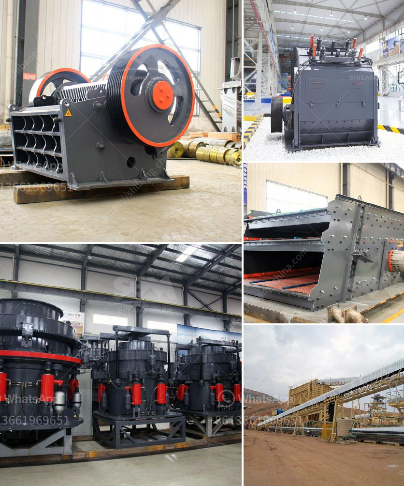

<h3>What is a cone-type rock crusher?</h3>
A cone-type rock crusher is extensively used in the industries like mining, metallurgy, cement, building materials, chemical and water and electricity, and it is commonly used in road and bridge construction for its large capacity, stable performance, high efficiency and environmental friendliness.

The cone crusher, as the name suggests, squeezes the rock between the gyrating spindles and enclosing concave hopper walls. It's these cone-shaped surfaces that generate the crushing action. Because of its powerful crushing capacity, the cone crusher is widely used in gravel quarry, concrete mixing stations, dry mortar, construction waste treatment, and other industries. It can crush various ores and rocks with medium and high hardness, thus achieving significant crushing efficiency.

One of the key advantages of the cone-type rock crusher is its ability to accommodate changing feed conditions. It accepts rock material fed directly from the excavator or loader, which means no need for a primary crusher. This greatly simplifies the transportation and installation processes, reducing costs and improving efficiency. Moreover, the cone crusher is equipped with an overload protection system, ensuring safety and preventing damage from foreign bodies or iron pieces entering the crushing chamber, which allows for continuous and stable operation.

Another feature that differentiates cone-type rock crushers from other crushers is the special chamber design which enhances the production capacity and product quality. The combination of the chamber's steep angle and long crushing surface effectively increases the output capacity and ensures a high level of finished product quality. This is particularly desired in the mining and aggregate industries where a high percentage of fine material is key for producing high-quality products.

Furthermore, the cone-type rock crusher offers better control over the size distribution of the crushed rock particles. It achieves this through the adjustable discharge opening that controls the product size. This feature allows operators to easily adjust the crusher to produce different sizes of end-products according to specific requirements, providing greater flexibility for varied applications.

Additionally, cone-type rock crushers are known for their low operating costs and energy efficiency. The advanced hydraulic system effectively adjusts the crushing gap and compensates for wear, ensuring minimal downtime and reduced maintenance costs. Moreover, the cone crusher can be equipped with a variety of automated systems, such as remote monitoring and control, enabling operators to optimize crusher performance and improve operational efficiency.

In conclusion, cone-type rock crushers are versatile machines that offer significant advantages compared to other crushing equipment. With their high efficiency, large capacity, and ability to handle various feed conditions, they are widely used in various industries, making them an essential tool for mining, construction, and materials processing. Their ability to produce high-quality end-products, control product size distribution, and minimize operating costs make cone-type rock crushers an indispensable solution for many crushing applications.
<h3>Contact us</h3><ul><li><strong>Whatsapp:&nbsp;<a href="https://wa.me/8613661969651">+8613661969651</a></strong></li><li><a href="https://swt.shibang-china.com/?git&amp;zhl&amp;What is a conetype rock crusher"><strong>Online Service(chat now)</strong></a></li></ul><h3>Related</h3><ul><li><a href='What chrome ore used for .md'>What chrome ore used for ?</a></li><li><a href='what is the process to buy stone crusher in Nigeria.md'>what is the process to buy stone crusher in Nigeria</a></li><li><a href='What products are produced from a cone crusher.md'>What products are produced from a cone crusher?</a></li><li><a href='What does aggregate crusher mean.md'>What does "aggregate crusher" mean?</a></li><li><a href='What is the application of a ball mill.md'>What is the application of a ball mill?</a></li></ul>