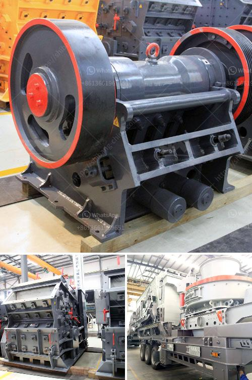

<h3>What is a construction waste crusher ？</h3>
In today's construction industry, there is increasing emphasis on reducing waste while improving the efficiency of construction projects. One way to achieve this is to reduce the amount of waste generated during a project. However, this is easier said than done, as the construction process involves a wide range of materials that are often bulky, heavy, and difficult to dispose of. This is where a construction waste crusher comes into play.

A construction waste crusher is a machine that can break down large pieces of construction waste into smaller, more manageable pieces. Not only does this make it easier to remove and dispose of the waste, but it also ensures that the materials can be recycled and reused effectively. This reduces the environmental impact of construction projects and helps to conserve valuable resources.

There are several types of construction waste crushers available on the market today. Some of the most common ones include jaw crushers, impact crushers, cone crushers, and hammer crushers. Each type of crusher has its own unique features and advantages, depending on the specific needs of the construction project.

Jaw crushers are commonly used in the construction industry to crush large pieces of waste material. They are often used as the primary crusher in a multistage crushing process. These machines are known for their reliability, high production capacity, and low maintenance requirements. Jaw crushers are ideal for processing construction waste that is hard and abrasive.

Impact crushers are another popular choice for crushing construction waste. They work by using a series of hammers that rotate at high speeds to strike the material. This impact breaks the material into smaller pieces, making it easier to handle and dispose of. Impact crushers are versatile and can be used to crush a wide range of construction waste materials.

Cone crushers are often used in aggregate production and mining operations. However, they can also be used to crush construction waste. These machines work by compressing the material between a rotating mantle and a stationary bowl liner, which causes the material to break. Cone crushers are known for their high efficiency and low operating costs.

Hammer crushers, on the other hand, use rotating hammers to break down the construction waste. These hammers strike the material repeatedly until it is reduced to the desired size. Hammer crushers are often used in the mining industry and can be used to crush a variety of construction waste materials.

In conclusion, a construction waste crusher is a powerful tool that can break down large pieces of waste material into smaller, more manageable pieces. This allows the waste to be disposed of properly and ensures that valuable resources are not wasted. Whether it is a jaw crusher, impact crusher, cone crusher, or hammer crusher, there is a machine that is right for any construction project. By investing in a construction waste crusher, construction companies can greatly reduce their environmental footprint and improve the efficiency of their projects.
<h3>Contact us</h3><ul><li><strong>Whatsapp:&nbsp;<a href="https://wa.me/8613661969651">+8613661969651</a></strong></li><li><a href="https://swt.shibang-china.com/?git&amp;zhl&amp;What is a construction waste crusher ？"><strong>Online Service(chat now)</strong></a></li></ul><h3>Related</h3><ul><li><a href='what is the cost of an 200mt capacity of cement plant？.md'>what is the cost of an 200mt capacity of cement plant？</a></li><li><a href='What does it cost to mill gold ore.md'>What does it cost to mill gold ore?</a></li><li><a href='What are the parts of a Raymond Mill.md'>What are the parts of a Raymond Mill?</a></li><li><a href='What is an overpressure fan in a cone crusher.md'>What is an overpressure fan in a cone crusher?</a></li><li><a href='What are the advantages of a roll crusher compared to other crushers.md'>What are the advantages of a roll crusher compared to other crushers?</a></li></ul>