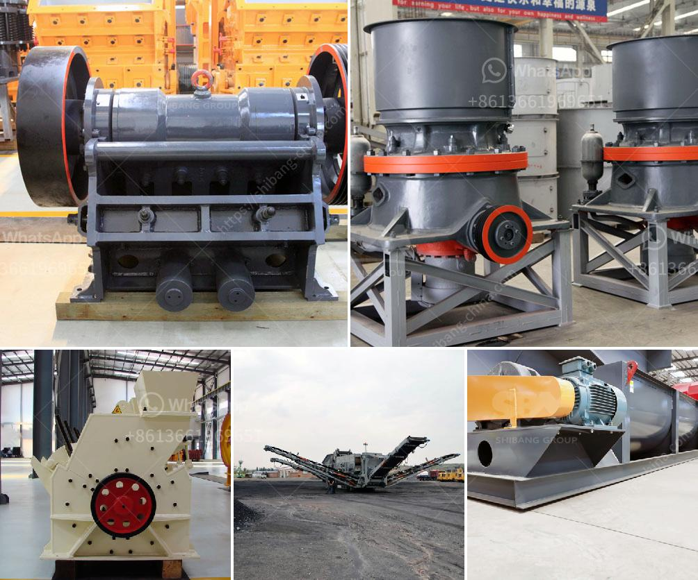

<h3>What is a dry ball mill?</h3>
A dry ball mill is a grinding equipment that uses dry grinding technology to grind various materials. The working principle is that the material enters the mill chamber by the feeding device, and the inside of the chamber is equipped with wear-resistant liners or with wear-resistant steel balls, which act as the grinding media. As the mill rotates, the material is crushed and ground into fine powder.

Unlike wet grinding, which requires the addition of water and other liquid additives, a dry ball mill does not use any liquid in the grinding process. This means that the mill operates at a lower moisture content compared to a wet ball mill, which ensures efficient and effective grinding.

1. Lower maintenance cost: Since the mill does not require the use of liquid, there is no need for frequent inspection and maintenance of pumps, piping, and other associated equipment. This reduces maintenance costs and increases the mill's longevity.

2. Energy-saving: Dry ball mills generally consume less power compared to wet ball mills. The energy-saving effect is more prominent in large-scale grinding equipment, such as grid ball mills and overflow ball mills. This is because the grinding medium in these mills is steel balls, and due to the large volume of the mill, the impact force of the steel balls is stronger, leading to more efficient crushing and grinding.

3. Wide range of applications: Dry ball mills are suitable for grinding various ores and other materials, either wet or dry. They can be used in mineral processing, building materials, chemical industry, and other industries.

4. Environmental protection: Dry ball mills do not require the use of water, which saves valuable resources. It also eliminates the need for water treatment and disposal, reducing environmental pollution.

5. Flexibility in operation: Dry ball mills can be operated in batch or continuous mode, depending on the production requirements. This flexibility allows for greater control over the grinding process and the ability to tailor it to specific material properties.

Despite these advantages, dry ball mills do have some limitations. For instance, they may not be suitable for grinding materials that are prone to agglomeration or that require the addition of liquid additives for effective grinding. In such cases, wet grinding systems may be more appropriate.

In conclusion, a dry ball mill is a versatile and efficient grinding equipment that operates without the need for water or liquid additives. It offers several advantages, including lower maintenance costs, energy savings, and environmental protection. However, it may not be suitable for all materials and applications. Therefore, it is crucial to consider the specific requirements of the grinding process before choosing the appropriate grinding equipment.
<h3>Contact us</h3><ul><li><strong>Whatsapp:&nbsp;<a href="https://wa.me/8613661969651">+8613661969651</a></strong></li><li><a href="https://swt.shibang-china.com/?git&amp;zhl&amp;What is a dry ball mill"><strong>Online Service(chat now)</strong></a></li></ul><h3>Related</h3><ul><li><a href='What is a ball mill for .md'>What is a ball mill for ?</a></li><li><a href='What is a composite cone crusher.md'>What is a composite cone crusher?</a></li><li><a href='What should I know about a crusher plant.md'>What should I know about a crusher plant?</a></li><li><a href='what is a primary and secondary crusher？.md'>what is a primary and secondary crusher？</a></li><li><a href='What is the price of mobile crusher.md'>What is the price of mobile crusher?</a></li></ul>