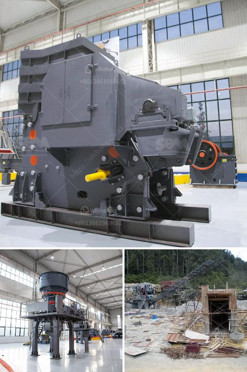

<h3>What is a fixed jaw crusher plate and what are its uses?</h3>
A fixed jaw crusher plate, also known as a jaw wedge, is an integral part of the crusher frame. It is used to support the movable jaw teeth while extruding materials. It is an essential component in an industrial jaw crusher machine. The purpose of the jaw wedge is to facilitate the hold of the fixed jaw plate against the counterpart movable jaw plate to generate the desired crushing force.

A fixed jaw crusher plate is installed to one side of the crusher machine, and it remains static throughout the crushing process, thereby providing structural support to the other jaw plate, which is free to move and exert the crushing force. These plates are rugged and made of high-quality materials to withstand the immense pressure and rough handling during the crushing operation.

The primary use of a fixed jaw crusher plate is to crush hard materials such as stones and ores efficiently. It is commonly used in the mining and quarrying industry, where large rocks are crushed into smaller pieces for further processing. The fixed jaw plate acts as a support beam to transmit the crushing force generated by the movement of the movable jaw.

One of the main advantages of using a fixed jaw crusher plate is its high durability. Since it remains fixed in its position, it undergoes less wear and tear compared to the movable jaw plate, which continuously moves back and forth during the crushing process. This results in a longer lifespan of the fixed jaw plate, reducing the frequency of replacement and thus leading to cost savings.

The fixed jaw crusher plate is also adjustable, allowing for the easy regulation of the gap between the two jaw plates. This gap determines the size of the crushed material, with smaller gaps producing finer output and larger gaps resulting in coarser materials. The adjustability of the fixed jaw plate enables operators to achieve the desired end product specifications by simply adjusting the gap accordingly.

In addition to crushing hard materials, a fixed jaw crusher plate can also be used for recycling purposes. It can crush concrete and other demolition debris into reusable aggregates, making it suitable for construction and road building projects. The versatility of a fixed jaw crusher plate allows it to handle various types of materials, making it a widely utilized component in the crushing industry.

To conclude, a fixed jaw crusher plate plays a crucial role in the crushing process by providing structural support and transmitting crushing force. It is a durable component that permits the regulation of the gap between the jaw plates, leading to the desired product specifications. Its primary application lies in the mining and quarrying industry, but it can also be used for recycling purposes. Overall, a fixed jaw crusher plate is an integral part of a jaw crusher machine that enhances efficiency and performance while crushing various materials.
<h3>Contact us</h3><ul><li><strong>Whatsapp:&nbsp;<a href="https://wa.me/8613661969651">+8613661969651</a></strong></li><li><a href="https://swt.shibang-china.com/?git&amp;zhl&amp;What is a fixed jaw crusher plate and what are its uses"><strong>Online Service(chat now)</strong></a></li></ul><h3>Related</h3><ul><li><a href='What is the yield in mineral processing.md'>What is the yield in mineral processing?</a></li><li><a href='What is a hammer mill work.md'>What is a hammer mill work?</a></li><li><a href='What RPM does the jaw crusher spin.md'>What RPM does the jaw crusher spin?</a></li><li><a href='What are the coal sizing requirements for a power plant.md'>What are the coal sizing requirements for a power plant?</a></li><li><a href='What does a cone crusher do .md'>What does a cone crusher do ?</a></li></ul>