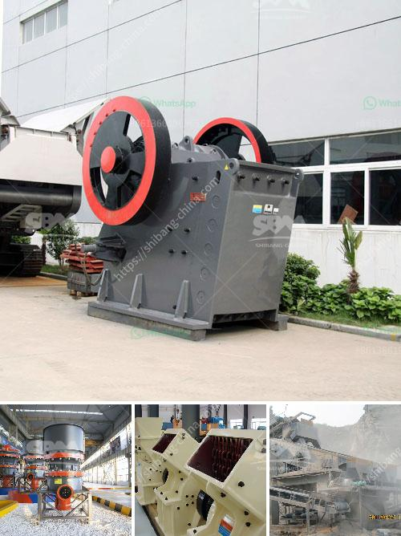

<h3>What is a hammer mill work?</h3>
A hammer mill is a piece of crushing/shredding equipment used for grinding and reducing the size of various types of materials. It has a series of hammers mounted on a rotating shaft that crush the material against a screen or grate to produce the desired particle size. This equipment is commonly used in the food and pharmaceutical industries due to its versatility and efficiency.

The basic principle of a hammer mill consists of a rotating shaft fitted with free-swinging hammers. These hammers are usually made of manganese or carbon steel, ensuring its durability and effectiveness. The hammers are mounted on pivoting arms attached to the shaft, allowing them to move in a circular motion. As the shaft rotates, the hammers strike the material fed into the grinding chamber, pulverizing it into small particles.

The grinding chamber is typically enclosed to prevent dust and debris from escaping. Smaller models may feature a small hopper at the top of the mill, where the material is manually fed into the machine. Larger hammer mills can be equipped with an automatic feeding mechanism to ensure a continuous flow of material.

The material to be processed is fed into the grinding chamber through the feed chute or hopper and comes into contact with the hammers. Due to the high speed of the rotating shaft, the hammers deliver a powerful impact on the material, causing it to break and disintegrate. The size of the final product is determined by the size of the openings in the screen or grate that is positioned beneath the grinding chamber. Different screens or grates with various hole sizes can be used to obtain the desired particle size.

Hammer mills are widely used in various industries for processing a wide range of materials. They are particularly suitable for grinding grains, such as corn, rice, wheat, and barley. In the food industry, hammer mills can be used to grind meat, spices, vegetables, and fruits for further processing. They are also commonly used in the pharmaceutical industry to grind active ingredients or excipients in preparation for tablet manufacturing.

The advantages of using a hammer mill include its efficiency, versatility, and ease of operation. It can process a wide range of materials with varying degrees of hardness, from soft to hard, brittle to fibrous. The particle size can be easily adjusted by changing the screen or grate openings, allowing for greater control over the final product. Additionally, hammer mills are relatively simple machines that require minimal maintenance.

In conclusion, a hammer mill is a powerful piece of equipment used for grinding and reducing the size of various materials. It works by delivering a powerful impact on the material, causing it to break apart into smaller particles. Hammer mills are widely used in various industries due to their efficiency, versatility, and ease of operation.
<h3>Contact us</h3><ul><li><strong>Whatsapp:&nbsp;<a href="https://wa.me/8613661969651">+8613661969651</a></strong></li><li><a href="https://swt.shibang-china.com/?git&amp;zhl&amp;What is a hammer mill work"><strong>Online Service(chat now)</strong></a></li></ul><h3>Related</h3><ul><li><a href='What equipment can be used to crush 6 mm aggregate into dust.md'>What equipment can be used to crush 6 mm aggregate into dust?</a></li><li><a href='What is the largest industrial crusher.md'>What is the largest industrial crusher?</a></li><li><a href='What are the different types of cone crushers.md'>What are the different types of cone crushers?</a></li><li><a href='What causes tension rods in jaw crushers to break.md'>What causes tension rods in jaw crushers to break?</a></li><li><a href='what is iron ore screening equipment？.md'>what is iron ore screening equipment？</a></li></ul>