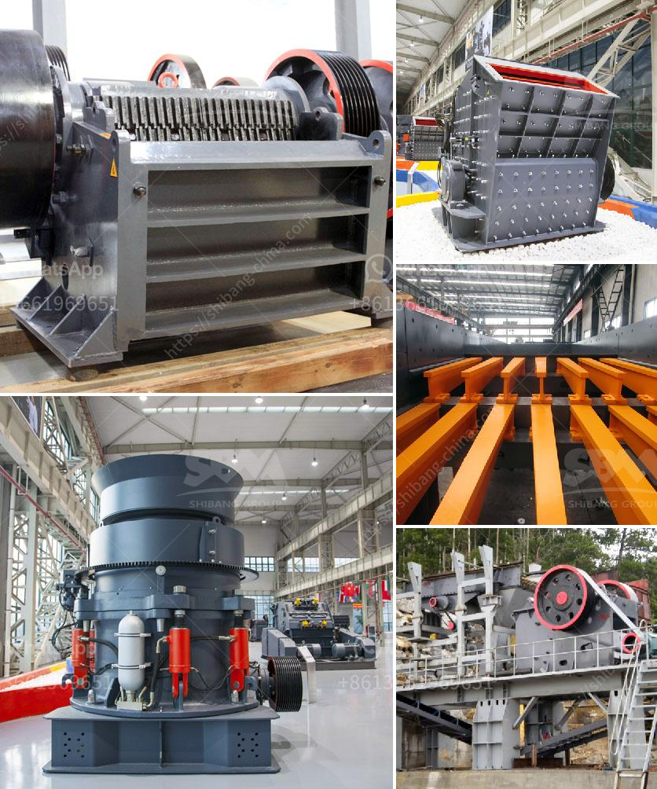

<h3>What is a hammermill crusher machine?</h3>
A hammermill crusher machine is a type of crusher that features a hammerhead connected to a rotor, which revolves at high speed to crush and pulverize materials, such as rocks, coal, grain, and wood into smaller pieces.

Hammermill crusher machines are designed for various purposes including reducing materials in size, as well as mixing and blending different materials. They are primarily used in industries such as mining, cement, building materials, and chemical processing.

One of the main components of a hammermill crusher machine is the hammerhead, which is attached to the rotor. As the rotor rotates at high speed, the hammerhead impacts and crushes the material being fed into the machine. This crushing action reduces the size of the material, turning large pieces into smaller, more manageable particles.

The versatility of a hammermill crusher machine is evident in its ability to handle a wide range of materials. It can crush both dry and wet materials, making it useful in various applications. For example, it can be used to crush coal for energy production, grind grains for animal feed, or pulverize rocks for construction material.

In addition to its primary crushing function, a hammermill crusher machine can also be used for secondary or tertiary crushing. This means that it is capable of further reducing the size of already crushed materials, creating a finer end product.

Another advantage of a hammermill crusher machine is its simplicity in operation and maintenance. The basic design of the machine allows for easy access to the internal parts, which simplifies maintenance and repairs. Additionally, the machine's robust construction ensures durability and long-term use.

Furthermore, some hammermill crusher machines are equipped with additional features that enhance their performance. For instance, they may have adjustable discharge openings, allowing for precise control over the size of the final product. They may also include screens or grates to separate the crushed material into different sizes or remove any impurities.

When selecting a hammermill crusher machine, several factors need to be considered. These include the desired size and type of the crushed material, the required output capacity, and the specific application. It is important to choose a machine that is capable of handling the intended material and achieving the desired end result.

In conclusion, a hammermill crusher machine is a powerful and versatile tool that can be used to crush and pulverize various materials. Its efficient crushing action makes it suitable for a wide range of applications in different industries. Whether used for primary, secondary, or tertiary crushing, these machines offer reliability, simplicity, and high productivity.
<h3>Contact us</h3><ul><li><strong>Whatsapp:&nbsp;<a href="https://wa.me/8613661969651">+8613661969651</a></strong></li><li><a href="https://swt.shibang-china.com/?git&amp;zhl&amp;What is a hammermill crusher machine"><strong>Online Service(chat now)</strong></a></li></ul><h3>Related</h3><ul><li><a href='What are the coal sizing requirements for a power plant.md'>What are the coal sizing requirements for a power plant?</a></li><li><a href='What are the main current crusher and which is good.md'>What are the main current crusher and which is good?</a></li><li><a href='What are the mechanical devices used in mining What is the role of each.md'>What are the mechanical devices used in mining? What is the role of each?</a></li><li><a href='What are the advantages of a roll crusher compared to other crushers.md'>What are the advantages of a roll crusher compared to other crushers?</a></li><li><a href='What is the iron ore thickening process.md'>What is the iron ore thickening process?</a></li></ul>