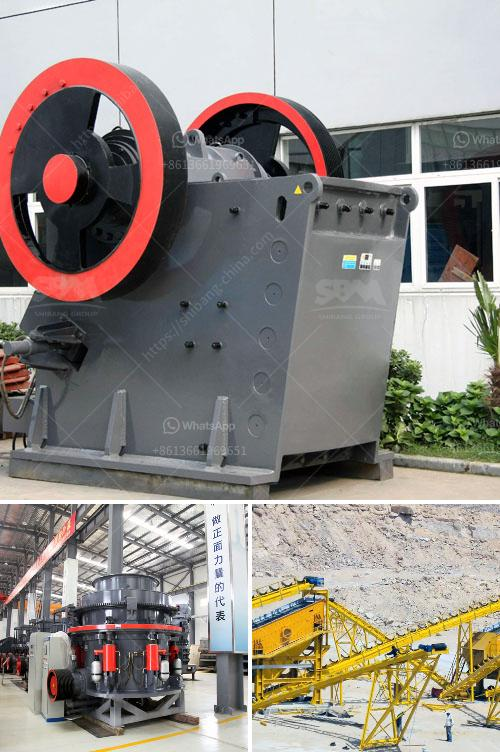

<h3>What is a hydraulic cone crusher? What are the advantages?</h3>
A hydraulic cone crusher is a type of primary crusher used in mines and ore processing plants. It is designed to be reliable and easy to operate. The hydraulic system enables the crusher to clear any blockages that may occur during operation, thereby preventing downtime and ensuring uninterrupted production.

Advancements in technology have brought forth innovative features in hydraulic cone crushers, making them more user-friendly and reliable. The hydraulic cone crusher is equipped with a hydraulic clearing system, including the hydraulic cylinder and the accumulator. This allows the crusher to easily remove any material that cannot be crushed, thus preventing damage to the machine and ensuring the continuous production of high-quality final products.

One of the key advantages of a hydraulic cone crusher is the higher production capacity it offers. With the increase in production capacity, the size and volume of the material can also be processed. This means that the machine is capable of handling larger ore quantities in less time, thereby increasing productivity and reducing overall costs. Additionally, hydraulic cone crushers provide outstanding performance in crushing hard and mid-hard rocks and ores.

Another advantage of a hydraulic cone crusher is its versatility. The crusher can be utilized for various materials, such as limestone, granite, and basalt. The finer the grain size, the greater the production capacity and efficiency. Hydraulic cone crushers can process materials with a side length of 100-500 mm, and their compressive strength is up to 350 MPa.

In addition to higher production capacities, hydraulic cone crushers provide superior end-product quality. The machines produce a precisely shaped final product, ensuring excellent particle distribution and reducing the amount of oversized material. This leads to improved product quality, as well as better overall efficiency.

Furthermore, hydraulic cone crushers are designed for easy operation and maintenance. The advanced technology incorporated in these machines simplifies the maintenance process, enabling operators to quickly and easily replace parts and minimize downtime. Additionally, the hydraulic system helps in adjusting the crusher settings to achieve the desired product size and shape.

Lastly, hydraulic cone crushers offer environmental benefits. The machines consume less energy, resulting in lower fuel consumption and reduced greenhouse gas emissions. This makes hydraulic cone crushers a sustainable and eco-friendly choice for mining and ore processing operations.

In conclusion, hydraulic cone crushers are an efficient and reliable solution for crushing hard materials. They offer several advantages, including higher production capacity, versatility, superior end-product quality, ease of operation and maintenance, and environmental benefits. With ongoing technological advancements, hydraulic cone crushers are becoming increasingly popular in the mining and quarrying industry. They are an essential tool for processing various materials and ensuring uninterrupted productivity.
<h3>Contact us</h3><ul><li><strong>Whatsapp:&nbsp;<a href="https://wa.me/8613661969651">+8613661969651</a></strong></li><li><a href="https://swt.shibang-china.com/?git&amp;zhl&amp;What is a hydraulic cone crusher What are the advantages"><strong>Online Service(chat now)</strong></a></li></ul><h3>Related</h3><ul><li><a href='What is the cascading effect in a ball mill.md'>What is the cascading effect in a ball mill?</a></li><li><a href='What is the total cost of a 100 TPH crusher plant.md'>What is the total cost of a 100 TPH crusher plant?</a></li><li><a href='What are the functions of a gyratory crusher in mining.md'>What are the functions of a gyratory crusher in mining?</a></li><li><a href='What should I know about a crusher plant.md'>What should I know about a crusher plant?</a></li><li><a href='What kind of quartz can be used in the paint industry and how to get it.md'>What kind of quartz can be used in the paint industry and how to get it?</a></li></ul>