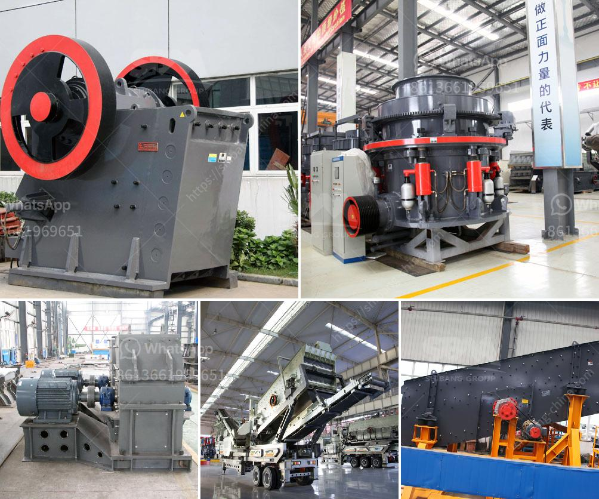

<h3>What is a jaw crusher used for?</h3>
A jaw crusher is a type of primary crusher used in mines and ore processing plants. Jaw crushers are designed to crush the toughest materials through the use of compressive force (pressure). The jaw crusher design includes a set of two vertical jaws—a fixed (stationary) jaw and a swing (reciprocating) jaw. The swing jaw moves back and forth by a cam or pitman mechanism acting like a nutcracker or a class II lever.

The ore enters the crushing chamber where the jaws squeeze and reduce the material size. When the material passes through the top, it gets crushed again between the jaws until it reaches the desired size. Jaw crushers are versatile machines, suitable for a variety of applications such as mining, quarrying, and recycling.

1. Primary Crushing: In mining, jaw crushers are often used to break down large chunks of rock into manageable sizes. The primary purpose of a jaw crusher is to reduce the material size for further processing, whether it is for a specific product or simply for use in the construction industry.

2. Quarrying and Demolition: Jaw crushers are commonly used in the quarrying and demolition industries. They help to break down larger pieces of material into smaller, more manageable sizes. This is crucial for efficient transportation and processing of materials in these industries.

3. Recycling: Jaw crushers play a key role in the recycling process. They can crush and separate different types of materials, such as concrete, metal, and asphalt, ensuring that valuable resources are repurposed instead of going to waste. This makes jaw crushers a crucial component in recycling operations.

4. Construction: Jaw crushers are also widely used in the construction industry for various materials, such as aggregates, crushed stone, gravel, and recycled concrete. These machines can handle large amounts of material and produce final products suitable for road construction, landscaping, or general construction purposes.

5. Industrial Applications: Jaw crushers are also used in various industrial applications, such as for manufacturing glass, ceramics, abrasives, cement, and other materials. They can be used as a secondary crusher in these industries, where the material needs to be reduced further before being processed into the final product.

In conclusion, a jaw crusher is an essential piece of equipment used in mines and ore processing plants. This primary crushing machine is capable of breaking down the toughest materials into smaller and more manageable sizes. Its versatility and wide range of applications make it indispensable in the mining, quarrying, recycling, construction, and industrial sectors. Overall, the jaw crusher plays a significant role in the processing of various materials, making it a vital asset to any operation in need of efficient crushing power.
<h3>Contact us</h3><ul><li><strong>Whatsapp:&nbsp;<a href="https://wa.me/8613661969651">+8613661969651</a></strong></li><li><a href="https://swt.shibang-china.com/?git&amp;zhl&amp;What is a jaw crusher used for"><strong>Online Service(chat now)</strong></a></li></ul><h3>Related</h3><ul><li><a href='What is a belt conveyor machine .md'>What is a belt conveyor machine ?</a></li><li><a href='what is iron ore screening equipment？.md'>what is iron ore screening equipment？</a></li><li><a href='What should be the RPM of a ball mill with a 45inch diameter.md'>What should be the RPM of a ball mill with a 45-inch diameter?</a></li><li><a href='what are advantage of grinding machines？.md'>what are advantage of grinding machines？</a></li><li><a href='What is the problem with ore mining .md'>What is the problem with ore mining ?</a></li></ul>