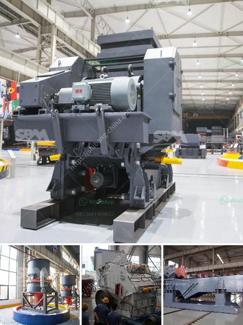

<h3>What is a pressurized coal mill?</h3>
A pressurized coal mill is an important part of any thermal power plant. It pulverizes coal particles to optimize their combustion process and heat energy generation. In turn, this process helps to reduce pollutant emissions. The coal mills also contribute to the safe and efficient operation of the boiler, protecting it from possible damage or explosion due to excess coal accumulation or insufficient airflow inside the mill.

A pressurized coal mill is designed to provide a secure and enclosed environment for grinding and drying coal, ensuring continuous operation and reducing the risk of explosions. The pressurization system consists of several components, including fans, seals, and a static pressure chamber that keeps airborne coal dust away from the mill area.

The grinding process in a coal mill involves multiple heating, drying, and pulverizing stages. In this process, coal is fed into the mill through a central inlet pipe, where gravity is used to distribute the coal across the grinding table. A rotating table further pulverizes the coal, ensuring a consistent particle size distribution throughout the grinding process.

To achieve optimal combustion, the coal particles need to be finely ground. The mill’s grinding capacity depends on the coal characteristics, including its hardness, moisture content, and calorific value. Therefore, the pressurized coal mill needs to be able to handle a wide range of coal types while maintaining a high grinding efficiency.

The grinding process in a pressurized coal mill involves both impact and attrition. The rotating table and grinding rollers generate a down-flow of coal particles that contacts the grinding elements. The coal particles are crushed and ground by the high-pressure grinding rolls, exerting pressure and shearing forces on the coal particles trapped between them. As a result, the coal is pulverized to a fine powder suitable for combustion.

To ensure safe and efficient operation, the pressurized coal mill is equipped with a range of safety features. These include coal mill temperature monitoring, flame detection, and an emergency inerting system. The temperature monitoring system continuously monitors the coal mill’s temperature, preventing excessive heat buildup and potential fires. The flame detection system detects any flames or sparks inside the mill, triggering immediate actions to suppress the fire.

In case of emergency situations, such as a sudden drop in airflow or an accumulation of coal dust, the emergency inerting system is activated. This system injects an inerting medium, such as carbon dioxide or nitrogen, into the mill to dilute the explosive mixture of coal dust and air. Inerting prevents or suppresses any potential explosions and ensures the safety of the mill and personnel.

In conclusion, a pressurized coal mill is a crucial component of a thermal power plant that grinds coal particles to optimize combustion efficiency. It provides a secure and enclosed environment for grinding and drying coal, ensuring continuous operation and reducing the risk of explosions. By pulverizing coal particles to a fine powder, the pressurized coal mill helps to reduce pollutant emissions and generate heat energy efficiently. Moreover, the integration of safety features ensures safe and reliable mill operation, protecting the mill and personnel from potential hazards.
<h3>Contact us</h3><ul><li><strong>Whatsapp:&nbsp;<a href="https://wa.me/8613661969651">+8613661969651</a></strong></li><li><a href="https://swt.shibang-china.com/?git&amp;zhl&amp;What is a pressurized coal mill"><strong>Online Service(chat now)</strong></a></li></ul><h3>Related</h3><ul><li><a href='What machines are used in a crushing plant？.md'>What machines are used in a crushing plant？</a></li><li><a href='What is a composite cone crusher.md'>What is a composite cone crusher?</a></li><li><a href='what does a raymond coal mill cost？.md'>what does a raymond coal mill cost？</a></li><li><a href='What are the parts of a Raymond Mill.md'>What are the parts of a Raymond Mill?</a></li><li><a href='What are the different types of cone crushers.md'>What are the different types of cone crushers?</a></li></ul>