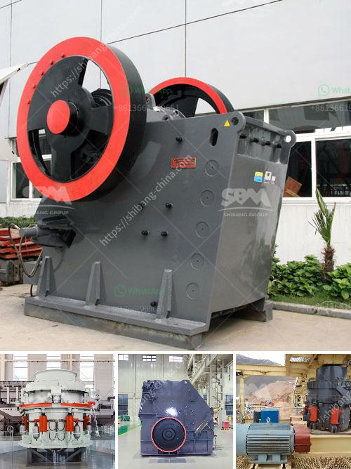

<h3>What is a sand sieving machine?</h3>
A sand sieving machine is a tool that produces sand within an industrialized environment. It simultaneously screens sand grains of different sizes by shaking them on a mesh or perforated screen. With this motion, the machine efficiently separates smaller and larger sand particles, ensuring a consistent particle size distribution. This device is commonly used in construction projects, foundries, mining operations, and various other industries where a homogeneous sand mixture is a requirement.

The primary purpose of a sand sieving machine is to separate sand particles tailored to specific size requirements. The machine accomplishes this by trapping irregularly shaped sand grains between its sieving screens and shaking them until they pass through the screen openings, effectively sorting the particles based on their size. The sieving screens, usually made of stainless steel or nylon, are available in different mesh sizes, enabling versatility and allowing a wide range of grain sizes to be sieved.

Not only does a sand sieving machine sort particles, but it also removes any impurities such as stones, shells, or other foreign objects that may be mixed in with the sand. By eliminating these unwanted substances, the sieving machine provides a higher quality sand product, suitable for various applications, including concrete mixing, plastering, and sandblasting.

There are different types of sand sieving machines available, each designed to cater to specific industrial needs. Handheld sand sieving machines are portable and compact, making them suitable for small-scale sand sieving processes or fieldwork. On the other hand, larger, automated machines with conveyor belts are widely used in large-scale operations, streamlining the sieving process and significantly increasing productivity.

The advantages of using a sand sieving machine are numerous. Firstly, it ensures consistent particle size and quality, leading to improved product performance and reliability. Secondly, it reduces labor costs by automating the sieving process, saving time and effort. Additionally, this machine enables cost-effective sand production by minimizing waste and maximizing resource utilization. Lastly, the use of a sand sieving machine promotes a cleaner and safer working environment by eliminating impurities that may cause harm to workers or damage machinery.

To operate a sand sieving machine, the sand is poured onto the sieving screen, which is then set in motion. The machine shakes the screen, causing the sand particles to gradually pass through the openings in the screen while the larger particles remain on top. The sieved sand can then be collected and utilized for various applications, ensuring a uniform particle size distribution.

In conclusion, a sand sieving machine is a valuable tool that efficiently separates sand particles based on their sizes, ensuring a consistently graded sand mixture. It plays a crucial role in various industries where high-quality sand is required. Whether used in construction projects, foundries, or mining operations, a sand sieving machine provides reliability, productivity, and cost-effectiveness – all contributing to the success of the particular industry it serves.
<h3>Contact us</h3><ul><li><strong>Whatsapp:&nbsp;<a href="https://wa.me/8613661969651">+8613661969651</a></strong></li><li><a href="https://swt.shibang-china.com/?git&amp;zhl&amp;What is a sand sieving machine"><strong>Online Service(chat now)</strong></a></li></ul><h3>Related</h3><ul><li><a href='What does it cost to mill gold ore.md'>What does it cost to mill gold ore?</a></li><li><a href='what is the best installation for crusher plant production and maintenance？.md'>what is the best installation for crusher plant production and maintenance？</a></li><li><a href='What type of crusher is good for bentonite and dolomite.md'>What type of crusher is good for bentonite and dolomite?</a></li><li><a href='What is the project cost for ball grinding unit .md'>What is the project cost for ball grinding unit ?</a></li><li><a href='What is a sand sieving machine.md'>What is a sand sieving machine?</a></li></ul>