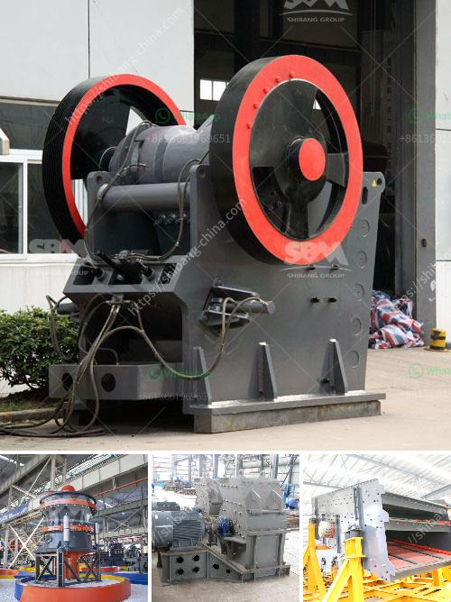

<h3>What is a screening plant for manganese ore?</h3>
A screening plant for manganese ore is used to separate the different sizes of manganese ore produced by the mining operation. It is an essential part of any manganese ore processing plant, as it not only separates the feed material into different sizes to cater to the downstream process, but also generates a saleable product by removing the unwanted impurities.

Manganese ore is a crucial mineral used in various industrial applications, such as steel production, batteries, and chemical manufacturing. However, the quality and size of the manganese ore are critical factors in determining its usability. Therefore, it is necessary to screen the mined ore to ensure the production of a high-grade product.

The screening plant consists of multiple screens of different sizes stacked on top of each other. The ore material is fed into the top screen, where it is subjected to vibrations that separate it into different sizes. The larger-sized ore particles are retained on the screen, while the smaller ones pass through. This separation process is repeated with subsequent screens of decreasing mesh size until the desired sizes are obtained.

The size of the screens used in the screening plant depends on the end user's requirements. For example, if the ultimate goal is to produce manganese ore for steel production, the screens may be adjusted to yield a specific size range that matches the specifications of the steel industry. On the other hand, if the manganese ore is intended for battery production, the screen sizes may be different to meet the requirements of the battery manufacturers.

Apart from separating the ore into different sizes, the screening plant also removes the unwanted impurities present in the mined material. This is achieved by utilizing screens with specific mesh sizes that allow only the desired-sized ore particles to pass through while blocking the larger-sized impurities.

The impurities in manganese ore can vary depending on the mining location and mining method. Common impurities found in manganese ore include silica, iron, aluminum, and other minerals. These impurities need to be removed to produce a high-quality manganese product, as they can negatively impact the downstream processes or the final product's performance.

In conclusion, a screening plant for manganese ore is crucial in the mining and processing operations to ensure the production of a high-grade product. It separates the ore into different sizes and removes unwanted impurities, making it suitable for various industrial applications. The size and configuration of the screens used in the screening plant can be adjusted based on the end user's requirements and the specific industry standards. Whether it is for steel production, battery manufacturing, or other applications, a screening plant plays a vital role in the manganese ore processing process to deliver a saleable and high-quality product.
<h3>Contact us</h3><ul><li><strong>Whatsapp:&nbsp;<a href="https://wa.me/8613661969651">+8613661969651</a></strong></li><li><a href="https://swt.shibang-china.com/?git&amp;zhl&amp;What is a screening plant for manganese ore"><strong>Online Service(chat now)</strong></a></li></ul><h3>Related</h3><ul><li><a href='What does it cost to mill gold ore.md'>What does it cost to mill gold ore?</a></li><li><a href='What materials can the vertical roller mill grind.md'>What materials can the vertical roller mill grind?</a></li><li><a href='What are the specifications of the crusher for crushing concrete.md'>What are the specifications of the crusher for crushing concrete?</a></li><li><a href='What causes tension rods in jaw crushers to break.md'>What causes tension rods in jaw crushers to break?</a></li><li><a href='What is a tertiary crusher.md'>What is a tertiary crusher?</a></li></ul>