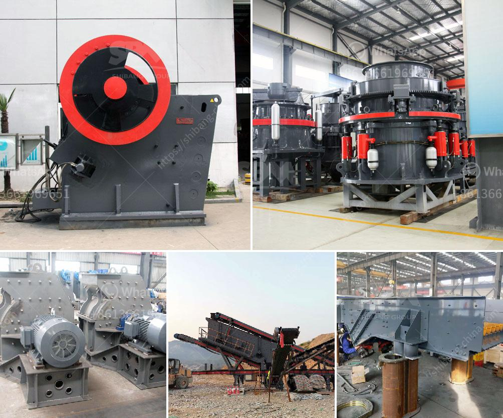

<h3>What is a single toggle jaw crusher?</h3>
A single toggle jaw crusher is a type of jaw crusher in which the movable jaw is suspended from the eccentric shaft, creating an elliptical jaw motion. The single toggle jaw crusher is renowned for its ability to crush hard and abrasive rocks and materials, such as ores and ferroalloys.

The swing jaw of the single toggle jaw crusher is larger, heavier, and moves in a linear motion, resulting in higher crushing rates, and therefore, a greater throughput capacity. The swing motion also allows for the discharge of crushed material, reducing blockages and maintaining a consistent feed to the crusher.

One of the main features of the single toggle jaw crusher is its aggressive crushing action, which generates a significant amount of force on the material being crushed. This force is achieved through a combination of vertical and horizontal components, resulting in efficient crushing performance.

The single toggle jaw crusher utilizes a hydraulic toggle mechanism that sets the toggle plate in a swinging motion, giving the crusher an aggressive bite and reliable operation. Compared with double toggle jaw crushers, single toggle crushers are robust machines, with fewer moving parts and lower maintenance costs. The overhead pivot design further reduces wear and tear on crusher components.

In traditional crushers, a toggle plate compresses the material against the stationary jaw. However, this motion is quite limited in its range of motion, and more emphasis is placed on the top of the crusher chamber, reducing the ability to efficiently crush larger materials.

The single toggle jaw crusher features a more comprehensive bite, which enhances the material flow and breakage characteristics of the machine, achieving a higher reduction ratio and allowing for a higher throughput capacity. The crusher's jaw dies are of high–manganese steel castings, and the cheek plates of high abrasive–resistant steel plate.

The jaw dies can be reversed for maximum utilization. Tools for jaw die changes are included with the jaw crusher. Hydraulic setting adjustment – Hydraulic Power Unit 480/115V/60Hz. Jaw Profile – Quarry, protection plate – front frame & pitman; Support Brackets – Installation Angle –6 degrees.

The jaw crusher relies on a single toggle for enhanced productivity demand and better results. The single toggle jaw crusher typically includes a fixed jaw and a movable jaw. The stationary jaw is mounted vertically on the front edge of the concrete foundation frame, while the movable jaw is attached to the pull rod and supported by the spring. The size of the crushed material can be adjusted by adjusting the gap between the two jaws, and the particles can be broken and discharged from the lower opening of the crushing chamber.

In conclusion, the single toggle jaw crusher has a simple structure and it is robust and reliable in operation. It is widely used for crushing various materials like stone, granite, trap rock, coke, coal, manganese ore, iron ore, emery, fused aluminum, oxide, fused calcium carbide, lime stone, quartzite, alloys, etc. The single toggle jaw crusher has a history of more than 100 years, and it is still widely used due to its simplicity and reliability in various industrial applications.
<h3>Contact us</h3><ul><li><strong>Whatsapp:&nbsp;<a href="https://wa.me/8613661969651">+8613661969651</a></strong></li><li><a href="https://swt.shibang-china.com/?git&amp;zhl&amp;What is a single toggle jaw crusher"><strong>Online Service(chat now)</strong></a></li></ul><h3>Related</h3><ul><li><a href='What kind of equipment is used for fine crushed stone？.md'>What kind of equipment is used for fine crushed stone？</a></li><li><a href='What equipment is required for a large quarry.md'>What equipment is required for a large quarry?</a></li><li><a href='What is a Raymond mill.md'>What is a Raymond mill?</a></li><li><a href='What is a single toggle jaw crusher.md'>What is a single toggle jaw crusher?</a></li><li><a href='What are the parts of a mill in a cement plant.md'>What are the parts of a mill in a cement plant?</a></li></ul>