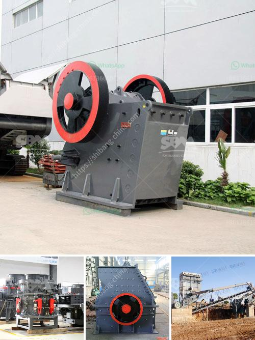

<h3>What is a stone crusher?</h3>
A stone crusher is a machine designed to reduce large rocks into smaller rocks, gravel, or rock dust. Crushers may be used to reduce the size, or change the form, of waste materials so they can be more easily disposed of or recycled, or to reduce the size of a solid mix of raw materials (as in rock ore), so that pieces of different composition can be differentiated. Crushing is the process of transferring a force amplified by mechanical advantage through a material made of molecules that bond together more strongly, and resist deformation more, than those in the material being crushed.

Industrial crushers reduce large rocks, ore, or waste materials to smaller sizes by impact or pressure to fracture or deform them. Both the impact and the pressure type crushers are used to perform the crushing action. The crushers are categorized into three different types based on their nature and impact on the end product:

1. Jaw Crusher: A jaw crusher is one of the main types of primary crushers in a quarry or ore processing plant. The size of a jaw crusher is designated by the rectangular or square opening at the top of the jaws. Primary jaw crushers are typical of the square opening design, and secondary jaw crushers are of the rectangular opening design. A jaw crusher reduces large size rocks or ore by placing the rock into compression. A fixed jaw, mounted in a "V" alignment is the stationary breaking surface, while the movable jaw exerts a force on the rock by forcing it against the stationary plate. The space at the bottom of the "V" aligned jaw plates is the crusher product size gap or the size of the crushed product from the jaw crusher.

2. Impact Crusher: Impact crushers are typically used for primary and secondary crushing with the largest compression resistance of the material being crushed being 320MPa. The impact crusher is widely used in various industries such as mining, quarrying, and construction industries. It is often used for intermediate and fine crushing of materials like limestone, coal, calcium carbide, quartz, dolomite, sulfide iron ore, gypsum, and chemical raw materials.

3. Cone Crusher: A cone crusher is similar in operation to a gyratory crusher, with less steepness in the crushing chamber and more of a parallel zone between crushing zones. A cone crusher breaks rock by squeezing the rock between an eccentrically gyrating spindle, which is covered by a wear-resistant mantle, and the enclosing concave hopper, covered by a manganese concave or a bowl liner. As rock enters the top of the cone crusher, it becomes wedged and squeezed between the mantle and the bowl liner or concave.

In summary, a stone crusher is a valuable machine that is designed to reduce large rocks into smaller rocks, gravel, sand, or rock dust, reducing the size of a variety of materials to improve process efficiency and help with final product quality.
<h3>Contact us</h3><ul><li><strong>Whatsapp:&nbsp;<a href="https://wa.me/8613661969651">+8613661969651</a></strong></li><li><a href="https://swt.shibang-china.com/?git&amp;zhl&amp;What is a stone crusher"><strong>Online Service(chat now)</strong></a></li></ul><h3>Related</h3><ul><li><a href='What are some applications of bauxite .md'>What are some applications of bauxite ?</a></li><li><a href='What are the parts of a ball mill.md'>What are the parts of a ball mill?</a></li><li><a href='What is Raymond mill and ball mill process .md'>What is Raymond mill and ball mill process ?</a></li><li><a href='What are the models of Raymond mill.md'>What are the models of Raymond mill?</a></li><li><a href='what is the difference between tube grinder and ball mill.md'>what is the difference between tube grinder and ball mill</a></li></ul>